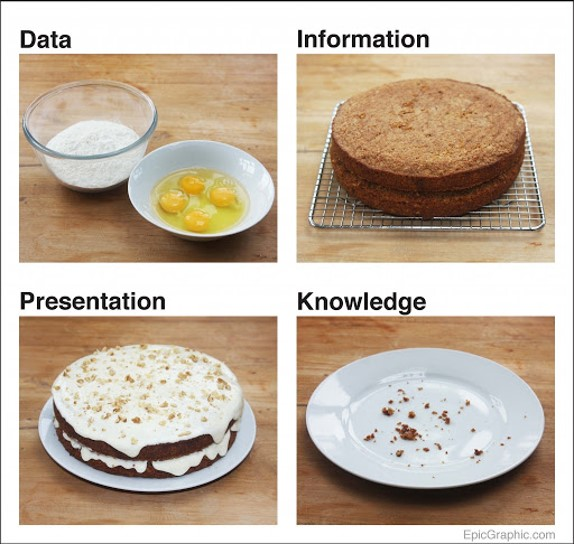
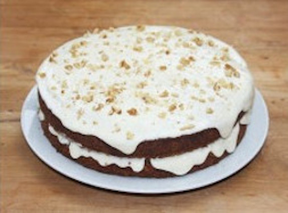
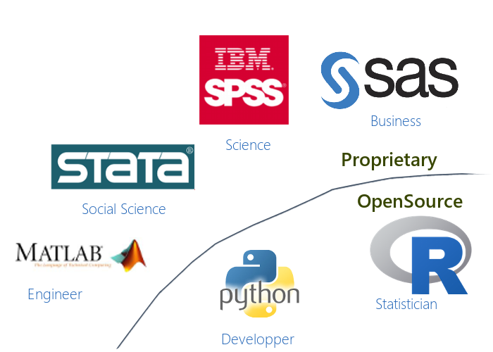
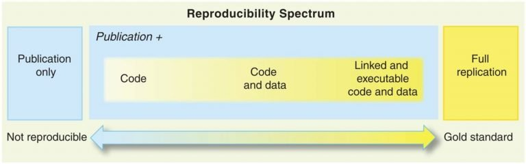
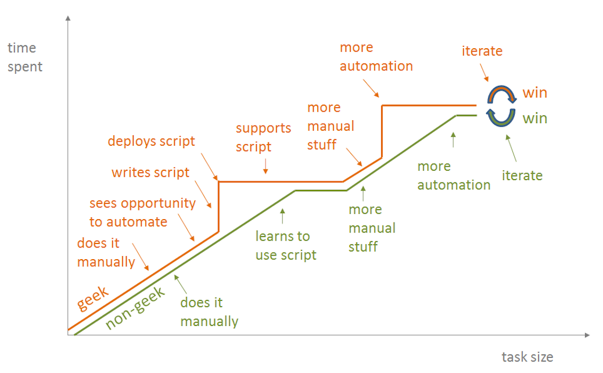
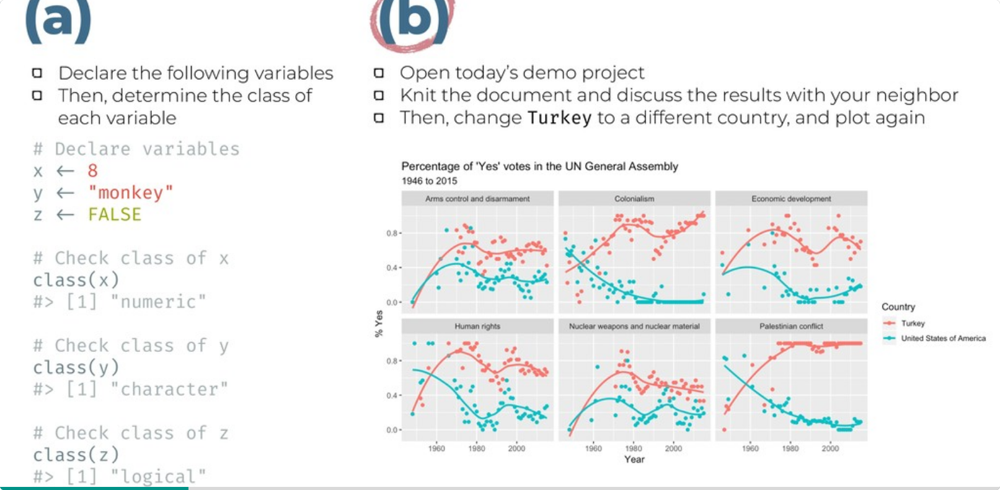
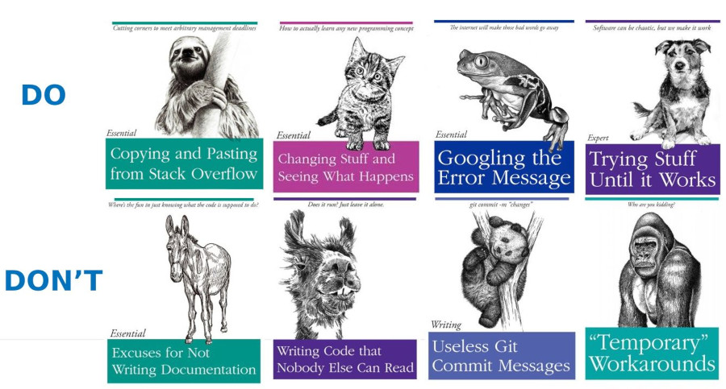
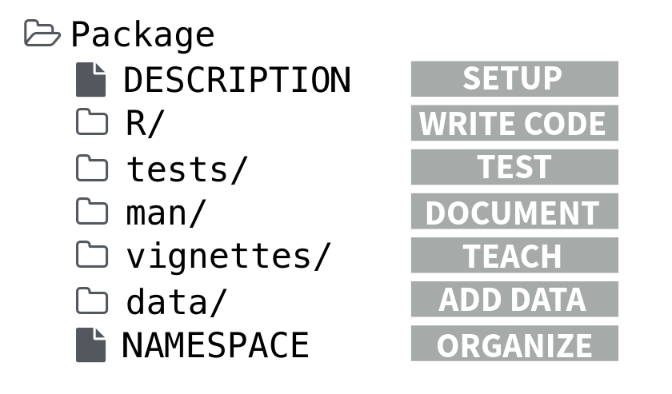
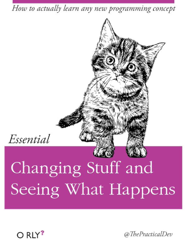

 


# Learning objectives

- Understand what is "analysis reproducibility" and you can gain from it. 

- Know what are the main technical requirements for an analysis piece to be reproducible... 

- Get an idea of how to implement this concept in your work!


???
Have you ever completed the development of a data product with the feeling that you may have done a mistake or not have used the optimal way to clean or process your data?  

As an analyst, if using “point & click” interface, “rewinding” all the steps at an advanced stage of the development of your product can be extremely painful and lengthy. Errare humanum est sed perseverare... If you want to learn from your mistake rather than to suffer from them, then analysis reproducibility is what you need... 

In this session, we will introduce you to the basics of analysis reproducibility and explain you what elements you need to watch for when you kick start your analysis so that you can always rewind and improve any products you have already spent time on. We will also show you how you can learn from analysis done in a reproducible way done by other colleagues. 

We will also show you through practical examples how to implement a fully reproducible data analysis workflow applied to a Household Survey dataset using R statistical Language: from initial data exploration to joint interpretation till the creation of data stories.  

Last, we hope that this session will motivate you to join the vibrant R users community in UNHCR and soon become an R champion. In order to make the most of the session, we would advise you to install the following open source environment: 

    R - https://cran.r-project.org/bin/windows/base/ 

    Rstudio Free version: https://www.rstudio.com/products/rstudio/download/ 

    Create an account on Github - https://github.com/join?  and install Github desktop https://desktop.github.com/ 

You may also start installing UNHCR Packages – following the instruction in their respective documentation published on Github: 

    Use UNHCR Open data  - https://unhcr.github.io/unhcrdatapackage/docs/  

    API to connect to internal data source - https://unhcr-web.github.io/hcrdata/docs/ 

    Perform High Frequency Check https://unhcr.github.io/HighFrequencyChecks/docs/ 

    Process data crunching for survey dataset - https://unhcr.github.io/koboloadeR/docs/  

    Use UNHCR graphical template- https://unhcr-web.github.io/unhcRstyle/docs/ 

Last, you may also take advantage of going through one or more of the R learning content on Learn & Connect: Achieve your potential: UNHCR (csod.com)  and see some practical tutorial on https://humanitarian-user-group.github.io/  

The best way to start and learn is to have a concrete project! If you have one and need mentoring, we can liaise after the session. 

---

## A Vision for data analysis

<span style='font-size:50px; color:grey;'>"Multi-functional teams, with strengthened data literacy, regularly conduct meaningful and documented joint data interpretation sessions to define their strategic directions based on statistical evidences"</span>

---

## A Theory of Change for Data analysis

<span style='font-size:30px;'>Proper user of data for advocacy & programmatic decision making </span>

 <span style='font-size:40px;'>&#8618;</span> Corporate __Standards__ exist to define how to encode & process household surveys dataset
 
 <span style='font-size:40px;'>&#8618;</span> Field data experts are trained based on precise recipes and predefined tools at each step of the __data life cycle__

 <span style='font-size:40px;'>&#8618;</span> Data are presented, discussed and linked to expert knowledge during data __interpretation__ sessions with a multi-functional team
 
 <span style='font-size:40px;'>&#8618;</span> All potential valid interpretations, including diverging views, are systematically __recorded__
 
 <span style='font-size:40px;'>&#8618;</span>  __Persuasive__ "Data Stories“ and Policy papers are generated


---


## Data Science is like... Cooking!

.pull-left[

When a chef is starting out with a new dish...

 - Hypothesis Tasting  -- Setting the right questions
 
 - Ingredients = source the Data
 
 - Wash your food = clean your data
 
 - Flavor engineering = create calculated & derived variables
 
 - Taste and explore = reshape & visualize the data
 
 - Tune your oven = statistical modeling
 
 - Art of plating = use styled brand
 
 - Document your recipe = add technical comments
]

.pull-right[

.img85[] 
]

???
https://towardsdatascience.com/data-science-explained-with-cooking-1a801731d749

https://towardsdatascience.com/5-reasons-why-data-science-is-like-cooking-daa506b4166a

Without good ingredients, you can’t cook a good dish.
Most time and effort are spent on cleaning and preparing the ingredients.  
Different tools and techniques are needed for different recipes.
Cooking is both a science and an art.  
You can’t become a great cook overnight.

---

## Information Anxiety...  Analysis paralysis...

<span style='font-size:30px;'> _When people do not eat the cake..._ </span>

.pull-left[

Potential sources of reluctance...

 *  I do not know how to eat it: I see all those elements on it without being able to understand why they were added there and how this works...
 
 *  I do not trust this cake: How was it created? Did you follow correctly the recipe? Were the ingredient fresh? Can I trust how you sourced the ingredient?
 
 *  This is not the cake I need! It looks too heavy & too big: I will not be able to digest it... 
 
 *  I do not even know what cake I want... 
 
__In data science, the equivalent of food safety measures are required....__ 

]
.pull-right[
.img[] 
]
 
???
simple data visualization for decision making or complex patterns interpretation for knowledge building

---

## The Reproducible Research Manisfesto

.left-column[


]

.right-column[ 

Safety measures to implement for data analysis:
 
 1. For every result, **keep track** of how it was produced

 2. **Avoid manual data manipulation** steps

 3. **Archive** the exact versions of all external programs used

 4. **Version control** all custom scripts

 5. **Record all intermediate results**, when possible in standardized formats

 6. For analyses that include randomness, **note underlying random seeds**

 7. Always **store raw data** behind plots

 8. Generate hierarchical analysis output, allowing layers of increasing detail to be inspected

 9.  Connect **textual statements** to underlying results

 10. Provide **public access** to scripts, runs, and results

]

???


More on reproducible analysis [here](https://ropensci.github.io/reproducibility-guide/sections/introduction/)


---

##   From _"point-and-click"_ to _"code & script"_

.pull-left[

_"point-and-click"_ refers to user interactions made solely by selecting options directly with a mouse within a graphical interface, without keeping any written records... 

A __script__ is a set of written code instructions that automates a series of orchestrated tasks.

Using the right combination of packages, all necessary data analysis steps can be recorded into scripts.

 * Data management (_clean, recode, merge, reshape_)

 * Data analysis (_test, regression, multivariate analysis, etc..._)
 
 * Data visualization (_plot, map, graph..._)

 * Writing up results (_report and presentation generation_)
 

 
]

.pull-right[ 


]


---

## __So what working language to use to write scripts?__


<span style='font-size:30px;'> R, the _lingua franca_ for Statistical Analysis </span>


.pull-left[

R is a programming language and a software environment for statistical computing and graphics. The first version of R has been released in 1997!

The capabilities of R are extended through user-created packages, which allow specialized statistical techniques, graphical devices, import/export capabilities, reporting tools. 

Engineers tend to use Python over R, but R remains the preferred language of statisticians who needs latest techniques & Algorithm.

R can also be compared to proprietary statistical software such as Stata or SPSS but has the advantage of being totally free to install & use. 
]

.pull-right[ 


 

]


---

class: center, middle, inverse

# Why we need to work in a reproducible way? 

### Quality, Ethics, Productivity, Credibility & Learning

---

## Quality


.pull-left[

 
]

.pull-right[ 


__IF__ When managing numerous analysis and continuously changing dataset:
 * Data are manipulated through "point-and-click" user interfaces!
 * Data are exported / imported from a software to another (Excel, GIS, Word...) using different formats!
 * All results (figures, tables) are manually copied/pasted to the final publishing system...

> It consumes time and open space for errors...


A scripted approach enables per design quality review by Peers. If an error is identified, it can quickly be fixed without re-doing everything...

]


---

## Ethics: Science is '_show me_' - not '_trust me_'  
.pull-left[

<span style='font-size:30px;'>Reproducibility allows for __peer review__</span>
 
 Peer Review allows for __transparency__
 
 Transparency allows for __scrutinity__

 Scrutinity allows for __accountability__
 
 > _It's okay to make mistakes, as long as one can detect them and that we can learn from them..._ 

]
.pull-right[
.img60[] 
]

???
Ethical principles into algorithmic design - would apply as well when designing household vulnerability scoring formula to inform humanitarian targeting - https://www.hum-dseg.org/sites/default/files/2020-10/Framework%20for%20the%20ethical%20use.pdf

---

## Productivity: getting things done quickly and safely!  

.pull-left[

<span style='font-size:30px;'>Automation through functions & scripts can help skipping __repetitive tasks__</span>

> Tasks that involve recurrent __data manipulation__ are undertaken by teams...
> .. but not everyone in the team needs to be a __geek/coder__! 

When enough investment can be made, __Graphical User Interface__ (GUI) can be developed for specific functions to ease the learning curve of new users while they are still in the process of building up their personal R skills.

]
.pull-right[
.img130[] 
]
???
https://blog.jonudell.net/2012/01/09/another-way-to-think-about-geeks-and-repetitive-tasks/


---

## Credibility: Following best practices

.pull-left[

> Reproducibility is the first requirement for __replicability__

Reproducible Research Repository from World Bank. 
https://reproducibility.worldbank.org/ 

"Publishing reproducibility packages allow all consumers of research to fully scrutinize the data and methodological choices underlying research results. Sharing data and code also democratizes development research by allowing others to replicate, build on, and extend research findings. Together, scrutiny and sharing improve the __credibility__, transparency and ultimately the impact of World Bank research. "

]
.pull-right[

]


???
Opportunities

    Engage and excite broader audience with latest research progress
    Remove research debt, onboard new researchers
    Make faster and clearer research progress 

Challenges

    No clear incentive structure for researchers
    Little funding for bespoke research dissemination and communication
    Not seen as a legitimate research contribution (e.g., to the field, or one's career)  

---

## Learning with a community! 

.pull-left[

Eat the cake first! (then play with and change ingredients...)

<span style='font-size:40px;'>In other words, Identify a published reproducible project similar to what you would like to do, then __reverse engineer it__ and finally rebuild it with your own data!</span>

]
.pull-right[

Which approach is the most appealing exercise among the 2 proposed aside?!! (a) or (b)

.img[] 
]
???
https://speakerdeck.com/player/078592d490ae459790af7e77695fafcf?title=false&skipResize=true


---

class: center, middle, inverse

# Conditions for reproducibility. 

### Sourcing data,  documenting analysis & packaging output


 
---


## Sourcing data

.pull-left[
Data Wrangling takes usually more than 80% of any data project time...

Imagine if you need to rewind your analysis...

Correct at any steps in the process and re-run all..

]
.pull-right[
.img[] 
]


---

## Documenting analysis

.img[] 


---

## Packaging functions  

.pull-left[

Gradual automation

 * level 1: write a command
 * level 2: organize multiple command together in re-usable function
 * Level 3: organize multiple functions together in a package
 * Level 4: includes test data, Documentation & Unit testing, aka code review</span> 
 * Level 5: <span style='font-size:30px;'>Graphical User Interface (GUI) with Shiny</span> 
]
.pull-right[
.img75[] 
]


---

class: center, middle, inverse

# How to get started?

### Define your product, build your first project, Review documentation, Participate in the community


---
.pull-left[

## Data Products: Not always a _dashboard_...

<span style='font-size:20px; color:grey;'> When you drive your car, you dashboard provides decision-focused information (_Key Performance Indicators - KPIs_), to support decisions (_refill the tank, decelerate..._) based on pre-existing knowledge (_the driver has already a license..._))</span>

>  When you need to build knowledge (rather than to support directly decision), then opt for a __notebook__ approach

A __notebook__ in the context of data analysis is a dynamic digital document that combines code, visualizations, and explanatory text in a user-friendly interface. It serves as an interactive platform to analyze and share insights from data, fostering collaboration and enhancing the transparency of analytical workflows.

]
.pull-right[ 


```{r  echo=FALSE, out.width='100%',  message=FALSE, warning=FALSE}
library(ggplot2)
library(ggtext) 

ggplot(NULL, aes()) +
  # fix the scale so it's always a square
  coord_fixed() +
  # set the scale to one greater than 0-10 in each direction
  # this gives us some breating room and space to add some arrows
  scale_x_continuous(expand = c(0, 0), limits = c(-1, 11),
                     breaks = c(2,8), labels=c("2" = "", "8" = "")) +
  scale_y_continuous(expand = c(0, 0), limits = c(-1,11),
                     breaks = c(2,8), labels=c("2" = "", "8" = "")) +
  # labels
  labs(title = '"*It is not enough to do your best; you must know what to do, and then do your best.*"<br>  W. Edwards Deming',
       x = "How you do it? Control if you are doing things right<br> Use a <span style='color:black;'>**Business Intelligence Dashboard**</span> to measure Key Performance Indicators",
       y = "What you do? Evaluate if you are doing the right things<br> Use <span style='color:black;'>**Data Science Notebook**</span> to build Knowledge") +
  # create the quadrants
  geom_segment(aes(x = 10, y = 0, xend = 10, yend = 10)) +
  geom_segment(aes(x = 0, y = 0, xend = 0, yend = 10)) +
  geom_segment(aes(x = 0, y = 0, xend = 10, yend = 0)) +
  geom_segment(aes(x = 0, y = 5, xend = 10, yend = 5)) +
  geom_segment(aes(x = 5, y = 0, xend = 5, yend = 10)) +
  geom_segment(aes(x = 0, y = 10, xend = 10, yend = 10)) +
  # quadrant labels
 
  annotate(geom='richtext', x = 2.5, y = 2.5, alpha = 0.35,
           size = 15,
           #hjust = 1, vjust = 1,
           # remove label background and outline
           fill = NA, label.color = NA,
           # remove label padding, since we have removed the label outline
           label.padding = grid::unit(rep(0, 4), "pt") , 
           label = "<span style='color:#EF4A60;'>Wrong</span><br> Things<br> <span style='color:#EF4A60;'>Wrong</span>") +
  annotate(geom='richtext', x = 2.5, y = 7.5, alpha = 0.35,
           size = 15,
          # hjust = 1, vjust = 1,
           # remove label background and outline
           fill = NA, label.color = NA,
           # remove label padding, since we have removed the label outline
           label.padding = grid::unit(rep(0, 4), "pt") , 
           label = "<span style='color:#0072BC;'>Right</span><br> Things<br> <span style='color:#EF4A60;'>Wrong</span>") +
  annotate(geom='richtext', x = 7.5, y = 2.5, alpha = 0.35,
           size = 15,
          # hjust = 1, vjust = 1,
           # remove label background and outline
           fill = NA, label.color = NA,
           # remove label padding, since we have removed the label outline
           label.padding = grid::unit(rep(0, 4), "pt") , 
           label = "<span style='color:#EF4A60;'>Wrong</span><br> Things<br> <span style='color:#0072BC;'>Right</span>") +
  annotate(geom='richtext', x = 7.5, y = 7.5, alpha = 0.35,
           size = 15,
          # hjust = 1, vjust = 1,
           # remove label background and outline
           fill = NA, label.color = NA,
           # remove label padding, since we have removed the label outline
           label.padding = grid::unit(rep(0, 4), "pt") , 
           label = "<span style='color:#0072BC;'>Right</span><br> Things<br><span style='color:#0072BC;'>Right</span>") +
  # arrows are cut in half which conveniently matches the gartner one
  annotate("segment", x = 0, xend = 10, y = -1, yend = -1,colour = "grey",
           size=2, alpha=1, arrow=arrow(type = "closed", angle = 15)) +
  annotate("segment", x = -1, xend = -1, y = 0, yend = 10, colour = "grey",
           size=2, alpha=1, arrow=arrow(type = "closed", angle = 15)) +
  unhcrthemes::theme_unhcr() +
  theme(                              
    plot.background = element_blank(), 
    panel.grid.major = element_blank(), 
    panel.grid.minor = element_blank(), 
    panel.border = element_blank(), 
    panel.background = element_blank(),
    
    axis.title.x = element_textbox_simple(
      #orientation = "left-rotated",
      width = grid::unit(5.5, "in"),
      size = 15,
      hjust = 0 ),
    axis.title.y = element_textbox_simple(
      orientation = "left-rotated",
      width = grid::unit(5.5, "in"),
      size = 15,
      hjust = 0 ),
    
    plot.title = element_textbox_simple(
      size = 14, lineheight = 1, padding = margin(0, 0, 5, 0)
    ),
    axis.line = element_blank(),
    axis.ticks = element_blank(),
    axis.text.y = element_text(angle = 90)
  )
```


```{r , eval = FALSE, echo=FALSE, out.width='100%',  message=FALSE, warning=FALSE}
#install.packages('DiagrammeR')
# /* https://mermaid-js.github.io/mermaid/#/flowchart */
# https://mermaid-js.github.io/mermaid-live-editor/edit
# https://mermaid-js.github.io/mermaid/#/flowchart?id=styling-and-classes
# https://bookdown.org/yihui/rmarkdown-cookbook/diagrams.html
# library(DiagrammeR)
# mermaid("dataproduct.mmd")

library("DiagrammeR")

grViz(" 
  digraph CFA {
  
    # direction of flowchart left to right      
    graph[layout = dot, # neato|dot|twopi|circo|twopi
          #rankdir = LR, 
          label= '', 
          fontsize= 135] 

    # Decision 
    node [shape = oval, fontname = Lato, fontsize= 150, margin=1]
    X [label = 'Building a data product']; 
    
    # Decision 
    node [shape = diamond, 
          style = filled,
          color =  Gold, 
          fillcolor = Gold, 
          fontname = Lato, 
          fontsize= 135]
    a [label = 'Need to display\\n Key Performance\\n Indicators (KPI)?']; 
    b [label = 'Basic\\n Statistics?']; 
    c [label = 'Polished visuals with\\n  brand style?']; 
    d [label = 'Satistical Modeling \\n Machine Learning?']; 
    e [label = 'Quick processing \\n is critical ?']; 
    f [label = 'Need for \\n Interactivity ?']; 

    # Choices
    node [shape = box, 
          style = filled,
          fillcolor = Lavender, 
          fontname = Lato, 
          fontsize= 160] 
    1 [label = 'Dashboard  \\n with PowerBI', 
             constraint = false , margin=1.5 ];
    2 [label = 'Notebook \\n with Rmd ', margin=1.5];
    3 [label = 'Application\\n  with Python', margin=1.5];
    4 [label = 'Interface\\n with R-Shiny', margin=1.5];

    # Connect nodes with edges and labels
    X -> a [label = 'Start', fontsize= 130, penwidth = 15] 
    a -> 1 [label = 'Yes', fontsize= 130, penwidth = 15]  # PowerBI
    a -> b [label = 'No', fontsize= 130, penwidth = 15]  # Continue
    
    # Basic stat
    b -> c [label = 'Yes', fontsize= 130, penwidth = 15] 
    b -> d  [label = 'No', fontsize= 130, penwidth = 15]
    
    # Polished visuals
    c -> 2 [label = 'Yes', fontsize= 130, penwidth = 15]
    c -> e [label = 'No', fontsize= 130, penwidth = 15]
    
    # Machine learning
    d -> e [label = 'Yes', fontsize= 130, penwidth = 15]
    d -> 2 [label = 'No', fontsize= 130, penwidth = 15]
    
    # Quick processing
    e -> 3 [label = 'Yes', fontsize= 130, penwidth = 15]
    e -> f [label = 'No', fontsize= 130, penwidth = 15]
    
    # Interactivity
    f -> 4 [label = 'Yes', fontsize= 130, penwidth = 15]
    f -> 2 [label = 'No', fontsize= 130, penwidth = 15]
  }

")
```


]


???
https://towardsdatascience.com/dashboards-are-dead-b9f12eeb2ad2 


---

### Get and initial project.. then Search, Test, Try...

.pull-left[


]

.pull-right[


Search and ask in [Stackoverflow](https://stackoverflow.com/questions/tagged/r)

Go through [Cheat-sheets](https://rstudio.cloud/learn/cheat-sheets)

Consult Key Manuals, maybe starting with [R for Data Science](https://r4ds.had.co.nz/)

Follow blogs like general [Rbloggers](https://www.r-bloggers.com/), [Tidyverse blog](https://www.tidyverse.org/blog/) or more specific [HumanitaRian-useR-group](https://humanitarian-user-group.github.io/) as well some twitter accounts.

Join forum like [Inter-Agency R skype group](https://join.skype.com/qYBKC5q3wKp4) or Internal UNHCR Ms Discussion group (ask to join!).

]


---

## R in Humanitarian Context
.pull-left[

<span style='font-size:50px;'>You are not alone</span>

> More than 580 users from multiple organisation in the [humanitarian-useR-group](https://humanitarian-user-group.github.io/) [skype forum](https://join.skype.com/qYBKC5q3wKp4)

> Already many R champions within UNHCR  

> Try to start by using existing UNHCR packages and start from a project you can reproduce

]
.pull-right[
.img[] 
]


---
class: inverse, center, middle

# Thank you

### Questions?

<a href="index.html"><i class="fa fa-indent  fa-fw fa-2x"></i></a>
 

[post Feedback here](https://github.com/unhcRverse/unhcrverse/issues/new?assignees=&labels=enhancement&projects=&template=comment_prex_1_reproducibility.md&title=%5Blearn%5D) 
->  [next sesssion: 02.Tidyverse](02.Tidyverse.html)


---
 

# Reference

[World Bank DIME](https://dimewiki.worldbank.org/Reproducible_Research)

[Reproducible Analytical Pipelines(RAP)](https://analysisfunction.civilservice.gov.uk/support/reproducible-analytical-pipelines/)

[Oxford](https://researchdata.ox.ac.uk/reproducible-research-resources-from-around-the-web)

[Open Science Mooc](https://opensciencemooc.eu/modules/reproducible-research-and-data-analysis/)


---

## Let's take the time to install R & Rstudio...


 
