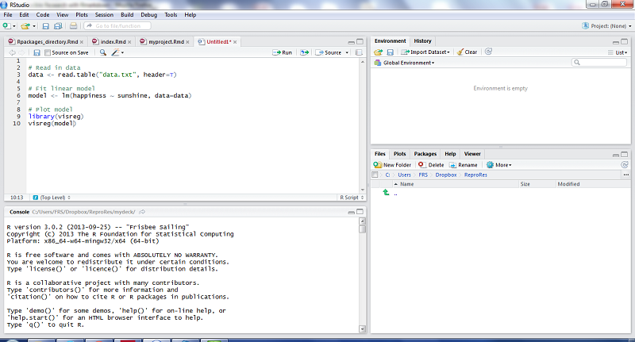

```{r setup, include=FALSE}
options(htmltools.dir.version = FALSE)
library(ragg)
knitr::opts_chunk$set(
  message = FALSE,
  warning = FALSE,
  collapse = TRUE,
  comment = "#",
  dev = "ragg_png",
  fig.showtext = TRUE,
  fig.retina = 2,
  dpi = 300
)
library(tidyverse)
library(unhcrthemes)

```


# Learning objectives

- An intro to Rstudio Development Interface

- Basic of the grammar of data manipulation with [**`dplyr`**](https://dplyr.tidyverse.org/) & [**`tidyr`**](https://tidyr.tidyverse.org/) using [**`{refugees}`**](https://www.unhcr.org/refugee-statistics/insights/explainers/refugees-r-package.html) package

- Basic of the grammar of graphics with [**`ggplot2`**](https://ggplot2.tidyverse.org/index.html)

- Get branded visuals with [**`{unhcrthemes}`**](https://unhcr-dataviz.github.io/unhcrthemes/) package


---

# Learning stages...

.pull-left[


]

.pull-right[

 __Step 1.__ Develop an understanding of what data science is and what concepts are needed for it
 
 __Step 2.__ Break data science challenges into small steps - Acquire basic command syntax through very practical and focused project - Data Manipulation & visualization
 
 __Step 3.__ Develop Reproducible Analysis Workflow with function and report template  - Understand the relevance, inputs, constraints, and limitations of the various techniques
 
 __Step 4.__ Optimize your problem solving approaches in elegant ways - Build packages & ShinyApp

]

???
https://towardsdatascience.com/the-stages-of-learning-data-science-3cc8be181f54 

See Video - https://www.youtube.com/watch?v=hpMc6TgT34I 
 
---

# Essential Concept: Objects & Data elements in base R

-  `Vectors` are a core data structure in R, and are created with `c()`. Elements in a vector must be of the same type.

-  `Data.frame` where each column is a vector, but adjacent vectors can hold different things

- `Matrix` just like a data frame except it's all numeric

- `List` are made of any dimension, mix and match

- `Factors` are a special class that R uses for categorical variables, which also allows for value labeling and ordering.

Reference link on [Manipulating data](http://www.cookbook-r.com/Manipulating_data/)


---

# Vector Example

```{r eval=FALSE}
  numbers = c(23, 13, 5, 7, 31)
  names = c("mohammed", "hussein", "ali")

#Elements are indexed starting at 1, and are accessed with `[]` notation.
	numbers[1] # 23
	names[1] # mohammed
```

---

# Data frames

[Data frames](http://www.r-tutor.com/r-introduction/data-frame)

```{r eval=FALSE}
    books = data.frame(
        title = c("harry potter", "war and peace", "lord of the rings"),
        author = c("rowling", "tolstoy", "tolkien"),
        num_pages = c("350", "875", "500")
    )

# you can access columns of a data frame with `$`.
	books$title # c("harry potter", "war and peace", "lord of the rings")
	books$author[1] # "rowling"

#You can also create new columns with `$`.
	books$num_bought_today = c(10, 5, 8)
	books$num_bought_yesterday = c(18, 13, 20)
	books$total_num_bought = books$num_bought_today + books$num_bought_yesterday
```

---

# Load a Data Frame from a csv file and inspect it

``` {r eval=FALSE}
# load a data set from csv and assign it to an object called 'mydata'
mydata <- read.csv("unhcr_mass_comm_db_merged_20140612.csv") 

# first few rows of the dataset
head(mydata)

# last few rows
tail(mydata)

# variable names
colnames(mydata)

# pop-up view of entire data set  
View(mydata)

```

---

# Initial Exploration

```{r eval=FALSE}
# dimension of the data frame
dim(mydata)

# Structure of the data frame of all variables
# this includes the class(type) i.e factor or not
str(mydata)

# summary statistics with means for every variable
summary(mydata)
```


---
class: inverse, center, middle

# Using Rstudio


---

## An Integrated Development Interface (IDE)

.pull-left[

__Rstudio__ is an integrated development environment for R that allows users to interact more easily with R by integrating different aspects of scripting, from code completion to debugging. It act as a single interface to access: 

 *  Console/Terminal
 *  Files
 *  Packages
 *  Plots
 *  Environment
 *  History
 *  Help
 *  Source
]
.pull-right[
  
]

You can download RStudio from [Posit Website](https://posit.co/products/open-source/rstudio/) and review the [cheatsheets](https://rstudio.github.io/cheatsheets/html/rstudio-ide.html.


---

## Rstudio - Source & Console

.pull-left[

Where you write your R code or document content

If you are writing a R Markdown document, you can render it in this area 

To run a R code, you can use the shortcut Crtl + Enter

The console (or Terminal) is where you can check the execution of commands and where the code is evaluated

Environment/History Where you can see the objects in your working space 

You can also view your command history (History tab) 

]
.pull-right[ 
.img75[]

]


---

## Rstudio - Files/Plots/Packages/Help

.pull-left[

Files/Plots/Packages/Help

You can see the file directories

View plots

View which R packages are installed. You can also update the packages
   
]
.pull-right[ 
.img75[]

]


---
class: inverse, center, middle

# Manipulate data on {refugees} with {dplyr} & {tidyr}

---

### Install the {tidyverse}, a collection of opinionated packages!

The __{tidyverse}__ provides a coherent system of packages for data manipulation, exploration, and visualization that share a common design philosophy, based on a __grammar of verbs__

.pull-left[
Got to your [locally installed Rstudio](https://www.rstudio.com/products/rstudio/download/#download) or [sign-up for a free Rstudio Cloud account](https://login.rstudio.cloud/register?redirect=https%3A%2F%2Fclient.login.rstudio.cloud%2Foauth%2Flogin%3Fshow_auth%3D0%26show_login%3D0)
First create a new project within R studio and then make sure we have the [tidyverse](https://www.tidyverse.org/packages/)  

```{r, comment='#', evaluate = FALSE} 
# The following will install with one single 
# command all the packages from the tidyverse
# it will take time but only needs to be 
# done once

install.packages("tidyverse", 
                 dependencies = TRUE)

```
]

 
.pull-right[


.img75[] 


]

???

The tidyverse is an opinionated collection of R packages designed for data science. All packages share an underlying design philosophy, grammar, and data structures.


---

## Reproducible Analysis Pipeline - make your code legible...


.pull-left[ 

In R, __pipes__ are used to chain together a sequence of operations on a data frame. Pipes are particularly useful and encouraged when working with the __{tidyverse}__ packages, which is a collection of R packages designed for data science. 

The pipe operator __|>__ is used to connect multiple functions together in a single line of code.

 *  Use __|>__ to emphasize a sequence of actions, rather than the object that the actions are being performed on.
 
 *  Avoid using the pipe when you need to manipulate more than one object at a time. Reserve pipes for a sequence of steps applied to one primary object.
 

 
 
 ]
.pull-right[ 


]

???
In adition


 *  Use whitespace to make your code more readable.  __|>__  should always have a space before it, and should usually be followed by a new line. After the first step, each line should be indented by two spaces.
 
 *  If the arguments to a function don’t all fit on one line, put each argument on its own line and indent.
 
 *  Use variable names and assignment on separate lines to make your code more readable.

---

## The {refugees} Data Package

A package can be made of both functions and data. 

__{refugees}__ works as an easy-to-use interface to the datasets served normally through the API, which cover forcibly displaced populations, including refugees, asylum-seekers and internally displaced people, stateless people, and others over a span of more than 70 years. 

.pull-left[

It provides data from three major data sources:

 *  UNHCR’s annual statistical activities dating back to 1951.
 
 *  United Nations Relief and Works Agency for Palestine Refugees in the Near East (UNRWA), specifically for registered Palestine refugees under UNRWA’s mandate. 
 
 *  Internal Displacement Monitoring Centre (IDMC) on people displaced within their country due to conflict or violence.
 
 

]

.pull-right[


```{r eval=FALSE}

# 2 options to install the package 

# From CRAN
install.packages("refugees")

# From Github
pak::pkg_install("PopulationStatistics/refugees")


# Once installed, load the package!
library(refugees)

```
]

---

## 8 sub datasets updated every 6 months

 1. `population`: Data on forcibly displaced and stateless persons by year, including refugees, asylum-seekers, internally displaced people (IDPs) and stateless people. Detailed definitions of the different population groups can be found on the methodology page of the Refugee Data Finder.
 
 2. `idmc`: Data from the Internal Displacement Monitoring Centre on the total number of IDPs displaced due to conflict and violence.
 
 3. `asylum_applications`: Data on asylum applications including the procedure type and application type.
 
 4. `asylum_decisions`: Data on asylum decisions, including recognitions, rejections, and administrative closures.
 
 5. `demographics`: Demographic and sub-national data, where available, including disaggregation by age and sex.

 6. `solutions`: Data on durable solutions for refugees and IDPs.
  
 7. `unrwa`: Data on registered Palestine refugees under UNRWA’s mandate.
 
 8. `flows`: Numbers of the people forced to flee during each of the years since 1962. For more information, see the explaination of the forced displacement flow dataset.

---

## Data Manipulation: filter, group, summarise, slice...

The [grammar of data manipulation](https://rstudio.github.io/cheatsheets/html/data-transformation.html) is a set of verbs that help you solve the most common data manipulation challenges in R. 

The dplyr package provides a consistent set of verbs that include __mutate()__, __select()__, __filter()__, __summarise()__, __slice()__ and __arrange()__.

```{r, echo = TRUE}
library(refugees)
library(dplyr)

# Prepare top 10 countries of origin for 
# refugee and other in needs of international protection in 2022
ref_coo_10 <- refugees::population |>
  dplyr::filter(year == 2022) |>
  # First we define the variable to group by
  dplyr::group_by(coo_name) |>
  # and now summarise using sum - 
  # watch-out na.rm used to ensure NA are not considered in the sum
  # If not, if you have NA , then the sum will be NA
  dplyr::summarise(refugees = sum(refugees, na.rm = TRUE) +
                     sum(oip, na.rm = TRUE) ) |>
  # and now get the top 10
  dplyr::slice_max(order_by = refugees, n = 10)
```


Now prepare top 10 countries of asylum for asylum seekers in 2021!

???
Each can be used to add new variables, pick variables based on their names, pick cases based on their values, reduce multiple values down to a single summary, and change the ordering of the rows, respectively

---

## Data Manipulation: base R versus the tidyverse way...

Let’s say we have a data frame called `df` with two columns: `x` and `y`. We want to filter the rows where x is greater than 5 and then calculate the `mean` of y for those rows.

.pull-left[ 

__base R way__ 

```{r, eval=FALSE}

# Filter the rows where x > 5
df2 <- df[df$x > 5, ]

# Calculate the mean of y for those rows
mean(df2$y)


```
 
 
 ]
.pull-right[ 
__tidyverse way__ 

```{r, eval=FALSE}

library(tidyverse)

df |>
  filter(x > 5) |>
  summarize(mean(y))


```

As you can see, the tidyverse code is more concise and easier to read.

It uses the __|>__ pipe operator to chain together the `filter()` and `summarize()` functions, which makes the code more readable and easier to understand. 

The `summarize()` function is used to calculate the mean of y for the filtered rows.

]


---

## Data Manipulation: Join


.left-column[
 
 ]
.right-column[
```{r, echo = TRUE}

fd_last_ten_years <- refugees::population |>
  dplyr::filter(year >= 2013 & year <= 2022) |>
  dplyr::summarise(refugees = sum(refugees, na.rm = TRUE),
            asylum_seekers = sum(asylum_seekers, na.rm = TRUE), 
            oip = sum(oip, na.rm = TRUE),
            # by define the key to use for summarise
                        .by = year) |>  
  # and now starting the lef_join - using year
  dplyr::left_join(refugees::idmc |> 
              filter(year >= 2013 & year <= 2022) |>
              summarise(idmc = sum(total, na.rm = TRUE),
                        .by = year),
            by=c("year")) |>
  dplyr::left_join(refugees::unrwa |> 
              filter(year >= 2013 & year <= 2022) |>
              summarise(unrwa = sum(total, na.rm = TRUE),
                        .by = year), 
            by=c("year"))  
```

]
 


---

## Data Reshaping: Pivot


.pull-left[ 

 `pivot_longer()` and `pivot_wider()` are two functions in the tidyr package of R that are used to reshape data frames from wide to long or long to wide


```{r, echo = TRUE}

library(tidyr)
# Piping from previous steps
fd_last_ten_years <- fd_last_ten_years |>
  
  tidyr::pivot_longer(cols = -year, 
               names_to = "population_type", 
               values_to = "total")  

```
 
 
 ]
.pull-right[ 


]


???


https://rstudio.github.io/cheatsheets/tidyr.pdf


---

## Data Manipulation: mutate, recode, arrange, rename, relevel


```{r, echo = TRUE}

library(tidyr)
# Piping from previous steps
fd_last_ten_years <- fd_last_ten_years |> 
  # Creating new or overwriting variables with mutate 
  dplyr::mutate(
    # with factor we enforce a specific order to be used 
    population_type = forcats::fct_relevel(population_type,
                  "idmc", "refugees", "unrwa", "oip", "asylum_seekers"), 
    # Now we map this to labels
    pop_type  = dplyr::recode(population_type,
             refugees="Refugees under UNHCR’s mandate",
             asylum_seekers="Asylum-seekers",
             oip="Other people in need of international protection",
             idmc="Internally displaced persons",
             unrwa="Palestine refugees under UNRWA’s mandate")) |>
  # Sorting with arrange
  dplyr::arrange(year, population_type)  |>
  # Renaming existing variables
  dplyr::rename( pop_num = total ) 

```


---
class: inverse, center, middle

# Visualise with {ggplot2} and {unhcrthemes}

### Introduction

---

## The `ggplot2` package

.pull-left[

- **`ggplot2`** is an R package for declaratively creating graphics

- **`ggplot2`** is an implementation [The Grammar of Graphics](https://link.springer.com/chapter/10.1007/978-3-642-21551-3_13) by Leland Irving

- **The idea** don't start with the final form of the graphic (Excel approach) but **decompose the graphic** into its constituents

]

.pull-right[

.center[]

]


???
You provide the data, tell ggplot2 how to map variables to aesthetics, what graphical primitives to use, and it takes care of the details.
What does it take to create a graphic? Data, axis, geometric objects, etc.


## Decomposition of a Graphic

The **"grammar of graphics"** is a [conceptual description](https://ramnathv.github.io/pycon2014-r/visualize/ggplot2.html) of all potential graphs. It can be summarized as follows:

```
-  plot ::= coord scale+ facet? layer+

-  layer ::= data mapping stat geom position?
```
 


---

## Structure of `ggplot2`

How a **`ggplot2`** graph is built on the grammar of graphics elements:

```{r, echo=FALSE}
 
ggplot <- data.frame(
      Layer = c(
        "Data",
        "Aesthetics",
        "Geometries",
        "Statistical transformations",
        "Scales",
        "Coordinate System",
        "Facets",
        "Visual Themes"
      ),
      Function = c(
        "ggplot(data)",
        "aes()",
        "geom_*()",
        "stat_*()",
        "scale_*()",
        "coord_*()",
        "facet_*()",
        "theme_*()"
      ),
      Explanation = c(
        "The raw data that you want to plot.",
        "Aesthetics mappings of the geometric and statistical objects, such as position, color, size, shape, and transparency.",
        "The geometric shapes that will represent the data.",
        "Statistical summaries of the data, such as quantiles, fitted curves, and sums.",
        "Maps between the data and the aesthetic dimensions, such as data range to plot width or factor values to colors.",
        "The transformation used for mapping data coordinates into the plane of the data rectangle.",
        "The arrangement of the data into a grid of plots.",
        "The overall visual defaults of a plot, such as background, grids, axes, default typeface, sizes and colors."
      )
    ) 
kableExtra::kbl(head(ggplot, 8), format = 'html', caption = "Credit: Cedric Scherer") |> 
  kableExtra::kable_styling(font_size = 16) |> 
  kableExtra::column_spec(1, bold = TRUE) |> 
  kableExtra::column_spec(2, bold = TRUE, color = "#0072bc")

```

???
1. Data - without data, you don't have a plot!
2. Mapping - linking variables to graphical properties.
3. Geometries - interpret aesthetics as graphical representations.
4. Statistics - compute/transform numbers for us.
5. Scales - interpret values in data to graphical properties.
6. Coordinates - define physical mapping.
7. Facets - split plot into panels.
8. Theme - what does your plot look like?

---

## {unhcrthemes} package

.pull-left[

1. **Branded** `ggplot2` theme

]

.pull-right[

```{r, echo=FALSE, fig.height=5}
library("unhcrthemes")
# Keep only 2022 records, Sum refugees and oip,
# Keep only top 10, Wrap long label
bar_df <- refugees::population |>
  filter(year == 2022) |>
  summarise(
    refugees = sum(refugees, na.rm = TRUE) + sum(oip, na.rm = TRUE),
    .by = coo_name
  ) |>
  slice_max(order_by = refugees, n = 10) |>
  mutate(coo_name = str_wrap(coo_name, 25))

#Plot 
# Set title and subtitle
title_bar <- "Refugees and other people in need of international protection"
subtitle_bar <- "By country of origin at the end of 2022"

# Plot
ggplot(
  bar_df,
  aes(
    x = refugees,
    y = reorder(coo_name, refugees)
  )
) +
  geom_col(
    fill = unhcr_pal(n = 1, "pal_blue"),
    width = 0.8
  ) +
  scale_x_continuous(
    expand = expansion(mult = c(0, .1)),
    breaks = seq(0, 7e6, by = 1e6),
    labels = scales::label_number(scale_cut = scales::cut_short_scale())
  ) +
  labs(
    title = title_bar,
    subtitle = subtitle_bar,
     caption = "Source: Refugee Data Finder<br>© UNHCR, The UN Refugee Agency",
    x = "Number of people"
  ) +
  theme_unhcr(grid = "X", axis = "Y", axis_title = "X")

```

]

---

## {unhcrthemes} package

.pull-left[

1. **Branded** `ggplot2` theme

2. A series of color palette for:

    - A **categorical palette** for UNHCR main data visualization colors

    - A **categorical palette** for people of concern to UNHCR categories

    - A **categorical palette** for geographical regional divisions of UNHCR

    - Six **sequential color palettes** for all the main data visualization colors

    - Two recommended **diverging color palette**

]

.pull-right[


```{r, echo=FALSE,fig.height=4.5}
display_unhcr_all()
```

]

---

## {unhcrthemes} package

.pull-left[

1. **Branded** `ggplot2` theme

2. A series of color palette for:

    - A **categorical palette** for UNHCR main data visualization colors

    - A **categorical palette** for people of concern to UNHCR categories

    - A **categorical palette** for geographical regional divisions of UNHCR

    - Six **sequential color palettes** for all the main data visualization colors

    - Two recommended **diverging color palette**
    
3. Available on [CRAN](https://cran.r-project.org/web/packages/unhcrthemes/index.html) & [github](https://github.com/unhcr-dataviz/unhcrthemes/), dedicated [documentation page](https://unhcr-dataviz/.github.io/unhcrthemes/index.html) and throughout [examples of the data visualization platform](https://dataviz.unhcr.org/tools/r/).

]

.pull-right[

.center[]

]


---
class: inverse, center, middle

# {ggplot2} and {unhcrthemes}

### In action


---

## Replicate an existing chart!

.pull-left[

Replicate a chart example from the [Global Trends 2022](https://www.unhcr.org/globaltrends.html) webpage, using `ggplot2` and make it brand compliant with `unhcrthemes` packages.


]

.pull-right[


```{r, echo=FALSE, fig.height=6}
fd_last_ten_years |>
# Plot
  ggplot(  
    # Define aesthetics..
    aes(  x = as.factor(year),  y = pop_num, fill = pop_type) ) +
    # geometry
    geom_col( width = .7,
            position = position_stack(reverse = TRUE)  ) +
    # Scales
    scale_y_continuous(
      expand = expansion(mult = c(0, 0)),
      labels = scales::label_number(scale_cut = scales::cut_short_scale()),
      breaks = scales::pretty_breaks(n = 5)) +
    scale_fill_unhcr_d(  palette = "pal_unhcr_poc", 
                         nmax = 9,
                         order = c(4, 1, 2, 9, 3)) +
    #labels
    labs( title = "People forced to flee worldwide | 2013-2022",
         caption = "Source: Refugee Data Finder<br>© UNHCR, The UN Refugee Agency") +
    theme_unhcr(   grid = "Y", axis = "X", 
                   axis_title = FALSE, legend_text_size = 9) +
    guides(fill = guide_legend(ncol = 3))
```

]

---

## Setup

.pull-left[


```{r, eval=FALSE}
# Install packages 
# if needed uncomment lines below
# install.packages('tidyverse')
# remotes::install_github("unhcr-datavizunhcr-dataviz/unhcrthemes") 

# Load packages
library(tidyverse)
library(unhcrthemes)

# Re-using data from previous manipulations!!
fd_last_ten_years 
# Check data structure
#View(displ)
```

]

.pull-right[


```{r, echo=FALSE}
 

knitr::kable(head(fd_last_ten_years  ), 
             format = 'html' ) #, 
           #  col.names = c("Year", "Population type", "# of people", "Poptype",))
```

]

---

## Configure the Data to use

.pull-left[

```{r, eval=FALSE}
ggplot(data = fd_last_ten_years) #<<


# this can also be written alternatively
# using a pipe operator  |>

fd_last_ten_years |>#<<
   ggplot( ) 

```

]

.pull-right[

```{r, echo=FALSE, fig.height=6}
ggplot(data = fd_last_ten_years)
```

]

???
1. Data - without data, you don't have a plot!
But nothing happens here because we haven't mapped the raw data to anything. SO we just get a empty canvas.

---

## Define Aesthetics

.pull-left[

```{r, eval=FALSE}
ggplot(data = fd_last_ten_years,
       
       # adding aesthetic to map the variables we will use...
       aes( x = year,  y = pop_num))  #<<
```

]

.pull-right[

```{r, echo=FALSE, fig.height=6}
ggplot(data = fd_last_ten_years,
       aes(
         x = year,
         y = pop_num
       ))
```

]

???
2. Mapping - linking variables to graphical properties.
We have now mapped the year to the x axis and the number displaced to y but we still don't see anything special except the axis value

---

## Setting up Geoms

.pull-left[

Now defining what type of geometry to use among: 

 * geom_col()     
 * geom_line()    
 * geom_area()  
 * geom_point()  

```{r, eval=FALSE}
ggplot(data = fd_last_ten_years,
       aes( x = year,  y = pop_num)) +
  geom_col() #<<
```

]

.pull-right[

```{r, echo=FALSE, fig.height=6}
ggplot(data = fd_last_ten_years,
       aes( x = year,  y = pop_num)) +
  geom_col()
```

]

---

## Scale

.pull-left[

Fixing the scale `x` with pretty breaks of 10!
A scale can be continuous or discrete - and is defined for each aesthetic!

* `scale_x_discrete()`
* `scale_y_continuous()`
* scale_fill, etc.

```{r, eval=FALSE}
ggplot(data = fd_last_ten_years,
       aes( x = year,  y = pop_num)) +
  geom_col() +
  scale_x_continuous( #<<
    breaks = scales::pretty_breaks(n = 10)) #<<
```

]

.pull-right[

```{r, echo=FALSE, fig.height=6}
ggplot(data = fd_last_ten_years,
       aes( x = year,  y = pop_num)) +
  geom_col() +
  scale_x_continuous(breaks = scales::pretty_breaks(n = 10))
```

]


---

## Scale with factor

.pull-left[

An alternative to scaling can be to ensure that year is indeed a factor

```{r, eval=FALSE}
ggplot(data = fd_last_ten_years,
       aes( x = as.factor(year),  #<<
            y = pop_num)) +
  geom_col()  
```

]

.pull-right[

```{r, echo=FALSE, fig.height=6}
ggplot(data = fd_last_ten_years,
       aes( x = as.factor(year),  y = pop_num)) +
  geom_col() 
```

]


---

## Scale to format units...

.pull-left[

Fixing the second scale `y` using `label_number_si()`

Expanding the scale to get more space across this axis

```{r, eval=FALSE}
ggplot(data = fd_last_ten_years,
       aes( x = factor(year),  y = pop_num)) +
  geom_col() + 
  
  scale_y_continuous( #<<
    # expansion vectors are used to add some space between the data and the axes.
      expand = expansion(mult = c(0, 0)), #<<
    # here we format the numbers appearance
      labels = scales::label_number(scale_cut = scales::cut_short_scale()), #<<
    # and finally we set up how many breaks we need
      breaks = scales::pretty_breaks(n = 5))  #<<
```

]

.pull-right[

```{r, echo=FALSE, fig.height=6}
ggplot(data = fd_last_ten_years,
       aes( x = year,  y = pop_num)) +
  geom_col() +
 
  scale_y_continuous( #<<
      expand = expansion(mult = c(0, 0)), #<<
      labels = scales::label_number(scale_cut = scales::cut_short_scale()), #<<
      breaks = scales::pretty_breaks(n = 5))  #<<
```

]

---

## Add Context through labels

.pull-left[

Before playing with `unhcthemes` let's add labels on the chart.

```{r, eval=FALSE}
fd_last_ten_years |>
# Plot
  ggplot(  
    # Define aesthetics..
    aes(  x = as.factor(year),  y = pop_num) ) +
    # geometry
    geom_col(    ) +
    # Scales
    scale_y_continuous(
      expand = expansion(mult = c(0, 0)),
      labels = scales::label_number(scale_cut = scales::cut_short_scale()),
      breaks = scales::pretty_breaks(n = 5)) +
    #labels
    labs( title = "People forced to flee worldwide | 2013-2022",  #<<
      caption = "Source: Refugee Data Finder<br>© UNHCR, The UN Refugee Agency")  #<<
 
```

]

.pull-right[

```{r, echo=FALSE, fig.height=6}
fd_last_ten_years |>
# Plot
  ggplot(  
    # Define aesthetics..
    aes(  x = as.factor(year),  y = pop_num) ) +
    # geometry
    geom_col(   ) +
    # Scales
    scale_y_continuous(
      expand = expansion(mult = c(0, 0)),
      labels = scales::label_number(scale_cut = scales::cut_short_scale()),
      breaks = scales::pretty_breaks(n = 5)) +
    #labels
    labs( title = "People forced to flee worldwide | 2013-2022",  #<<
      caption = "Source: Refugee Data Finder<br>© UNHCR, The UN Refugee Agency")  #<<
```

]

---

## Apply unhcrthemes

.pull-left[

Providing the right font and alignment - note the caption that comes with carriage return..
Note that you should get the lato font installed on your system

```{r, eval=FALSE}
fd_last_ten_years |>
# Plot
  ggplot(  
    # Define aesthetics..
    aes(  x = as.factor(year),  y = pop_num) ) +
    # geometry
    geom_col(   ) +
    # Scales
    scale_y_continuous(
      expand = expansion(mult = c(0, 0)),
      labels = scales::label_number(scale_cut = scales::cut_short_scale()),
      breaks = scales::pretty_breaks(n = 5)) +
    #labels
    labs( title = "People forced to flee worldwide | 2013-2022",   
     caption = "Source: Refugee Data Finder<br>© UNHCR, The UN Refugee Agency") +   
  theme_unhcr() #<<
```

]

.pull-right[

```{r, echo=FALSE, fig.height=6}
fd_last_ten_years |>
# Plot
  ggplot(  
    # Define aesthetics..
    aes(  x = as.factor(year),  y = pop_num) ) +
    # geometry
    geom_col(    ) +
    # Scales
    scale_y_continuous(
      expand = expansion(mult = c(0, 0)),
      labels = scales::label_number(scale_cut = scales::cut_short_scale()),
      breaks = scales::pretty_breaks(n = 5)) + 
    #labels
    labs( title = "People forced to flee worldwide | 2013-2022",   
     caption = "Source: Refugee Data Finder<br>© UNHCR, The UN Refugee Agency") +   
  theme_unhcr()
```

]

---

## Polishing Grid and Axis

.pull-left[

Let's keep only `Y` grid `X` axis. Setting geom_col `width`
We remove also axis tile to increase what Edward Tufte called the [__data-ink ratio__](https://www.codeconquest.com/blog/data-ink-ratio-explained-with-example/)

```{r, eval=FALSE}
fd_last_ten_years |>
# Plot
  ggplot(  
    # Define aesthetics..
    aes(  x = as.factor(year),  y = pop_num) ) +
    # geometry
    geom_col( width = .7  ) + #<<
    # Scales
    scale_y_continuous(
      expand = expansion(mult = c(0, 0)),
      labels = scales::label_number(scale_cut = scales::cut_short_scale()),
      breaks = scales::pretty_breaks(n = 5)) + 
    #labels
    labs( title = "People forced to flee worldwide | 2013-2022",   
     caption = "Source: Refugee Data Finder<br>© UNHCR, The UN Refugee Agency") +  
  theme_unhcr( grid = "Y", axis = "X",  #<<
              axis_title = FALSE) #<<
```

]

.pull-right[

```{r, echo=FALSE, fig.height=6}
fd_last_ten_years |>
# Plot
  ggplot(  
    # Define aesthetics..
    aes(  x = as.factor(year),  y = pop_num) ) +
    # geometry
    geom_col( width = .7   ) +
    # Scales
    scale_y_continuous(
      expand = expansion(mult = c(0, 0)),
      labels = scales::label_number(scale_cut = scales::cut_short_scale()),
      breaks = scales::pretty_breaks(n = 5)) + 
    #labels
    labs( title = "People forced to flee worldwide | 2013-2022",   
     caption = "Source: Refugee Data Finder<br>© UNHCR, The UN Refugee Agency") +  
  theme_unhcr( grid = "Y", axis = "X", 
              axis_title = FALSE)
```

]

---

## Adding colors within geometry with `unhcr_pal`

.pull-left[

```{r, eval=FALSE}
ggplot(data = fd_last_ten_years,
       aes(   x = as.factor(year),  y = pop_num)) +
  geom_col(width = .7 ,
    color = unhcr_pal(n = 1, name = "pal_blue")   ) +#<<
  scale_y_continuous(
      expand = expansion(mult = c(0, 0)),
      labels = scales::label_number(scale_cut = scales::cut_short_scale()),
      breaks = scales::pretty_breaks(n = 5)) +
  labs(title = "People forced to flee worldwide | 2013-2022",
     caption = "Source: Refugee Data Finder<br>© UNHCR, The UN Refugee Agency") +
  theme_unhcr(grid = "Y", axis = "X",
              axis_title = FALSE) 
```

No yet there...

]

--

.pull-right[

```{r, echo=FALSE, fig.height=6}
ggplot(data = fd_last_ten_years,
       aes( x = as.factor(year),  y = pop_num)) +
  geom_col( width = .7 ,
    color = unhcr_pal(n = 1, name = "pal_blue")
  ) + 
  scale_y_continuous(
      expand = expansion(mult = c(0, 0)),
      labels = scales::label_number(scale_cut = scales::cut_short_scale()),
      breaks = scales::pretty_breaks(n = 5)) +
  labs(title = "People forced to flee worldwide | 2013-2022",
     caption = "Source: Refugee Data Finder<br>© UNHCR, The UN Refugee Agency") +
  theme_unhcr( grid = "Y", axis = "X", 
              axis_title = FALSE)
```

]

???
Is color the right property?
Also notice that we haven't mapped the color to anything but we're just setting it.

---

## Filling geometry

.pull-left[

using now the fill property

```{r, eval=FALSE}
ggplot(data = fd_last_ten_years,
       aes( x = factor(year),  y = pop_num)) +
  geom_col( width = .7 ,
    fill = unhcr_pal(n = 1, name = "pal_blue") #<<
    ) +
  scale_y_continuous(
      expand = expansion(mult = c(0, 0)),
      labels = scales::label_number(scale_cut = scales::cut_short_scale()),
      breaks = scales::pretty_breaks(n = 5)) +
  labs(title = "People forced to flee worldwide | 2013-2022",
     caption = "Source: Refugee Data Finder<br>© UNHCR, The UN Refugee Agency") +
  theme_unhcr( grid = "Y", axis = "X", 
              axis_title = FALSE) 
```

]

.pull-right[

```{r, echo=FALSE, fig.height=6}
ggplot(data = fd_last_ten_years,
       aes( x =  factor(year),  y = pop_num)) +
  geom_col( width = .7 ,
    fill = unhcr_pal(n = 1, name = "pal_blue")  ) +
  scale_y_continuous(
      expand = expansion(mult = c(0, 0)),
      labels = scales::label_number(scale_cut = scales::cut_short_scale()),
      breaks = scales::pretty_breaks(n = 5)) +
  labs(title = "People forced to flee worldwide | 2013-2022",
     caption = "Source: Refugee Data Finder<br>© UNHCR, The UN Refugee Agency") +
  theme_unhcr( grid = "Y", axis = "X", 
              axis_title = FALSE)
```

]

???
Is color the right property?
Also notice that we haven't mapped the color to anything but we're just setting it.

---

## Setting up colors in relation with population type

.pull-left[

Using `fill` for `pop_type` within `aes`

```{r, eval=FALSE}
ggplot(data = fd_last_ten_years,
       aes( x =  factor(year),  y = pop_num,
           fill = pop_type)) + #<<
  geom_col( width = .7 ) + 
  scale_y_continuous(
      expand = expansion(mult = c(0, 0)),
      labels = scales::label_number(scale_cut = scales::cut_short_scale()),
      breaks = scales::pretty_breaks(n = 5)) +
  labs(title = "People forced to flee worldwide | 2013-2022",
    caption = "Source: Refugee Data Finder<br>© UNHCR, The UN Refugee Agency") +
  theme_unhcr( grid = "Y", axis = "X", 
              axis_title = FALSE)
```

]

.pull-right[

```{r, echo=FALSE, fig.height=6}
ggplot(data = fd_last_ten_years,
       aes( x =  factor(year),  y = pop_num,
           fill = pop_type)) + #<<
  geom_col( width = .7 ) + 
  scale_y_continuous(
      expand = expansion(mult = c(0, 0)),
      labels = scales::label_number(scale_cut = scales::cut_short_scale()),
      breaks = scales::pretty_breaks(n = 5)) +
  labs(title = "People forced to flee worldwide | 2013-2022",
     caption = "Source: Refugee Data Finder<br>© UNHCR, The UN Refugee Agency") +
  theme_unhcr( grid = "Y", axis = "X", 
              axis_title = FALSE)
```

]

---

## Apply UNHCR color palette

.pull-left[

Now we have the colors - but not yet correctly mapped out..

```{r, eval=FALSE}
ggplot(data = fd_last_ten_years,
       aes( x =  factor(year),  y = pop_num,
           fill = pop_type)) +  
  geom_col( width = .7 ) + 
  unhcrthemes::scale_fill_unhcr_d() + #<<
  scale_y_continuous(
      expand = expansion(mult = c(0, 0)),
      labels = scales::label_number(scale_cut = scales::cut_short_scale()),
      breaks = scales::pretty_breaks(n = 5)) +
  labs(title = "People forced to flee worldwide | 2013-2022",
     caption = "Source: Refugee Data Finder<br>© UNHCR, The UN Refugee Agency") +
  theme_unhcr( grid = "Y", axis = "X", 
              axis_title = FALSE) 
```

]

.pull-right[

```{r, echo=FALSE, fig.height=6}
ggplot(data = fd_last_ten_years,
       aes( x =  factor(year),  y = pop_num,
           fill = pop_type)) +  
  geom_col( width = .7 ) + 
  unhcrthemes::scale_fill_unhcr_d() + #<<
  scale_y_continuous(
      expand = expansion(mult = c(0, 0)),
      labels = scales::label_number(scale_cut = scales::cut_short_scale()),
      breaks = scales::pretty_breaks(n = 5)) +
  labs(title = "People forced to flee worldwide | 2013-2022",
     caption = "Source: Refugee Data Finder<br>© UNHCR, The UN Refugee Agency") +
  theme_unhcr( grid = "Y", axis = "X", 
              axis_title = FALSE) 
```

]

---

## unhcrthemes color palette

.pull-left[

**Recommended colours from [dataviz guideline](https://dataviz.unhcr.org/)**


]

.pull-right[

**Check available colours in the package**

```{r, fig.height=5}
display_unhcr_all()
```

]


---

## Applying the pallette

.pull-left[

We use palette = "pal_unhcr_poc" but we still need the mapping!

```{r, eval=FALSE}
ggplot(data = fd_last_ten_years,
       aes( x =  factor(year),  y = pop_num,
           fill = pop_type)) +  
  geom_col( width = .7 ) + 
  unhcrthemes::scale_fill_unhcr_d(
             palette = "pal_unhcr_poc" ) + #<<
  scale_y_continuous(
      expand = expansion(mult = c(0, 0)),
      labels = scales::label_number(scale_cut = scales::cut_short_scale()),
      breaks = scales::pretty_breaks(n = 5)) +
  labs(title = "People forced to flee worldwide | 2013-2022",
    caption = "Source: Refugee Data Finder<br>© UNHCR, The UN Refugee Agency") +
  theme_unhcr( grid = "Y", axis = "X", 
              axis_title = FALSE)  
```

]

.pull-right[

```{r, echo=FALSE, fig.height=6}
ggplot(data = fd_last_ten_years,
       aes( x =  factor(year),  y = pop_num,
           fill = pop_type)) +  
  geom_col( width = .7 ) + 
  unhcrthemes::scale_fill_unhcr_d(
             palette = "pal_unhcr_poc" ) + #<<
  scale_y_continuous(
      expand = expansion(mult = c(0, 0)),
      labels = scales::label_number(scale_cut = scales::cut_short_scale()),
      breaks = scales::pretty_breaks(n = 5)) +
  labs(title = "People forced to flee worldwide | 2013-2022",
     caption = "Source: Refugee Data Finder<br>© UNHCR, The UN Refugee Agency") +
  theme_unhcr( grid = "Y", axis = "X", 
              axis_title = FALSE) 
```

]

---

## Selecting the pallette

.pull-left[

We select the palette: "pal_unhcr_poc"

```{r, fig.height=3}
display_unhcr_pal(9, "pal_unhcr_poc")
 
```
]

.pull-right[

Now check the factor level for our population type to map them correctly

```{r }
levels(as.factor(fd_last_ten_years$pop_type))
 
```
So we have 5 levels to map to map to the same color order meaning

> c(4, 1:3, 9, 8)

]


---

## Mapping the pallette

.pull-left[

```{r, eval=FALSE}
ggplot(data = fd_last_ten_years,
       aes( x =  factor(year),  y = pop_num,
           fill = pop_type)) +  
  geom_col( width = .7 ) + 
  unhcrthemes::scale_fill_unhcr_d(
             palette = "pal_unhcr_poc" ,
             nmax = 9, order = c(4, 1:3, 9, 8)  ) +#<<
  scale_y_continuous(
      expand = expansion(mult = c(0, 0)),
      labels = scales::label_number(scale_cut = scales::cut_short_scale()),
      breaks = scales::pretty_breaks(n = 5)) +
  labs(title = "People forced to flee worldwide | 2013-2022",
     caption = "Source: Refugee Data Finder<br>© UNHCR, The UN Refugee Agency") +
  theme_unhcr( grid = "Y", axis = "X", 
              axis_title = FALSE)  
```

]

.pull-right[

```{r, echo=FALSE, fig.height=6}
ggplot(data = fd_last_ten_years,
       aes( x =  factor(year),  y = pop_num,
           fill = pop_type)) +  
  geom_col( width = .7 ) + 
  unhcrthemes::scale_fill_unhcr_d(
             palette = "pal_unhcr_poc" ,
             nmax = 9, order = c(4, 1:3, 9, 8)  ) +#<<
  scale_y_continuous(
      expand = expansion(mult = c(0, 0)),
      labels = scales::label_number(scale_cut = scales::cut_short_scale()),
      breaks = scales::pretty_breaks(n = 5)) +
  labs(title = "People forced to flee worldwide | 2013-2022",
     caption = "Source: Refugee Data Finder<br>© UNHCR, The UN Refugee Agency") +
  theme_unhcr( grid = "Y", axis = "X", 
              axis_title = FALSE)  
```

]

---

## Reversing the pallette

.pull-left[

```{r, eval=FALSE}
ggplot(data = fd_last_ten_years,
       aes( x =  factor(year),  y = pop_num,
           fill = pop_type)) +  
  geom_col( width = .7 ,
            position = position_stack(reverse = TRUE)  ) +#<<
  unhcrthemes::scale_fill_unhcr_d(
             palette = "pal_unhcr_poc" ,
             nmax = 9, order = c(4, 1:3, 9, 8)  ) +
  scale_y_continuous(
      expand = expansion(mult = c(0, 0)),
      labels = scales::label_number(scale_cut = scales::cut_short_scale()),
      breaks = scales::pretty_breaks(n = 5)) +
  labs(title = "People forced to flee worldwide | 2013-2022",
     caption = "Source: Refugee Data Finder<br>© UNHCR, The UN Refugee Agency") +
  theme_unhcr( grid = "Y", axis = "X", 
              axis_title = FALSE)  
```

]

.pull-right[

```{r, echo=FALSE, fig.height=6}
ggplot(data = fd_last_ten_years,
       aes( x =  factor(year),  y = pop_num,
           fill = pop_type)) +  
  geom_col( width = .7 ,
            position = position_stack(reverse = TRUE)  ) +#<<
  unhcrthemes::scale_fill_unhcr_d(
             palette = "pal_unhcr_poc" ,
             nmax = 9, order = c(4, 1:3, 9, 8)  ) +
  scale_y_continuous(
      expand = expansion(mult = c(0, 0)),
      labels = scales::label_number(scale_cut = scales::cut_short_scale()),
      breaks = scales::pretty_breaks(n = 5)) +
  labs(title = "People forced to flee worldwide | 2013-2022",
     caption = "Source: Refugee Data Finder<br>© UNHCR, The UN Refugee Agency") +
  theme_unhcr( grid = "Y", axis = "X", 
              axis_title = FALSE)  
```

]


---

## Fixing the legend

.pull-left[

Let's wrap the legend to make it more legible

```{r, eval=FALSE}
ggplot(data = fd_last_ten_years,
       aes( x =  factor(year),  y = pop_num,
           fill = pop_type)) +  
  geom_col( width = .7 ,
            position = position_stack(reverse = TRUE)  ) +
  unhcrthemes::scale_fill_unhcr_d(
             palette = "pal_unhcr_poc" ,
             nmax = 9, order = c(4, 1:3, 9, 8)  ) +
  scale_y_continuous(
      expand = expansion(mult = c(0, 0)),
      labels = scales::label_number(scale_cut = scales::cut_short_scale()),
      breaks = scales::pretty_breaks(n = 5)) +
  labs(title = "People forced to flee worldwide | 2013-2022",
     caption = "Source: Refugee Data Finder<br>© UNHCR, The UN Refugee Agency") +
  theme_unhcr( grid = "Y", axis = "X", 
              axis_title = FALSE, 
              legend_text_size = 9) + #<<
    guides(fill = guide_legend(ncol = 2)) #<<
```

]

.pull-right[

```{r, echo=FALSE, fig.height=6}
ggplot(data = fd_last_ten_years,
       aes( x =  factor(year),  y = pop_num,
           fill = pop_type)) +  
  geom_col( width = .7 ,
            position = position_stack(reverse = TRUE)  ) +
  unhcrthemes::scale_fill_unhcr_d(
             palette = "pal_unhcr_poc" ,
             nmax = 9, order = c(4, 1:3, 9, 8)  ) +
  scale_y_continuous(
      expand = expansion(mult = c(0, 0)),
      labels = scales::label_number(scale_cut = scales::cut_short_scale()),
      breaks = scales::pretty_breaks(n = 5)) +
  labs(title = "People forced to flee worldwide | 2013-2022",
     caption = "Source: Refugee Data Finder<br>© UNHCR, The UN Refugee Agency") +
  theme_unhcr( grid = "Y", axis = "X", 
              axis_title = FALSE, 
              legend_text_size = 9) + #<<
    guides(fill = guide_legend(ncol = 2)) #<<
```

]


---

## A better legend!

.left-column[


```{r, echo=FALSE, fig.height=6}
ggplot(data = fd_last_ten_years,
       aes( x =  factor(year),  y = pop_num,
           fill = pop_type)) +  
  geom_col( width = .7 ) + 
  unhcrthemes::scale_fill_unhcr_d(
             palette = "pal_unhcr_poc" ,
             nmax = 9, order = c(4, 1:3, 9, 8)  ) +
  scale_y_continuous(
      expand = expansion(mult = c(0, 0)),
      labels = scales::label_number(scale_cut = scales::cut_short_scale()),
      breaks = scales::pretty_breaks(n = 5)) +
  labs(title = "People forced to flee worldwide | 2013-2022",
       subtitle =  paste0(  #<<
        "By: <span style='color:",  #<<
        unhcr_pal(n = 9, "pal_unhcr_poc")[4], #<<
        "'>IDPs</span>, <span style='color:", #<<
        unhcr_pal(n = 9, "pal_unhcr_poc")[1], #<<
        "'>Refugees under UNHCR's mandate</span>, <span style='color:", #<<
        unhcr_pal(n = 9, "pal_unhcr_poc")[2], #<<
        "'>Refugees under UNWRA's mandate</span>,<br><span style='color:", #<<
        unhcr_pal(n = 9, "pal_unhcr_poc")[9], #<<
"'>Other people in need of international protection</span> and <span style='color:",#<<
        unhcr_pal(n = 9, "pal_unhcr_poc")[3], #<<
        "'>Asylum-seekers</span>."), #<<
     caption = "Source: Refugee Data Finder<br>© UNHCR, The UN Refugee Agency") +
  theme_unhcr( grid = "Y", axis = "X", 
              axis_title = FALSE,
               legend = FALSE) #<< 
```


] 
.right-column[
remove the legend and use colored subtitle

```{r, eval=FALSE}

  labs(title = "People forced to flee worldwide | 2013-2022",
       subtitle =  paste0(  #<<
        "By: <span style='color:",  #<<
        unhcr_pal(n = 9, "pal_unhcr_poc")[4], #<<
        "'>IDPs</span>, <span style='color:", #<<
        unhcr_pal(n = 9, "pal_unhcr_poc")[1], #<<
        "'>Refugees under UNHCR's mandate</span>, <span style='color:", #<<
        unhcr_pal(n = 9, "pal_unhcr_poc")[2], #<<
        "'>Refugees under UNWRA's mandate</span>,<br><span style='color:", #<<
        unhcr_pal(n = 9, "pal_unhcr_poc")[9], #<<
"'>Other people in need of international protection</span> and <span style='color:",#<<
        unhcr_pal(n = 9, "pal_unhcr_poc")[3], #<<
        "'>Asylum-seekers</span>."), #<<
     caption = "Source: Refugee Data Finder<br>© UNHCR, The UN Refugee Agency") +
  theme_unhcr( grid = "Y", axis = "X", 
              axis_title = FALSE,
               legend = FALSE) #<<
```

]


---
class: inverse, center, middle

# Thank you

### Questions?


[post Feedback here](https://github.com/unhcRverse/unhcrverse/issues/new?assignees=&labels=enhancement&projects=&template=comment_prex_2_tidyverse.md&title=%5Blearn%5D) 

->  [next sesssion: 03.Functions](03.Functions.html)

<a href="index.html"><i class="fa fa-indent  fa-fw fa-2x"></i></a>

---

## Resources  

Workday Training
 *    [R Essential Training: Wrangling and Visualizing Data](https://wd3.myworkday.com/unhcr/learning/course/046437bef6c810195cefc58c829f0006?type=9882927d138b100019b928e75843018d)

 *   [learn R tidyverse](https://wd3.myworkday.com/unhcr/learning/course/046437bef6c810195cfa6ae8c4f30003?type=9882927d138b100019b928e75843018d)

 *   [R for Excel users](https://wd3.myworkday.com/unhcr/learning/course/9c1ac0ad65dd1001b5838b7d40590001?type=9882927d138b100019b928e75843018d)

 *   [Data Visualization in R with ggplot2](https://wd3.myworkday.com/unhcr/learning/course/046437bef6c810195cfbd3773f3f0004?type=9882927d138b100019b928e75843018d)

 *   [Creating Maps with R](https://wd3.myworkday.com/unhcr/learning/course/046437bef6c810195cefd839751a0006?type=9882927d138b100019b928e75843018d)

Documentation

 *   [Ggplot main doc](https://ggplot2.tidyverse.org/index.html)

 *   [The ggplot flipbook](https://evamaerey.github.io/ggplot_flipbook/ggplot_flipbook_xaringan.html#1) by Gina Reynolds

- [A ggplot2 tutorial for beautiful plotting in R](https://www.cedricscherer.com/2019/08/05/a-ggplot2-tutorial-for-beautiful-plotting-in-r/) and [ggplot Wizardry Hands-On](https://z3tt.github.io/OutlierConf2021/) by Cedric Scherer

- Ggplot workshop [Part1](https://www.youtube.com/watch?v=h29g21z0a68)/[Part2](https://www.youtube.com/watch?v=0m4yywqNPVY) by Thomas Lin Pedersen (one of the main maintainer of ggplot)

- [Using R for data journalism](https://learn.r-journalism.com/en/)

 
---

# Excercise

*  Check the last #tidytuesday submission on Refugee: https://twitter.com/search?q=%20%23TidyTuesday%20refugees&src=typed_query

* Check data literacy app: https://rstudio.unhcr.org/Data_Literacy/

> Select a chart and try to reproduce it!!

