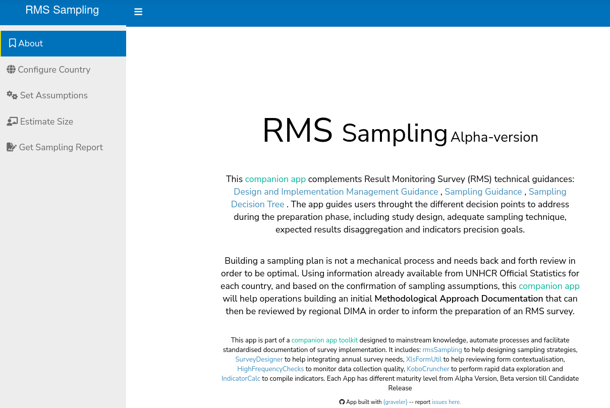
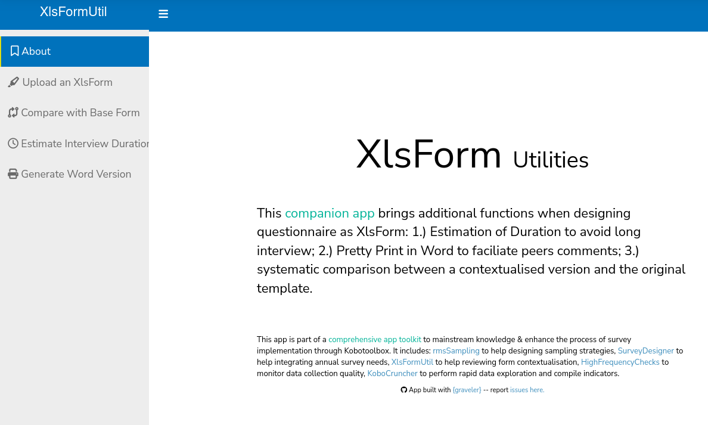
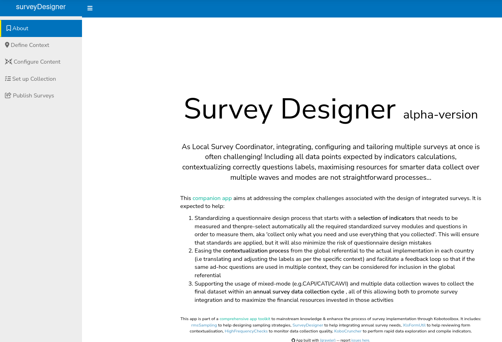
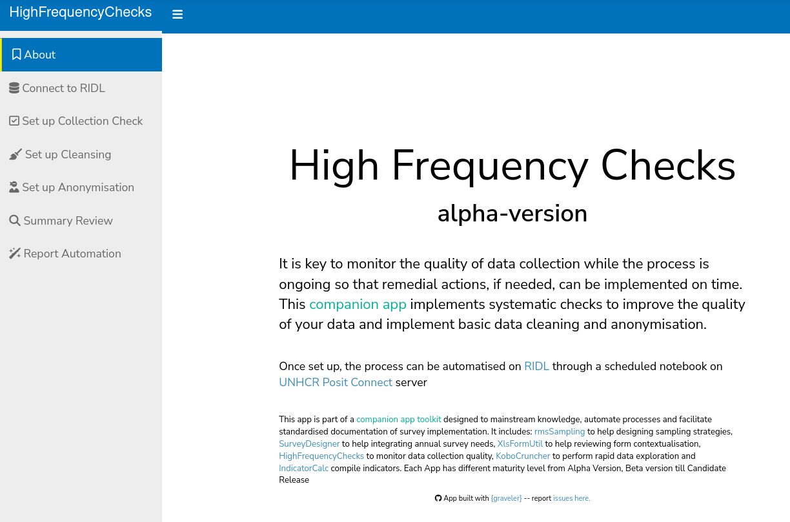
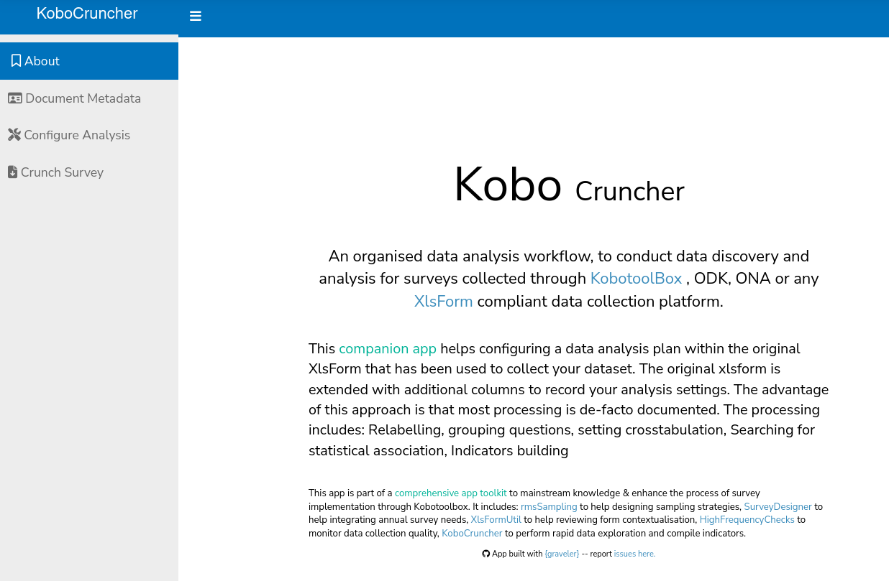
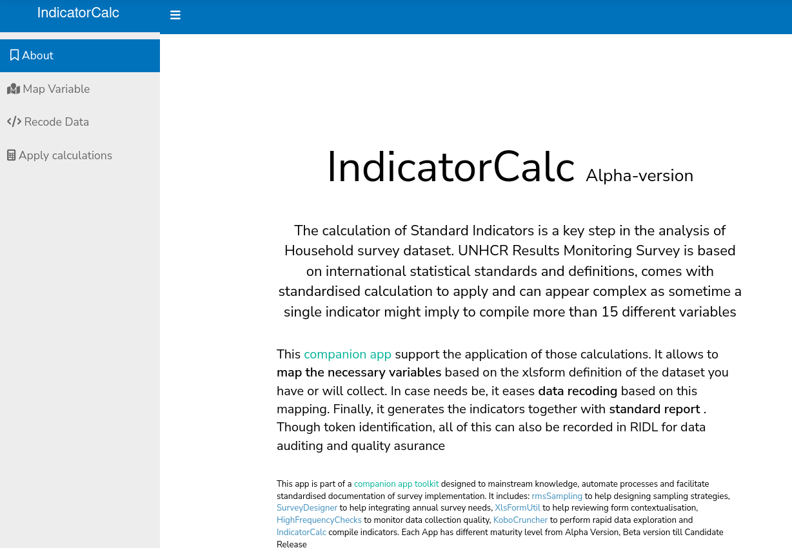
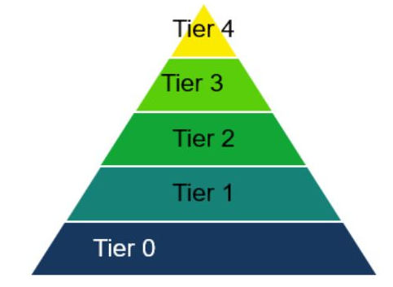

 
## Let's talk Quality!
 
 * Microdata quality in surveys on Forcibly Displaced Populations not only determines the reliability of currently collected information, but also the __quality of any future information__, such as remote sensing data, which requires validation through primary data.
 
 * Any errors introduced during the data collection process of the primary data, will most likely also create further issues with the information __reliability__ in the future. 
 
 * This can __negatively__ influence program design, protection advocacy and policy making
  
---
 
## and Capacity!
 
 * Many Steps in the survey data life-cycle involves data processing steps that cannot be implemented solely with __Excel__. Most field data experts (mostly Information Management Officer generalist) are not sufficiently skilled or trained to use and customize R scripts by themselves.
 
 * Global Scale up of Household Survey can not be rolled out with __ad-hoc international consultancies__, as it can be difficult to build an effective and actionable pool of experts to be mobilized for all operations running a survey in parallel. 
 
 * Even if consultants are being called in, the various steps of the processes needs to be standardized to allow for proper supervision and  __Quality Assurance__ (such as Data Audit trail or Analysis reproducibility).  
 
 * There's a need to __knowledge building__ to improve the processes over time based on field implementation feedback and make it replicable.
  
---

## The Companion App Survey Toolkit 

Need to get tools for field staff with minimal programming skills, that can enhance the overall quality of survey data and support: 

 * Sampling design 
 * Questionnaire design 
 * Data Collection Monitoring
 * Data Analysis 

__SOLUTION__: Dedicated interface helping the implementation and documentation of every steps. Advanced users can also use the functions directly for specific siuations not covered by generic interface.

The toolkit is mirroring the ["Survey Solution"](https://github.com/michael-cw?tab=repositories) project funded by [Joint Data Center](https://www.jointdatacenter.org/improving-the-quality-of-survey-data-on-forcibly-displaced-populations/) for [Kobotoolbox](http://kobo.unhcr.org), the Survey Platform used by UNHCR. It also enforce the usage of UNHCR [Internal Data Repository: RIDL](http::/ridl.unhcr.org).

???
all of which are critical in improving the quality of the data collected and managed on populations affected by forced displacement. With the scope of guaranteeing quality in the different stages of survey design and implementation, this project proposes different tools and methods for:

To cover the target populations in different population settings (i.e. returnee vs. IDPs, host- vs. camp-population) with the most effective sample design, the tool will allow implementation not only of standard sampling approaches (i.e. two stage stratified area sample), which can be used to sample households in host communities, as well as: Sampling from a spatial grid in the absence of any existing area- or list-frame;  Use of gridded population data like WorldPop (https://www.worldpop.org/ );Sampling based on other satellite-based data.
  
     

---

## Companion App: design strategy

 * Minimize scope: rather multiple simple __companion apps__ to be used at different stages of the whole process than a single _do-it-all_ complex one. Because of their restricted scopes, apps are easier to maintain.
 
 * Self-explanatory: Interface developed to help the diffusion of guidance: __learning by doing__ to be paired with __micro-learning__ for field staff in charge of the implementation on the ground
 
 * Open to contribution: Tools built around free or open source solutions and designed to operate in __capacity-constrained environments__ and to enable collaborative development.

---

## Starting with sampling frame

The construction of the sampling frame & the selection of the appropriate sampling design is crucial to produce statistically valid estimates that ensure results representativeness

 - Sampling frames are the backbones of __probability-based__ sampling design. They plays one of the main roles in determining quality and reliability for the survey  

 - Available frames often __do not meet basic criteria__: being current, comprehensive and sufficiently informative on the variable(s) of interest in the target population. In addition, target population size can be small and/or the population is hard to reach 

---

## Companion App {rmsSampling}

.pull-left[

Scope: 

 - Start from the country data as from ASR

 - Select the methodology based on a decision tree for each group

 - Define sample size based on expected accuracy

App Maturity: __Alpha-version__ 

 - [Initial Wireframe created](https://rstudio.unhcr.org/rmsSampling/)
 - [Link to doc](https://github.com/unhcr-americas/rmsSampling)

 - [ISSUE -- Pending discussion on decision tree](https://github.com/unhcr-americas/rmsSampling/issues/1)

 - [ISSUE -- Adjust sample size calculation based on method](https://github.com/unhcr-americas/rmsSampling/issues/2)

]

.pull-right[

.img85[] 

]
        
---

## Questionnaire design 

Enabling users planning to collect data, with basic to minimal programming knowledge,  to easily create questionnaires tailored for populations affected by forced displacement. 
 
Questionnaire templates designed to incorporate recommended checks and verifications of question and response options. 

How to implementing multiple interviewing modes during the survey as welll as multiple data collection waves.

---

## Companion App  {xlsFormUtil}

.pull-left[

Scope: 

 - Compare contextualized version with baseline global template

 - Estimate the survey duration 

 - Provides a pretty-print version of the master version

App Maturity: __Release-Candidate__ 

 - [Link to app](https://rstudio.unhcr.org/XlsFormUtil/)
 - No specific elements of complexity...
 - [Link to doc](https://unhcr-americas.github.io/XlsFormUtil/)
]

.pull-right[

.img85[] 

]

---

## Companion App {surveyDesigner} 

.pull-left[

Scope: 

 - Start questionnaire design from indicators selections
 
 - Provide scenarios over multiple data collection an waves and mode to optiomise the cost/quality threshold
  
App Maturity: __alpha-version__

 - [Initial Wireframe created](https://rstudio.unhcr.org/Survey_Designer/)
 - [Link to doc](https://unhcr-americas.github.io/surveyDesigner/)
 
 - [ISSUE -- Build cost/quality threshold simulation](https://github.com/unhcr-americas/surveyDesigner/issues/27)
 
 - [ISSUE -- Create a directory of indicators to questions](https://github.com/unhcr-americas/surveyDesigner/issues/22)

 
]

.pull-right[

.img85[] 
]

---

##  Fieldwork and data quality assurance

Real time quality monitoring and the use of metadata and paradata facilitate quality control, but often presents challenges for the survey practitioners  

Processing metadata and paradata opens avenues for understanding the behavior of the survey respondents, interviewers and improvement of the questionnaire. 
 

---

## Companion App {HighFrequencyChecks}

.pull-left[

Scope: 

 - Assess the quality of enumerator work according to predefined check on regular basis

 - Perform data cleaning through a documented and standardised data cleaning log

 - Apply a first level of data anonymisation in order to obtain "Scientific Use File"
 
 - All points above systematically recorded in RIDL allowing the data to go from the __raw_ to _cleaned & anonymised_ status, so that indicators can be calculated.

App Maturity: __beta-version__

 - [Link to app](https://rstudio.unhcr.org/HighFrequencyChecks/) 
 - [Link to doc](https://edouard-legoupil.github.io/HighFrequencyChecks/)
]

.pull-right[

.img85[] 
]

---

##  Data Exploration and Indicator Calculation

Working in Excel for large complex survey dataset is not a sustainable option

Reproducibility is a key element to enforce

---

## Companion App {koboCruncher} 
.pull-left[

Scope: 

 - Ease relabeling, grouping , cross-tabulation
 
 - Direct connection to RIDL to enable data audit

App Maturity: __beta-version__
 

 - [Link to app](https://rstudio.unhcr.org/kobocruncher/) 
 - [Link to doc](https://unhcr-americas.github.io/IndicatorCalc/)
]

.pull-right[

.img85[] 

]

---

## Companion App   {IndicatorCalc}

.pull-left[

Scope: 

 - Perform a mapping between a specific survey and expected variables/modality for on survey
 
 - Ease variables recoding
 
 - Output standard report and dataset for indicators - included directly in RIDL

App Maturity: __beta-version__
 

 - [Link to app](https://rstudio.unhcr.org/IndicatorCalc/) 
 - [Link to doc](https://rstudio.unhcr.org/XlsFormUtil/)
]

.pull-right[
.img85[] 

]

---

##  From Prototype to Production

.pull-left[

Applying Standard Multi-Tier IT Standard Support model...
 
  * __Tier 4__: Code Review & Quality Insurance (_Contracted Company with frame agreement_) 

  * __Tier 3__: Internal development (_one yearly R developers meeting to establish roadmap and incentivize contributing staff_)

  * __Tier 2__: User induction & Advanced User Support (_Global Data Service/DIMA_)  

  * __Tier 1__: Basic User Troubleshooting (_according to Documented Scenario_)

  * __Tier 0__: Self-support / Package documentation (_maintained and improved on continuous basis_)

]
.pull-right[
.img75[] 
]

---

## Using pacakges....

 - Kobo [Data Collection Management](https://edouard-legoupil.github.io/HighFrequencyChecks/tutorial/index.html) 
 
 - Kobo [Survey Data Exploration](https://edouard-legoupil.github.io/kobocruncher/tutorial/00-Intro.html#1) 
 
 - Apply [Indicator calculations for RMS](https://edouard-legoupil.github.io/IndicatorCalc/tutorial/index.html)