 

# Learning objectives


.pull-left[ 


Work as a team!

  * Understand why you need to use Git

  * Understand Git workflow
  
  * See git good practices
  
  * Use github as a portfolio to ease work discovery
  

  
]
.pull-right[
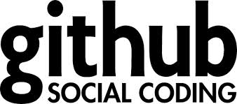 
]


---

## Integrate Git within Rstudio   

.pull-left[ 

Create an account on Github - https://github.com/join?  

install Github desktop https://desktop.github.com/  on your computer, open it and authenticate yourself. Then close the software.

Then from Rstudio TOOL> Global Options > GIT>SVN

and configure the path to your git.exe executable in your computer, apply and restart

]
.pull-right[
.img50[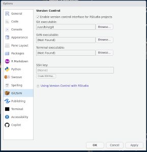] 
]

Find the path of git executable: Change your --WINDOWSUSERNAME-- below

```
C:\Users\--WINDOWSUSERNAME--\AppData\Local\GitHubDesktop\app-3.3.5\resources\app\git\cmd
```
More details on how to Connect Rstudio & Github: https://happygitwithr.com/rstudio-git-github.html   
 
---

## Git workflow


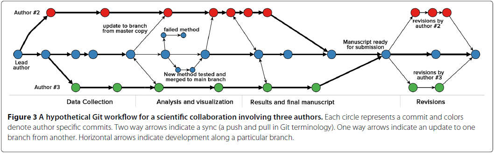

---

## Git - What

.pull-left[ 

Free: you don't need to pay to use any functionality

Open source: Anyone can modify or contribute to the Git code

Distributed: run Git on your local machine... all machines maintain a copy of the action history (commits) and can be synchronized at any time.

Version Control: save changes made to one (or several) file(s) over time. makes it easy to go back to previous versions (time travel) and coordinate several people working on the same file/project


]
.pull-right[
.img75[] 
]


---

## Git - When 


.pull-left[ 

Have you changed a code and now it doesn't run/compile anymore?

Do you want to avoid the previous situation altogether?

Do you want to guarantee the integrity of the code in production?

Do you want to keep a history of the contributions each member made to the project and its evolution? 


]
.pull-right[
.img75[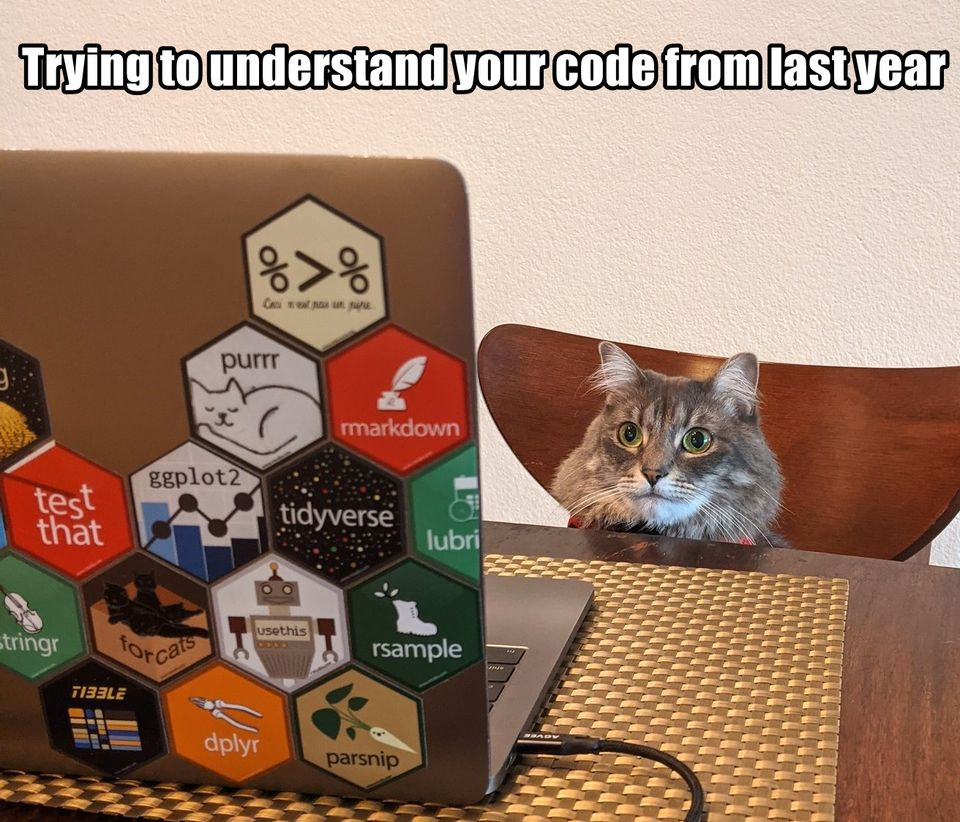] 
]

???

go back to the previous version with one (or two) commands on the terminal

use "branches" to make and test the changes before deploying  the new code to production.

use pull request

---

## Git - Why


.pull-left[ 

> If you want to go fast, go alone; if you want to go far, go together

 * Collaboration 

 * Agility 

 * Application integrity 

 * Privacy
 
 * Work Recognition

]
.pull-right[
.img75[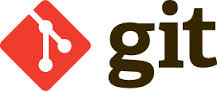] 
]

---

## Git - Good practises

.pull-left[ 

#### Do 

 * Make your checkpoints: Commit often
 
 * Test your code before pushing: Do not commit incomplete code

 * Break the task into several small sub-tasks: Commit only related work

 * Use branches: Update the master code with pull requests

 * Write descriptive/meaningful commit messages: Commit only related work. Limit your subject to 50 character. The commit message must complete the sentence "This commit ...". Use the body of the message to explain “what” and “why”, not “how”


]
.pull-right[ 

#### Don’ts

 * Don’t git push straight to master.

 * Do not commit files that can be regenerated (e.g. binary, graphs)

 * Do not commit configuration files (e.g. “.vscode/”, access tokens)

 * Do not change a repository's public history

 * Avoid rewriting the master’s history.

]


---

## Git -  Account Settings

```
usethis::use_git_config(user.name = “User Name”,
		                       user.email = “email@email.com”)
usethis::git_sitrep()
```

???
You only need to set this configuration once in your computer
Use the email of your Github account

---

## Git - Personal Access Token (PAT)


.pull-left[ 

Opens a browser window to the GitHub form to generate a PAT. You can change the PAT’s name. 

```

usethis::create_github_token()
```
After you have created the PAT, copy the token and register the token in your computer
]
.pull-right[ 

The command will open the .Renviron file
```

usethis::edit_r_environ()
```

Insert the variable GITHUB_PAT and paste the token as it value:
.img75[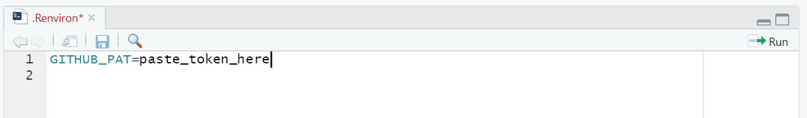] 

Restart R in RStudio: Ctrl-Shift-F10
]


---

## Git Essentials - Clone

.pull-left[ 

Create a repository in GitHub, Name it: “first_repo”, Choose it visibility (in this case, we can set it to public) 

Select Add a README file 
Click Create repository 


.img75[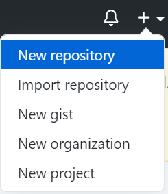] 


]
.pull-right[ 
Create a new project in RStudio

File > New Project > Version Control > Git
 
Repository URL: Paste the GitHub repository URL (it ends with a ".git")

Project directory name: is auto filled with the repository name, after you paste the URL

Create project as subdirectory of: set the path of the local git repository
 
Create a new R file
Add some content and save it 
] 

---

## Git Essentials - Clone & Push


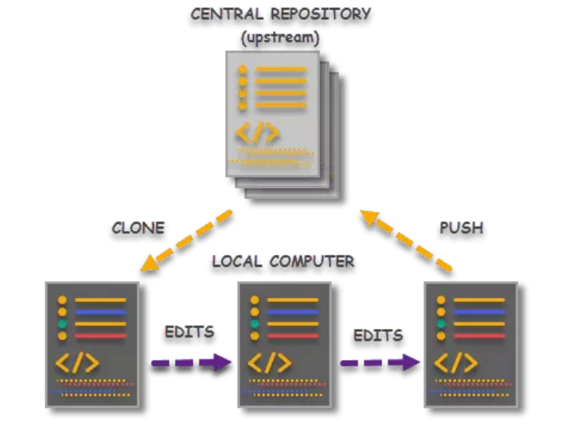

---

## Git Essentials - Stage - Commit 

.pull-left[  

Let’s push the changes to GitHub

  *  Go to the Git tab
  
  *  Staged the file 
  
  *  Add a commit message 
  
]
.pull-right[
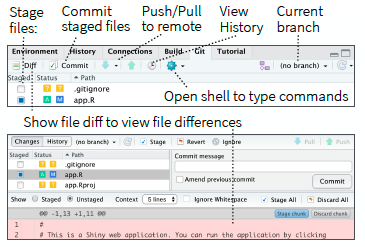
]

---

## Git Essentials - Stage - Commit 

.pull-left[  

Let’s push the changes to GitHub

 
  
  *  Click Commit
  
  *  Click Push 
  
  *  Refresh the repository website
  
]
.pull-right[
.img75[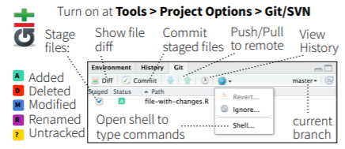] 
]


---

## Git Essentials - Fork  


.img75[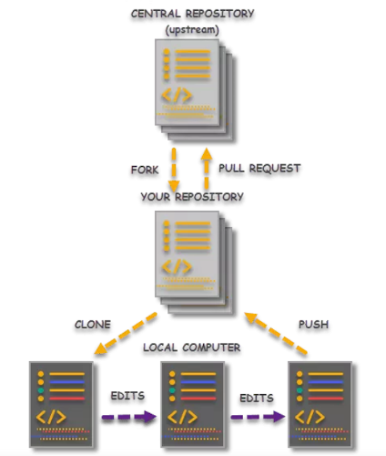]  


---

## Git Essentials - Fork  


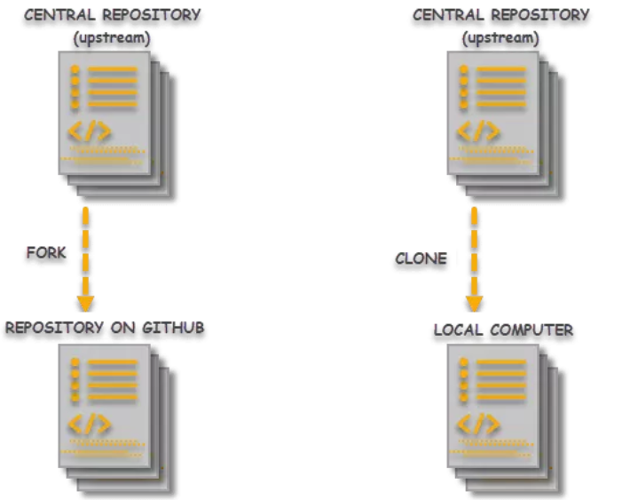

---

## Git Essentials - Pull Request (PR)


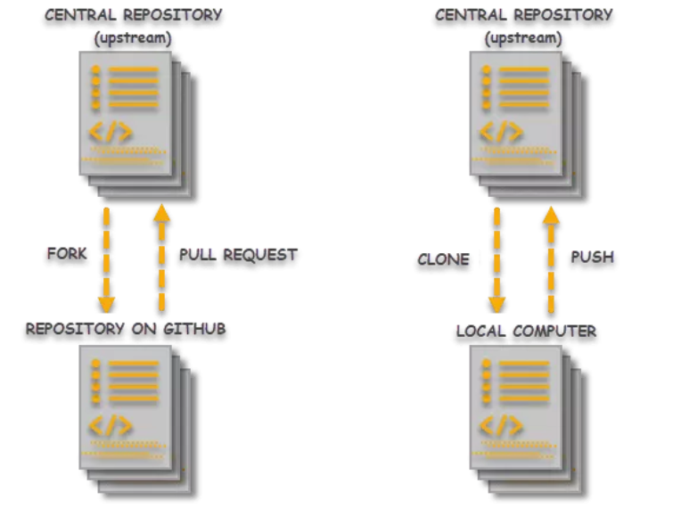


---

## Submit  Pull Request (PR)

__Good practice:__ use pull requests reviewed by at least another team member

Opens a browser window to the GitHub Pull Request page

Click “Create pull request”

Add a message explaining the pull request content and click “Create pull request”

Now the repository owner will evaluate your PR and if everything is alright, he/she will merge the PR to the master repo 

After the PR have been merged to the master repo, delete the local branch

---

## GitHub Issue Submission

.pull-left[  

2 main type of  Issues:
 1. Bug Tracking: Centralized platform for tracking and addressing software bugs.
 2. Enhancement Requests: Provides a structured way to propose and discuss new features or improvements.

 
]
.pull-right[

Benefits of Submitting Issues:

 *  __Clear Communication__: Offers a clear channel for communication between users and developers.
 *  __Documentation__: Serves as documentation for identified problems or desired enhancements.
 *  __Community Involvement__: Encourages community involvement by allowing users to contribute to issue discussions.

]

---

## How to Submit an Effective GitHub Issue:

 *  __Detailed Title__: Use a concise and descriptive title that summarizes the issue.
 
 *  __Reproducible Steps__: Clearly outline the steps to reproduce the issue, making it easier for developers to understand and address.
 
 *  __Expected vs. Actual Behavior__: Clearly state what behavior you expected and what behavior you observed.
 
 *  __Environment Information__: Provide details about your operating system, software version, and any relevant configurations.
 
 *  __Attachments__: Include screenshots, logs, or other relevant files to provide additional context.


---

## Setting / Github as a webserver

.pull-left[  

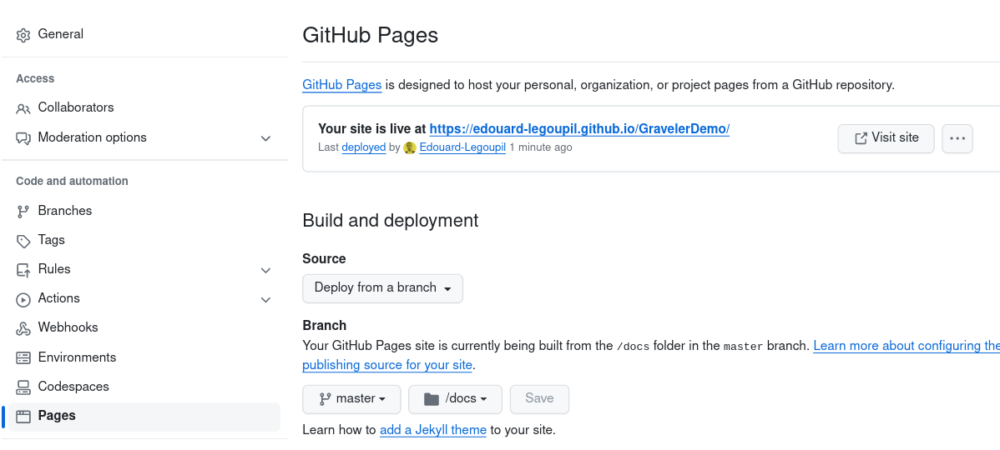
  
]
.pull-right[
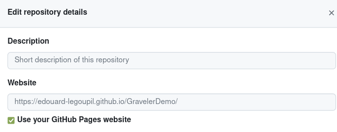
]


---

## Git for Discovery
 
 
.pull-left[  

Set up and organisation account for your operation

HQ: 
 * [UNHCR Population Statistics](https://github.com/populationstatistics/)
 * [UNHCR Dataviz](https://github.com/unhcr-dataviz/)

Region:

 * [DIMA Americas](http://github.com/unhcr-americas) 
 
 * [response4venezuelans](github.com/response4venezuelans) 

Country:

 * [Costa Rica](https://github.com/UNHCR-CostaRica/) 
  
]
.pull-right[


Other Org

 * [World Bank](https://github.com/orgs/worldbank/repositories?q=&type=all&language=r&sort=)

 * [WFP VAM](https://github.com/WFP-VAM/RAMResourcesScripts)
 
 * [REACH IMPACT](https://github.com/impact-initiatives)
 
 * [DHS](https://github.com/DHSProgram/)
 
 * [DFID](https://github.com/DFID/dfid-results-estimates)

> Before any project you have in mind, start with a [search in github](https://github.com/search?q=unhcr+language%3AR&type=repositories&l=R) in order to avoid building from scratch!!!


]

 


---
class: inverse, center, middle

# Thank you

### Questions?


[post Feedback here](https://github.com/unhcRverse/unhcrverse/issues/new?assignees=&labels=enhancement&projects=&template=comment_prex_2_tidyverse.md&title=%5Blearn%5D)


<a href="index.html"><i class="fa fa-indent  fa-fw fa-2x"></i></a>


-> Next you can [learn to use Report Template](08.Template_Report.html)

---

## Ressources

 - [Creating GitHub Portfolios](https://wd3.myworkday.com/unhcr/learning/course/16fc80c3079810011fc3d41e32520000?type=9882927d138b100019b928e75843018d)
 
 - [GitHub Actions for CI/CD](https://wd3.myworkday.com/unhcr/learning/course/db0ba7c05d98100035cf8c5c92240001?type=9882927d138b100019b928e75843018d)

---

## Excercise

 * Fork this repository
 
 * Create branch

 *  Modify a file

 * Commit the changes

 * Create a pull request
