## Most science is not reproducible  

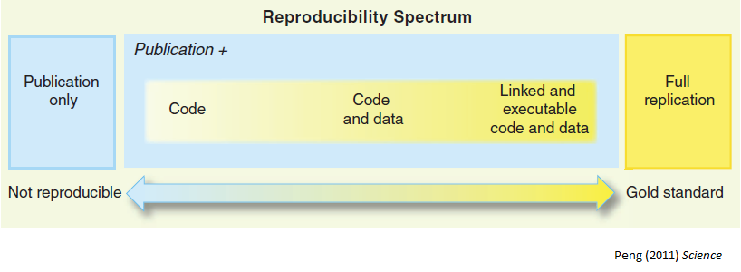

... even within the same lab group over time!

> Your closest collaborator is you 6 months ago, and you don't respond to emails.
<small>P. Wilson</small>

---

## Research workflow 

1. Prepare data (**EXCEL**)

***

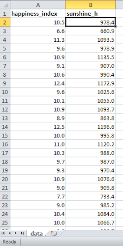

---

## Research workflow 

1. Prepare data (**EXCEL**)

2. Analyse data (**R**)

***

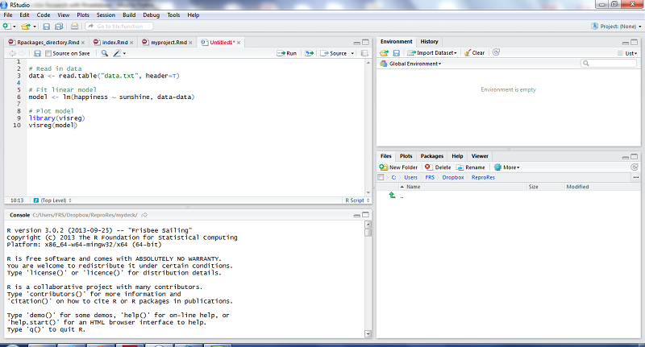

---

## Research workflow 

1. Prepare data (**EXCEL**)

2. Analyse data (**R**)

3. Write report/paper (**WORD**)

***

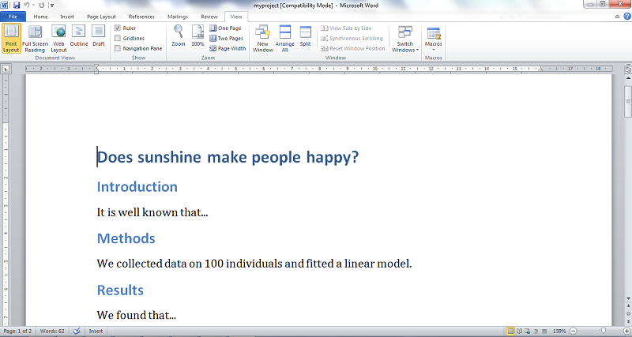

---

## This workflow is broken 

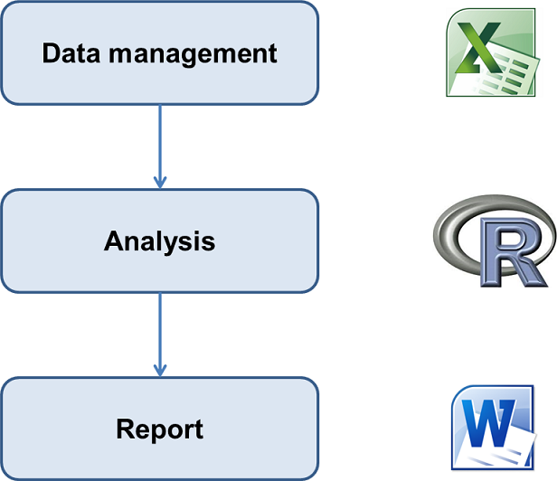

---

## Problems of a broken workflow  

- How did you do this? What analysis is behind this figure? Did you account for ...?

- What dataset was used (e.g. final vs preliminary dataset)?

- Oops, there is an error in the data. Can you repeat the analysis? And update figures/tables in Word!

> A scientific article is advertising, not scholarship. The actual scholarship is the full software environment, code and data, that produced the result.
<small>Claerbout & Karrenbach 1992</small>

---

## Rmarkdown to the rescue! 

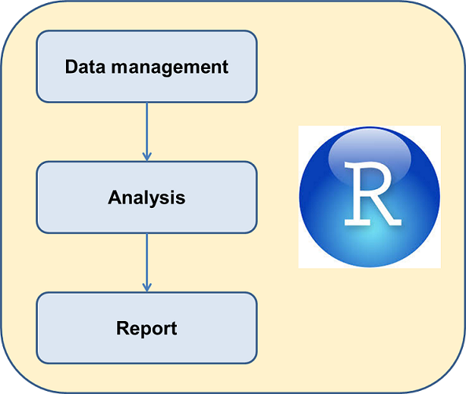

knitr - pandoc - Rstudio

---

## Rmarkdown documents 

* Fully reproducible (trace all results inc. tables and plots)

* Dynamic (regenerate with 1 click)

* Suitable for
    + documents (Word, PDF, etc)
    + presentations
    + books
    + websites
    + ...

---

## Let's see it in action 

In Rstudio, create new Rmarkdown document and click on `Knit HTML`.

=================
left: 30%

Example project:

Does sunshine influence happiness?

See [myproject.Rmd](myproject.Rmd)

***

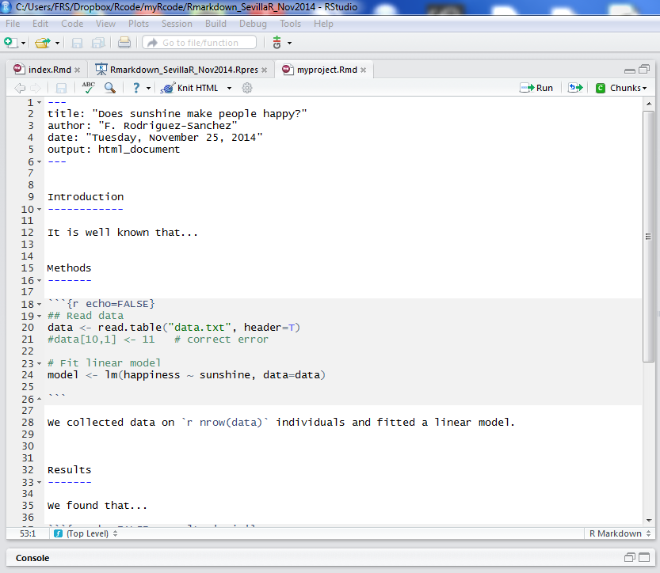

---

## HTML output 

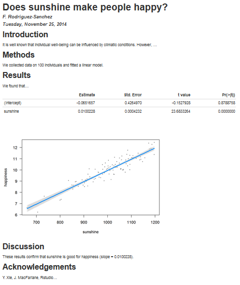

---

## Spotted error in the data? No problem! 
incremental:true

&nbsp;

Make changes in Rmarkdown document, click `knit` and report will update automatically!

---

## Other formats: PDF, Word 

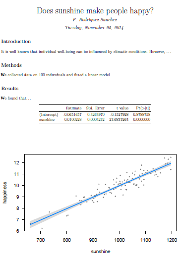

***

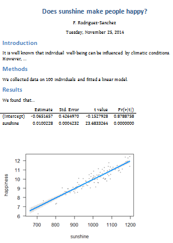

---

## Adding citations 

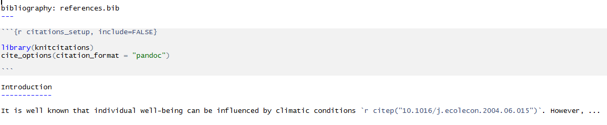

See [output](myproject_citations.html)

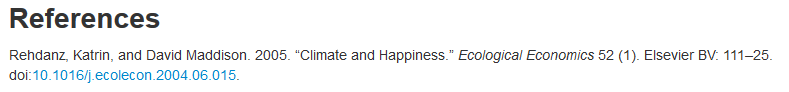

---

## Embedding data and Rmd source in HTML report 

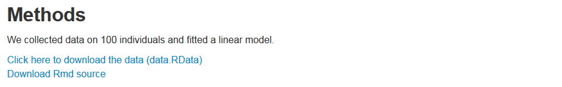

See [myproject_embed.html](myproject_embed.html)

---

## Interactive documents: Rmarkdown + plotly

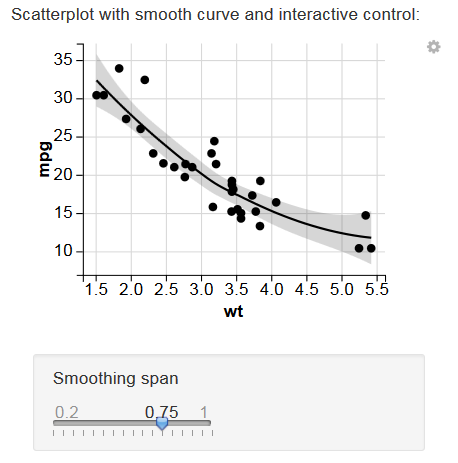

[See examples](http://127.0.0.1:4382/ggvis.Rmd)

---

## Give you and your collaborators a little treat  

---

## Convert your old R scripts to Rmarkdown 

- with [one click in RStudio](http://www.rstudio.com/ide/docs/authoring/markdown_notebooks)

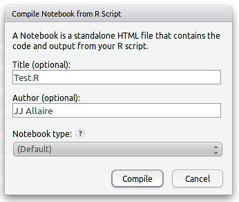

- using `knitr::spin`

---

## Leave behind your current workflow 

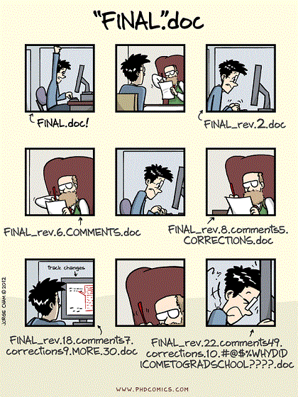

---

## Combine Rmarkdown with version control (Git) 

&nbsp;

R. Fitzjohn (https://github.com/richfitz/reproducibility-2014)

---

## An efficient, fully reproducible workflow based on Rmarkdown and Git 

[K. Ram 2013](http://www.scfbm.org/content/8/1/7)

---

## Doing Reproducible Research 

1. Everything with a script: **avoid manual data manipulation**.

2. Everything **within one directory** (Rstudio projects).
    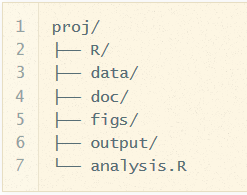

3. Use **relative paths**: "data/dataset.csv" rather than "C:/Users/..."

---

## Doing Reproducible Research (cont.) 

4. Use Rmarkdown to produce reports combining code and results.

5. Record exact versions of software used.
    - sessionInfo()
    - checkpoint
    - packrat
    - etc

---

## Some useful links 

- [Rmarkdown by RStudio](http://rmarkdown.rstudio.com/)

- [Rmarkdown cheat sheet](http://www.rstudio.com/resources/cheatsheets/)

- [Initial steps toward reproducible research](http://kbroman.org/steps2rr/)

- [Course on Reproducible Research by K. Broman](http://kbroman.github.io/Tools4RR/)

- [Reproducible Research in Coursera](https://www.coursera.org/course/repdata)

- [Nice R code](http://nicercode.github.io/guides/reports/)

- [Reproducible Research with R and RStudio](http://christophergandrud.github.io/RepResR-RStudio/)

- [Ten simple rules for reproducible computational research](http://www.ploscompbiol.org/article/info%3Adoi%2F10.1371%2Fjournal.pcbi.1003285)

---

## More links (software/R packages) 

- [CRAN Task View on Reproducible Research](http://cran.r-project.org/web/views/ReproducibleResearch.html)

- [knitr](http://yihui.name/knitr/)

- [pandoc](http://johnmacfarlane.net/pandoc/)

- [pander](http://rapporter.github.io/pander/)

- [rapport](http://rapport-package.info/)

- [reports](http://cran.r-project.org/web/packages/reports/index.html)

- [Rgitbook](http://jason.bryer.org/Rgitbook/)

---

## Find these slides at 

- [GitHub](http://pakillo.github.io/Rmarkdown-talk-Mar2015)

- [Figshare]()

- [Source code and materials](https://github.com/Pakillo/Rmarkdown-talk-Mar2015)

---

## Step 2- Notebook for Data Insights documentation: Analysis Repo

.pull-left[

> Insight: The capacity to gain an accurate and deep understanding of someone or something

Not all charts will emulate need for interpretation - the data analyst need to gemerate the one that can create __debates__.

Charts need to be __crafted__ - for instance use chart title framed as "opening question"...

Insights arive when a multifunctional team is able to explain __unexpected patterns__, to challenge or revise __existing assumptions__, or to identify evidence to support __Call to action__.

]
.pull-right[
.img[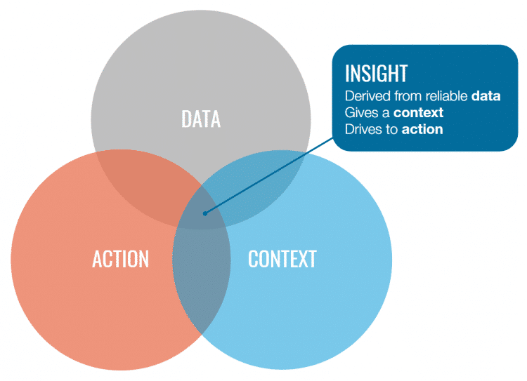] 
]

???
https://www.ictworks.org/wp-content/uploads/2021/02/usaid-guide-artificial-intelligence.pdf
https://bluemoondigital.co/our-blog/5-elements-storytelling-data/
Check the analysis repo: http://analysis.unhcr.org

---

## Step 3- Notebook to communicate with data: Microsite 
.pull-left[
From __assumptions to evidence__ based statement

Data is to support Narrative - not the other way around!

Leverage Art Data Storytelling to: 
 * __Explain__, 
 * __Enlighten__,
 * __Engage__ 

]
.pull-right[
.img75[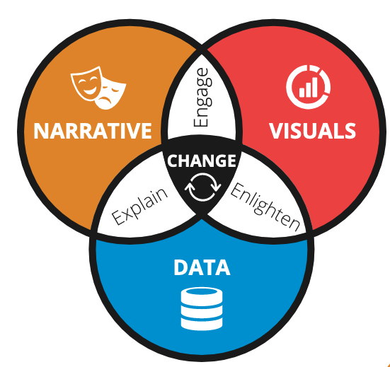] 
]

???
See https://github.com/unhcr-americas/ageingonthemove/blob/main/README.md

https://distill.pub/2020/communicating-with-interactive-articles/#applications-tab 
Research Dissemination
Conducting novel research requires deep understanding and expertise in a specific area. Once achieved, researchers continue contributing new knowledge for future researchers to use and build upon. Over time, this consistent addition of new knowledge can build up, contributing to what some have called research debt. Not everyone is an expert in every field, and it can be easy to lose perspective and forget the bigger picture. Yet research should be understood by many. Interactive articles can be used to distill the latest progress in various research fields and make their methods and results accessible and understandable to a broader audience.
Opportunities

    Engage and excite broader audience with latest research progress
    Remove research debt, onboard new researchers
    Make faster and clearer research progress 

Challenges

    No clear incentive structure for researchers
    Little funding for bespoke research dissemination and communication
    Not seen as a legitimate research contribution (e.g., to the field, or one's career) 

---

