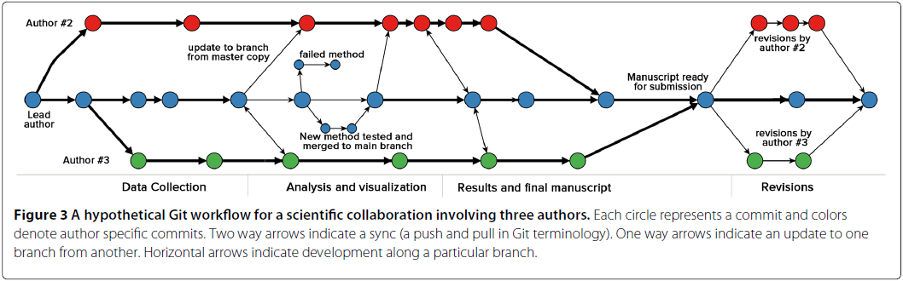

# Learning objectives

  * Work with Report to enable full reproducibility
  
  * Understand the type of reports 
  
  * Rmd & Quarto


---

## Most science is not reproducible  


... even within the same lab group over time!

> Your closest collaborator is you 6 months ago, and you don't respond to emails.
<small>P. Wilson</small>


---

## Research workflow (1/3)


.pull-left[  

1. Prepare data (**EXCEL**)


***
]
.pull-right[


]

---

## Research workflow (2/3)

.pull-left[  

1. Prepare data (**EXCEL**)

2. Analyse data (**R**)


***
]
.pull-right[


]

---

## Research workflow (3/3)


.pull-left[  

1. Prepare data (**EXCEL**)

2. Analyse data (**R**)

3. Write report/paper (**WORD**)


***
]
.pull-right[


]

---

## This workflow is broken 


---

## Problems of a broken workflow  


> A scientific article is advertising, not scholarship. The actual scholarship is the full software environment, code and data, that produced the result.

> <small>Claerbout & Karrenbach 1992</small>

- How did you do this? 

- What analysis is __behind this figure__? 

- Did you account for ...?

- What dataset was used (e.g. __final vs preliminary__ dataset)?

- Oops, there is an error in the data. Can you __repeat the analysis__? <smallAnd update figures/tables in Word!</small>


---

## Leave behind your current workflow 


---

## Rmarkdown to the rescue! 


???
knitr - pandoc - Rstudio

---

## Rmarkdown documents 

* Fully reproducible: trace all your analysis results including:
    + narrative interpretations,
    + tables, 
    + plots and 
    + maps!

* Dynamic (regenerate with 1 click)

* One single file to generate multiple format output:
    + documents (Word, PDF, etc)
    + presentations
    + books
    + websites
    + ...
 
 

---

## What is R Markdown?

  * R Markdown is an authoring format that combines code, text, and results in a single document.
  * It allows you to create reports, presentations, and dashboards with R code and text.
  


Let's Have a look at the [cheatsheet](https://rmarkdown.rstudio.com/lesson-15.html).


---

## Basic Structure

```{markdown}

---
title: "My Report"
output: 
  html_document
---

# Section 1
This is a text section.
```

---

## Intermingled prose (narratives) and code

There are two types of code in an Rmd document: code chunks and inline R code. Below is a quick example from the [Rmarkdown Cookbook](https://bookdown.org/yihui/rmarkdown-cookbook/r-code.html):

```` 
```{r}`r ''`
x <- 5  # radius of a circle
```

For a circle with the radius `r knitr::inline_expr('x')`,
its area is `r knitr::inline_expr('pi * x^2')`.
````

A code chunk usually starts with ```` ```{}```` and ends with ```` ``` ````. You can write any number of lines of code in it. Inline R code is embedded in the narratives of the document using the syntax `` `r ` ``. In the above example, we defined a variable `x` in a code chunk, which is the radius of a circle, and calculated its area in the next paragraph.

You can customize the behavior and output of code chunks through chunk options (provided inside the curly brackets `{}`). 


---

## Enable a fully auditable workflow

As soon as all steps (i.e. **DATA + TIDYING + MODELING + VISUALS + NARRATIVE**) are done through **series of written commands recorded in scripts**:

 - when spotting error in the data, or using different dataset, one just need to adjust in the script and report will update automatically;
 
 - Data manipulation becomes be *de facto* fully documented (no more manual changes in Excel);

 - Analysis is self-explanatory and ready for any kind of collaborative review;

 - Customization are facilitated and allow to deliver  final product  with a professional branding and styling.
 
> Analysis becomes streamlined and [reproducible](https://unhcr-americas.github.io/reproducibility)! 

> A "collaboration mode" is enabled from the begining of the process! 

> As your analysis can be reviewed, you become "covered"... 

???

 instead of **hundreds of mouse clicks**
See also http://muschellij2.github.io/summerR_2015/modules/module12.html


 

---

## UNHCR branded report: {unhcrdown}

[`{unhcrdown}`](https://github.com/vidonne/unhcrdown) provides a set of templates following UNHCR Brand recommendations. 

The goal of this package is to ease and speed up the creation of reports, presentation and website while promoting the UNHCR visual identity.

.pull-left[

**Content**

1. Microsoft Word document
2. HTML to PDF paged reports
3. Microsoft PowerPoint presentation
4. HTML slides

```{r eval=FALSE}
# If pak is not yet installed, 
# uncomment the following line:
# install.packages("pak")

pak::pkg_install("unhcr-dataviz/unhcrdown")
```


]

.pull-right[
  * Add organization logos and headers.
  * Maintain a consistent look across reports.


]

---

## Reproducible pipelines with R markdown  

```{r, echo = FALSE, out.width = "70%"}
knitr::include_graphics("img/tools_change_new.svg")
```

---

## Reproducible pipelines with R markdown  

```{r, echo = FALSE, out.width = "100%"}
knitr::include_graphics("img/reproducible_flow_tools.svg")
```

---

## Reproducible pipelines with R markdown  

```{r, echo = FALSE, out.width = "100%"}

```


---

# Combine Rmarkdown with version control (Git) 

&nbsp;


???
R. Fitzjohn (https://github.com/richfitz/reproducibility-2014)


---


## An efficient, fully reproducible workflow based on Rmarkdown and Git 



[K. Ram 2013](http://www.scfbm.org/content/8/1/7)


---

## Doing Reproducible Research 


.pull-left[

1. Everything with a script: **avoid manual data manipulation**.

2. Everything **within one directory** (Rstudio projects).
    


]

.pull-right[

3. Use **relative paths**: "data/dataset.csv" rather than "C:/Users/..."

4. Use Rmarkdown to produce reports combining code and results.

5. Record exact versions of software used.
    - sessionInfo()
    - checkpoint
    - packrat
    - etc

]

 
---

##  Notebook: what for? Generate Data Insights  

.pull-left[

> __Insight__: The capacity to gain an accurate and deep understanding of someone or something

Not all charts will emulate need for interpretation - the data analyst need to gemerate the one that can create __debates__.

Charts need to be __crafted__ - for instance use chart title framed as "opening question"...

Insights arive when a multifunctional team is able to explain __unexpected patterns__, to challenge or revise __existing assumptions__, or to identify evidence to support __Call to action__.

]
.pull-right[
.img[] 
]

???
https://www.ictworks.org/wp-content/uploads/2021/02/usaid-guide-artificial-intelligence.pdf
https://bluemoondigital.co/our-blog/5-elements-storytelling-data/
Check the analysis repo: http://analysis.unhcr.org


---

##  Notebook: what for? Generate Data Stories 

.pull-left[
<span style='font-size:30px;'>From __assumptions to evidence__ based statement</span>

Data is to support Narrative - not the other way around!

Leverage Art Data Storytelling to: 
 * __Explain__, 
 * __Enlighten__,
 * __Engage__ 


]
.pull-right[
.img75[] 
]

???
See https://github.com/unhcr-americas/ageingonthemove/blob/main/README.md

https://distill.pub/2020/communicating-with-interactive-articles/#applications-tab 
Research Dissemination
Conducting novel research requires deep understanding and expertise in a specific area. Once achieved, researchers continue contributing new knowledge for future researchers to use and build upon. Over time, this consistent addition of new knowledge can build up, contributing to what some have called research debt. Not everyone is an expert in every field, and it can be easy to lose perspective and forget the bigger picture. Yet research should be understood by many. Interactive articles can be used to distill the latest progress in various research fields and make their methods and results accessible and understandable to a broader audience.


---

## Use microsite

A microsite is a single web-page or a small cluster of web pages that exist separate from the organization main website and is used for specific campaign. To this regard a microsite can have its own domain or unique URL and a different and distinctive branding. Microsite can typically be built to highlight content from joint study and research process, following a data collection exercise.

Well designed microsite allows to reduce cognitive load, i.e. the amount of working memory resources used to process a piece of information. The better designed is a message the more chances, people will retain it. In order to do that: 

 * Highlight the main __call to action__ in the  microsite subtitle 
 
 * Start with the main __recommendations__ to ensure the readers does not need to wait 10 minutes of reading to find out what the report message is... if not, drop out risk are high.... 
 
 * Aim to be __minimalistic__: The [ideal length of an article](https://torquemag.io/2018/04/optimal-content-length/) should be between 1500 and 2500 characters, taking an average 7 minutes to read. 

 * Have a 2 or 3 main __top level chapters__ max - avoid presenting content in too many chapter to minimize the cognitive cost for reader to absorb the content.  

 * Minimize __overwhelming effects__ by avoiding putting [too many numbers](https://www.unhcr.org/innovation/wp-content/uploads/2018/02/InnovationYearInReview2017_web.pdf#page=21) to avoid [psychic numbing](https://www.arithmeticofcompassion.org/psychic-numbing)
 
???

https://github.com/unhcr-americas/ageingonthemove/edit/main/README.md 


 * [Desperate journeys](https://www.unhcr.org/desperatejourneys/)
 * [Families on the run](https://familiesontherun.org/)
 * [Her Turn](https://www.unhcr.org/herturn/)
 * [Stepping Up](https://www.unhcr.org/steppingup/)
 * [Home Visit Report](https://unhcr-jordan.github.io/home-visit-report)


---

## Key Takeaways

  * R Markdown is a versatile tool for report generation.
  * Parameterized reports enable dynamic customization.
  * Automate report generation for efficiency.
  * Customize and brand reports as needed.

---
class: inverse, center, middle

# Thank you

### Questions?


[post Feedback here](https://github.com/unhcRverse/unhcrverse/issues/new?assignees=&labels=enhancement&projects=&template=comment_prex_2_tidyverse.md&title=%5Blearn%5D) 


<a href="index.html"><i class="fa fa-indent  fa-fw fa-2x"></i></a>


-> Next you can [learn to automatise your reports](09.Automate_generation.html)

---

# Resources


.pull-left[


Workday Training: [Creating Reports and Presentations with R Markdown and RStudio](https://wd3.myworkday.com/unhcr/learning/course/046437bef6c810195cfa22015cc00003?type=9882927d138b100019b928e75843018d)

- [Rmarkdown by RStudio](http://rmarkdown.rstudio.com/)

- [Rmarkdown cheat sheet](http://www.rstudio.com/resources/cheatsheets/)

- [Initial steps toward reproducible research](http://kbroman.org/steps2rr/)

- [Course on Reproducible Research by K. Broman](http://kbroman.github.io/Tools4RR/)

- [Reproducible Research in Coursera](https://www.coursera.org/course/repdata)

- [Reproducible Research with R and RStudio](http://christophergandrud.github.io/RepResR-RStudio/)

- [Ten simple rules for reproducible computational research](http://www.ploscompbiol.org/article/info%3Adoi%2F10.1371%2Fjournal.pcbi.1003285)

- [Nice R code](http://nicercode.github.io/guides/reports/)

]

.pull-right[

- [CRAN Task View on Reproducible Research](http://cran.r-project.org/web/views/ReproducibleResearch.html)

- [knitr](http://yihui.name/knitr/)

- [pandoc](http://johnmacfarlane.net/pandoc/)

- [pander](http://rapporter.github.io/pander/)

- [rapport](http://rapport-package.info/)

- [reports](http://cran.r-project.org/web/packages/reports/index.html)

- [Rgitbook](http://jason.bryer.org/Rgitbook/)


]

 
---

# Excercise

 
Create a presentation with key statistical figures for your operation ! 
