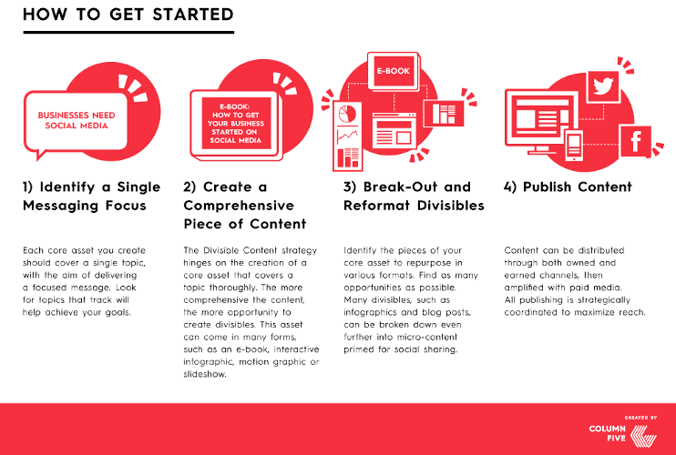

# Learning objectives

  * Introduction to Automation
  * Dynamic Content with parameters
  * Batch Processing
  * Custom Functions
  * Publication on github and Posit Connect

???
https://github.com/vidonne/r-tips#tips


---


## What is Report Automation?


.pull-left[

Automating report generation involves creating reports programmatically.

This ensures that reports are generated consistently and efficiently.

]

.pull-right[
__Benefits__:

  * Time-saving
  * Consistency
  * Reducing errors
  * Scalability
]

---

## Rmarkdown allows to include parameters

R Markdown documents can accept parameters: These parameters allow dynamic customization of reports.


__Example__: Parameterized Report

```{markdown}
---
title: "Dynamic Report"
output: 
  html_document:
    self_contained: false
params:
  author: "John Doe"
---

# Report by `r params$author`

This report is authored by `r params$author`.
```

You can use the knit button to render the report directly - __OR__ you can use `rmarkdown::render()` to render parameterized reports and supply parameter values in the render function.

---

## How to automate report?

  1. Create an R Markdown template with placeholders: Include code for data loading, analysis, and visualization.
  2. Automate data retrieval and processing.
  3. Embed the processed data in the report.
  4. Automate batch report rendering using loops or functions.
  5. Generate multiple reports with different inputs.  
  6. Define dynamic report names using parameters.
  7. Develop custom R functions to encapsulate report generation logic.
  8. Reuse these functions for different reports.
  9. Allow flexibility by defining function inputs and parameters.

---

##  What is Posit Connect?
 
Posit Connect is a platform for sharing, managing, and automating data-driven content.

.pull-left[  

__Features:__

 * Publish R Markdown reports, Shiny apps, Plumber APIs, Jupyter notebooks, and more.
 * Automate content updates and distribution.
 * Collaborate and access content securely.
 * Set up scheduled report execution for regular updates.
 * Specify time intervals (daily, weekly, monthly).
 * Get email notifications for status updates.

]
.pull-right[ 

__Key Benefits:__
 
 * Centralized Content: Store and organize reports, apps, and data in one location.
 * Automated Reporting: Schedule and automate report generation.
 * Collaboration: Share content with team members and stakeholders.
 * Security: Control access to content and ensure data security.
 
]

---

## A practical use case: Weekly Data Digest

You have set up one or more than one Kobo Form for field colleagues to report on their weekly activities

You set up an Rmd report template and would like it to be automatically refreshed and generated every week.

[Check UNHCR bureau weekly report](https://github.com/unhcr-americas/weekly-report)


---

##  Step 1 - Data Access in your report: Security and Authentication

Connect to databases and data sources using token authentication set up as Environment variables.

`Sys.setenv()` and `Sys.getenv()` are functions to set and returns the values of environment variables. All environment variables are saved to your `.Renviron` file 

```{r eval=FALSE}
# Set the MY_VARIABLE environment variable to "my_value"
Sys.setenv(
  "KOBO_API_KEY" = "my_personal_kobo_token")

# Then we can use this environment variable
# to connect to kobo and retried data
robotoolbox::kobo_setup(
  url = "https://kobo.unhcr.org",
  token = Sys.getenv('KOBO_API_KEY')
  )
 
```


???
See also - https://posit.co/blog/git-backed-deployment-in-posit-connect/ & https://docs.posit.co/connect/user/git-backed/#updating-content

 
---

##  Step 2 - Set up and/or refresh the `manifest.json`

You first need to create a documentation file - which allow the Rstudio server to regenerate your report. This files is created by th e `rsconnect::writeManifest`.

Note that if you are the one developing any of this package, you will first need to re-install them from github or gitlab for the manisfest file to be correctly written. See more documentation here: [Git Backed Content - RStudio Connect: User Guide](https://docs.rstudio.com/connect/user/git-backed/)

```{r eval=FALSE}
rsconnect::writeManifest(appPrimaryDoc = "Weekly_Data_Digest.Rmd")
```

 

---

##  Step 3 -  Publish the report to Rstudio Connect from Github

Go to UNHCR Rstudio server - [http://rstudio.unhcr.org](http://rstudio.unhcr.org) - you need first to have a license associated to your account - Contact Global Data Service Data Science team for that.
 
 


---

## Step 4 -  Set up your kobotoolbox API key within Rstudio Connect

You need now to set up the kobotoolbox authentication token within the Rstudio server so that the server can actually pull the data from Kobotoolbox in order to regenerate the Report.


---

## Step 5 -  Set up report frequency generation and sending it to your email


et voila...

---

## Step 6 -  Use power automate to forward automatically the email with the report to the data supervisor

Microsoft Power Automate is a convenient way to automatically re-forward the generated report to the trget audience.

---

## Get more for less effort: Divisible Content Strategy

.pull-left[
 
 .bg-blue[
Nowadays, the average consumer attention span is less than 10 sec. Long reports are therefore less likely to draw large audience.
] 

[“Divisible Content Strategy”](https://www.columnfivemedia.com/divisible-content-strategy-gives-brand-less) consists in breaking  a traditional report into a few articles, an info-graphic, social micro-content, or even a motion graphic video. For instance, if an article includes 5 different charts, each chart can be posted it as a visual tweet implying that the same content can be promoted through different angles.

]

.pull-right[


]

???
https://www.columnfivemedia.com/divisible-content-strategy-gives-brand-less

---


## Organise it as a campaign....





---


## Publication Tips 1/2

 
 1. Each chapter from the report should behave as an independent article. Reports to be shared through usual publication approach on http://data.unhcr.org . Potentially an EPUB version (for people using e-readers) of the report, in addition of the PDF version can be offered.

 2. The full report can be shared within existing platform and sub-articles can be shared in parallel within blogging platform like Medium4 or pre-identified publication partner.

 3. Article Headline shall be eye-catching to pique the interest of the audience: Use verbs, keep length under between60–100 characters5.

 4. The ideal length of an article should be between 1500 and 2500 characters, taking an average 7 minutes to read6.

 5. Charts should be self-explanatory in order to be engaging. This implies to have both a title (with same constraint that a headline, less than 80 char) and sub-title that should act as a short interpretation hint. Chart items should be concise (less than 40 characters). There should be a chart caption stating the reference and date of the data collection as well as the number of observations and confidence interval. A good chart shall deliver a clear message in less than 10 seconds, it is therefore key to adopt a minimalist design.

 6. Content shall include integrated social media sharing tools (like “Click to Tweet”) in order to make it easy for readers to share interesting information within the content. Shareable content shall include systematically one graphic from the article as it acts as a powerful micro-content, i.e. teaser for the main story.

---


## Publication Tips 2/2


 7. Content shall systematically include a call to action at the end of each article, direct the audience to take the next action: link to donate, link to the full report, link to the most recent appeal or link to subscribe to mailing list.

 8. Publication timing should be planned: according to research, the optimal times to publish posts are Monday and Thursday at 9:30 a.m. EST, with most blogs being read at around 11 a.m.

 8. Core piece of content shall be tweeted and shared in other social medias 3-4 times the first day using the main angle. The rest of microcontents can be tweeted in the rest of the first week.

 9.  Notify subscribers once by email, a day after the piece has gone live. This gives some lead time to get the social share numbers up, which increases the chances that others will share.

 10. An editorial calendar and media plan should be established in advance so a human story and a Briefing Note can accompany the release of each report
 

---


## Building Publication-Tailored Content 

Having refugee and displacement topics in major news channel is key to retain public attention and consequently fundraising.

Instead of pitching content to publishers post-completion, __bringing publishers into content development__ and ensuring that it will be appealing to their audience from the start has a lot of advantages: Ideas are vetted by the publishing partner (they may have ideas to share as well), content is designed for the publication’s aesthetic and/or preferences, the publisher provides feedback on content iterations, content is typically co-branded.

Publication-Tailored content approach greatly increases the likelihood of getting published and reaching out to a larger audience, leveraging the time and energy investment and resulting in more traffic to UNHCR regular communication channel.

Continued collaboration with publishers can also change the partnership approach as the same entity can then proactively start asking for high-quality and free content to help support their stories.

???

Though in the recent years, the topic of refugees and displacement has tended to enter the list of overly saturated topics. Journalists, publications, and the public want to know the core message as quickly as possible and press release on institutional website do not get maximum audience.

In order to bring the potential journalist and publishers in the content creation, it requires to __pro-actively identify and reach out to them__.  


---

## Key Takeaways

  * Automation saves time and improves consistency.
  * R Markdown is a powerful tool for report generation.
  * Dynamic content and batch processing enhance automation.
  * Customize reports and explore advanced techniques.
  * RStudio Connect is a powerful platform for sharing and automating data-driven content.
  * Benefits include centralized content, automation, collaboration, and security.
  * Explore publishing, scheduling, and data access features.

 


---
class: inverse, center, middle

# Thank you

### Questions?


[post Feedback here](https://github.com/unhcRverse/unhcrverse/issues/new?assignees=&labels=enhancement&projects=&template=comment_prex_2_tidyverse.md&title=%5Blearn%5D) 


<a href="index.html"><i class="fa fa-indent  fa-fw fa-2x"></i></a>

---

# Reference 

  - [Cleaning Bad Data in R](https://wd3.myworkday.com/unhcr/learning/course/046437bef6c810195cfac68c28de0003?type=9882927d138b100019b928e75843018d)
  
  - [R Programming in Data Science: High Variety Data](https://wd3.myworkday.com/unhcr/learning/course/046437bef6c810195cfaac05b5660005?type=9882927d138b100019b928e75843018d)
  
  - [Text Analytics and Predictions with R Essential Training](https://wd3.myworkday.com/unhcr/learning/course/046437bef6c810195cf498b2cb990006?type=9882927d138b100019b928e75843018d)
  
  - [Documentation Posit Connect](https://docs.posit.co/connect/) 
  
 
---

# Excercise

Let's automate the data cleaning report!