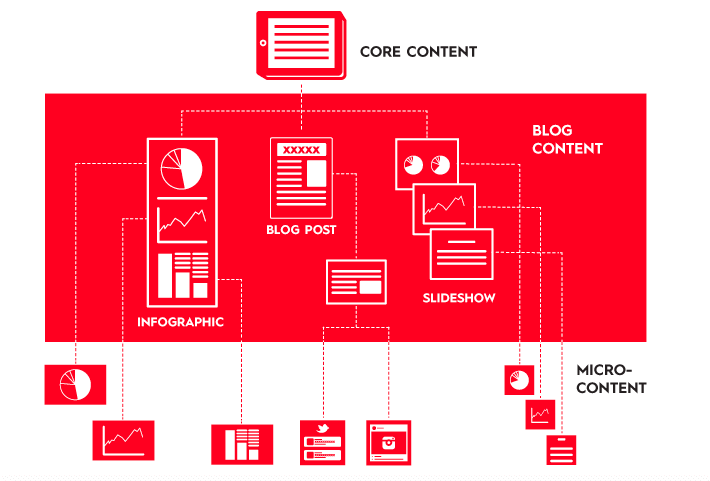

# Learning objectives

  * Introduction to Automation
  * Dynamic Content with parameters
  * Batch Processing
  * Custom Functions
  * Publication on github and Posit Connect

???
https://github.com/vidonne/r-tips#tips

--- 
 
## Parameterized Reports
- R Markdown documents can accept parameters.
- These parameters allow dynamic customization of reports.

---

## Example: Parameterized Report

```{markdown}
---
title: "Dynamic Report"
output: 
  html_document:
    self_contained: false
params:
  author: "John Doe"
---

# Report by `r params$author`

This report is authored by `r params$author`.
```


---

## Rendering Parameterized Reports

    Use rmarkdown::render() to render parameterized reports.
    Supply parameter values in the render function.

 
---

## Create a Template

  * Create an R Markdown template with placeholders.
  * Include code for data loading, analysis, and visualization.

---

## Automate Data Processing

  * Automate data retrieval and processing.
  * Embed the processed data in the report.

---

## Batch Report Generation

  * Use a loop or function to generate multiple reports.
  * Generate reports for different datasets or parameters.

---


## What is Report Automation?

  * Automating report generation involves creating reports programmatically.
  * This ensures that reports are generated consistently and efficiently.

---

## Benefits of Automation

  * Time-saving
  * Consistency
  * Reducing errors
  * Scalability

---

## Setting Up the Environment

R Markdown

  * Use R Markdown for report creation.
  * Install and load the rmarkdown package.

R Script

  * Write R scripts to perform data analysis and create dynamic content.
  * Organize your project with clear folder structures.

---

## Report Structure

    Organize your report with headers and sections.
    Use YAML metadata to define report options.

Code Chunks

    Use code chunks to insert R code and generate results.

Parameters

    Use parameters to make your report dynamic.
    Pass parameters from R scripts to R Markdown.

Inline R Code

    Embed R code inline in your report to display dynamic content.

---

## Batch Rendering

  * Automate batch report rendering using loops or functions.
  * Generate multiple reports with different inputs.  
  * Define dynamic report names using parameters.

---

## Create Custom Functions

  * Develop custom R functions to encapsulate report generation logic.
  * Reuse these functions for different reports.
  * Allow flexibility by defining function inputs and parameters.

---

## Template Libraries

  * Explore template libraries for R Markdown.
  * Leverage existing templates for various report styles.
  * Customize templates to match your organization's branding.

---

## Automation Tools

  * Explore automation tools like knitr and rmarkdown.
  * Learn about advanced options for report customization.
  * Integrate R Markdown reports with other tools and platforms.
  
---

## Combine Rmarkdown with version control (Git) 

&nbsp;


R. Fitzjohn (https://github.com/richfitz/reproducibility-2014)


## An efficient, fully reproducible workflow based on Rmarkdown and Git 


[K. Ram 2013](http://www.scfbm.org/content/8/1/7)


---

## Doing Reproducible Research 

1. Everything with a script: **avoid manual data manipulation**.

2. Everything **within one directory** (Rstudio projects).
    

3. Use **relative paths**: "data/dataset.csv" rather than "C:/Users/..."


---

## Doing Reproducible Research (cont.) 

4. Use Rmarkdown to produce reports combining code and results.

5. Record exact versions of software used.
    - sessionInfo()
    - checkpoint
    - packrat
    - etc


---

## Get more for less effort: Divisible Content Strategy

.pull-left[
 
 .bg-blue[
Nowadays, the average consumer attention span is less than 10 sec. Long reports are therefore less likely to draw large audience.
] 

“Divisible Content Strategy” consists in breaking  a traditional report into a few articles, an infographic, social microcontent, or even a motion graphic video. For instance, if an article includes 5 different charts, each chart can be posted it as a visual tweet implying that the same content can be promoted through different angles.

]

.pull-right[



]


---

## Use microsite

A microsite is a single web-page or a small cluster of web pages that exist separate from the organization main website and is used for specific campaign. To this regard a microsite can have its own domain or unique URL and a different and distinctive branding. Microsite can typically be built to highlight content from joint study and research process, following a data collection exercise.

Well designed microsite allows to reduce cognitive load, i.e. the amount of working memory resources used to process a piece of information. The better designed is a message the more chances, people will retain it. In order to do that: 

 * Highlight the main __call to action__ in the  microsite subtitle 
 
 * Start with the main __recommendations__ to ensure the readers does not need to wait 10 minutes of reading to find out what the report message is... if not, drop out risk are high.... 
 
 * Aim to be __minimalistic__: The [ideal length of an article](https://torquemag.io/2018/04/optimal-content-length/) should be between 1500 and 2500 characters, taking an average 7 minutes to read. 

 * Have a 2 or 3 main __top level chapters__ max - avoid presenting content in too many chapter to minimize the cognitive cost for reader to absorb the content.  

 * Minimize __overwhelming effects__ by avoiding putting [too many numbers](https://www.unhcr.org/innovation/wp-content/uploads/2018/02/InnovationYearInReview2017_web.pdf#page=21) to avoid [psychic numbing](https://www.arithmeticofcompassion.org/psychic-numbing)
 
???

https://github.com/unhcr-americas/ageingonthemove/edit/main/README.md 


 * [Desperate journeys](https://www.unhcr.org/desperatejourneys/)
 * [Families on the run](https://familiesontherun.org/)
 * [Her Turn](https://www.unhcr.org/herturn/)
 * [Stepping Up](https://www.unhcr.org/steppingup/)
 * [Home Visit Report](https://unhcr-jordan.github.io/home-visit-report)

---


## Publication Tips 1/2

 
 1. Each chapter from the report should behave as an independent article. Reports to be shared through usual publication approach on http://data.unhcr.org . Potentially an EPUB version (for people using e-readers) of the report, in addition of the PDF version can be offered.

 2. The full report can be shared within existing platform and sub-articles can be shared in parallel within blogging platform like Medium4 or pre-identified publication partner.

 3. Article Headline shall be eye-catching to pique the interest of the audience: Use verbs, keep length under between60–100 characters5.

 4. The ideal length of an article should be between 1500 and 2500 characters, taking an average 7 minutes to read6.

 5. Charts should be self-explanatory in order to be engaging. This implies to have both a title (with same constraint that a headline, less than 80 char) and sub-title that should act as a short interpretation hint. Chart items should be concise (less than 40 characters). There should be a chart caption stating the reference and date of the data collection as well as the number of observations and confidence interval. A good chart shall deliver a clear message in less than 10 seconds, it is therefore key to adopt a minimalist design.

 6. Content shall include integrated social media sharing tools (like “Click to Tweet”) in order to make it easy for readers to share interesting information within the content. Shareable content shall include systematically one graphic from the article as it acts as a powerful micro-content, i.e. teaser for the main story.

---


## Publication Tips 1/2


 7. Content shall systematically include a call to action at the end of each article, direct the audience to take the next action: link to donate, link to the full report, link to the most recent appeal or link to subscribe to mailing list.

 8. Publication timing should be planned: according to research, the optimal times to publish posts are Monday and Thursday at 9:30 a.m. EST, with most blogs being read at around 11 a.m.

 8. Core piece of content shall be tweeted and shared in other social medias 3-4 times the first day using the main angle. The rest of microcontents can be tweeted in the rest of the first week.

 9.  Notify subscribers once by email, a day after the piece has gone live. This gives some lead time to get the social share numbers up, which increases the chances that others will share.

 10. An editorial calendar and media plan should be established in advance so a human story and a Briefing Note can accompany the release of each report
 

---


## Building Publication-Tailored Content 

Having refugee and displacement topics in major news channel is key to retain public attention and consequently fundraising.

Though in the recent years, the topic of refugees and displacement has tended to enter the list of overly saturated topics. Journalists, publications, and the public want to know the core message as quickly as possible and press release on institutional website do not get maximum audience. Instead of pitching content to publishers post-completion, __bringing publishers into content development__ and ensuring that it will be appealing to their audience from the start has a lot of advantages: Ideas are vetted by the publishing partner (they may have ideas to share as well), content is designed for the publication’s aesthetic and/or preferences, the publisher provides feedback on content iterations, content is typically co-branded.

In order to bring the potential journalist and publishers in the content creation, it requires to __pro-actively identify and reach out to them__. As a result, Publication-Tailored content approach greatly increases the likelihood of getting published and reaching out to a larger audience, leveraging the time and energy investment and resulting in more traffic to UNHCR regular communication channel. Continued collaboration with publishers can also change the partnership approach as the same entity can then proactively start asking for high-quality and free content to help support their stories.


---

## Impact measurement of you campaign

The following metrics can be potentially measured at Bureau level on the microsite to assess the success of the dissemination strategy.
  

---

##  What is RStudio Connect?
 
RStudio Connect is a platform for sharing, managing, and automating data-driven content.

Features

 * Publish R Markdown reports, Shiny apps, Plumber APIs, Jupyter notebooks, and more.
 * Automate content updates and distribution.
 * Collaborate and access content securely.

 Key Benefits
 

 * Centralized Content: Store and organize reports, apps, and data in one location.
 * Automated Reporting: Schedule and automate report generation.
 * Collaboration: Share content with team members and stakeholders.
 * Security: Control access to content and ensure data security.

---

## Publish Content
 

 * Use RStudio or rsconnect package to publish R Markdown reports, Shiny apps, etc.
 * Choose deployment options and configure settings.

---

## Scheduling Reports
 

 * Set up scheduled report execution for regular updates.
 * Specify time intervals (daily, weekly, monthly).
 * Get email notifications for status updates.

---

## Collaboration and Sharing
 
 * Collaborate with team members and stakeholders.
 * Control access and permissions to content.
 * Share content with a secure link.

---

## Versioning

 * Keep track of content changes and revisions.
 * Valuable for auditing and ensuring data consistency.

---

## Data Access

 * Connect to databases and data sources.
 * Retrieve and update data as needed.

---

##  Security and Authentication
 
 * Configure user authentication and encryption for content.
 * Adhere to security standards.

 

---

## Key Takeaways

  * Automation saves time and improves consistency.
  * R Markdown is a powerful tool for report generation.
  * Dynamic content and batch processing enhance automation.
  * Customize reports and explore advanced techniques.
  * RStudio Connect is a powerful platform for sharing and automating data-driven content.
  * Benefits include centralized content, automation, collaboration, and security.
  * Explore publishing, scheduling, and data access features.

---

## Next Steps

Apply these tips and tricks to your projects for efficient report automation.


Thank you for participating  

Questions? 

Reference: https://docs.posit.co/connect/ 