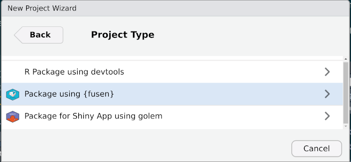
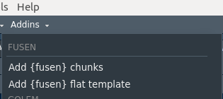
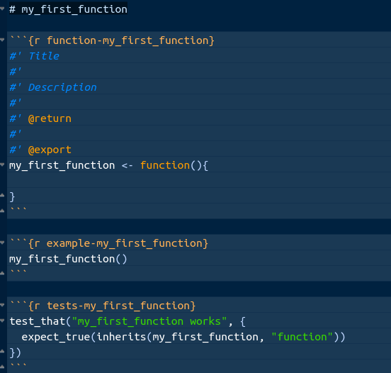

# Learning objectives

 * Why creating packages?
 
 * How to transition from functions to packages, 
 
 * Why documentation is crucial
 
 * Most current issues to fix package check

---


## Why Create Packages?

__Code Organization__

  * Packages are a collection of functions, data, and documentation that group related functions and data into a single unit.
  
  * They help you organize your code.   
  

__Code Reusability__

  * A package can be easily shared and used across different projects.
  
  * Share your work with others or your future self.
  
  * Functions and datasets are easily accessible.

__Collaboration__

  * Share your packages with the R community.
  
  * Contribute to the R ecosystem.


---

## Package Directory Structure

``` 

MyPackage/
|-- R/
|   |-- my_function.R
|-- data/
|   |-- data_made_available_with_the_package.Rda
|-- data-raw/
|   |-- data_used_for_package_development.csv
|-- inst/
|   |-- file_to_be_access_by_the_package.R
|
|-- man/
|   |-- my_function.Rd
|-- docs/
|   |-- index.html
|
|-- DESCRIPTION
|-- NAMESPACE
|-- README.md
|-- NEWS.md
```

 
---

##  Steps to Create a Package with {fusen}


.pull-left[  

Install the Fusen package

```
install.packages("fusen")

```

and benefit from a predefined project structure to speed-up package development

]
.pull-right[
.img75[] 
]


---

##  Use a single markdown file to build your package


.pull-left[  

The {fusen} Rmarkdown template encourages users to fill their documentation and tests at the same time of writing their functions code. 

 {fusen} simplifies and reduces the number of steps towards a full R package.
 
After that, your {pkgdown} documentation website is one command away to be shared with all your users.

]
.pull-right[
.img75[] 
]


---

##  Add a function in your package 

 


.pull-left[  
 

]
.pull-right[
 
]

  
 

---

##  Documentation Is Essential

Documentation provides information on how to use a package.
README.md provides the main pitch for your package

Each functions comes with its documentation and an example

Vignettes are either like tutorial to quickstart your users or technical documentation explaining how to orchestrate the functions

Companion website to be generated with `pkgdown::build_site()`

Create a _pkgdown.yml file and Use [unhcrtemplate](https://github.com/unhcr-dataviz/unhcrtemplate) to apply unhcr brand on your website documentation

``` 
template:
  package: unhcrtemplate
  bootstrap: 5
```

 


---

## Add demo data 


.pull-left[  


For users to understand your package and for your to test each functions within your package, you need to provide a demo data set
  

Including a demo dataset in your R package not only enriches user experience but also contributes to the overall accessibility and reliability of your package.

There are different ways to do it...
  
]
.pull-right[ 
``` 

MyPackage/
|-- data/
|   |-- data_made_available_with_the_package.Rda
|-- data-raw/
|   |-- data_used_for_package_development.csv
|-- inst/
|   |-- file_to_be_access_by_the_package.R
```
]


  


---

## Managing release

  * Follow semantic versioning (SemVer) principles.
  * Increment versions based on changes (major, minor, patch).
  * Specify the license in your package's DESCRIPTION file. Use MIT license and reference unhcr

Alpha Version:

  * Alpha versions are the earliest stages of software development.
  * They are typically not feature-complete and may contain many bugs and incomplete features.
  * Alpha versions are often used for internal testing and may not be released to the public.
  * Developers use alpha versions to identify and fix major issues.

Beta Version:

  * Beta versions come after alpha versions in the development cycle.
  * They are more stable than alpha versions but may still contain bugs and issues.
  * Beta versions are often released to a select group of users for testing, known as beta testers.
  * Beta testing helps identify issues and gather user feedback before the final release.

Release Candidate (RC):

  * A release candidate is a version of the software that is considered stable and feature-complete.
  * RC versions are released to a wider audience for testing to ensure there are no major issues.
  * If no critical bugs are found in the release candidate, it may become the final release.
 


---

## Package Dev 


.pull-left[  
Checks

  * Regularly perform package checks using devtools::check().
  * Address any warnings, errors, and notes.  
  * Use R CMD check to test your package thoroughly.  
  * Address any issues identified by this tool.  
  * Profile your code with profvis.  
  * Identify bottlenecks and optimize them.  

Bug Fixes and Updates

  * Regularly fix reported bugs and update the package.  
  * Keep it compatible with new R releases and dependencies.  

]
.pull-right[
Robustness

  * Make your package robust against different inputs.  
  * Handle errors and exceptions gracefully.   
  * Implement thorough unit tests using testthat.  
  * Ensure tests cover the majority of package functionality.  

Testing on Different Platforms
 
 
  * Set up a CI system (e.g., GitHub Actions, Travis CI).
  * Automatically run tests on code changes.
  * Ensure your package works on multiple platforms.
  * Test compatibility with different R versions.
]

---

## If you want to go fast, go alone, if you want to go far, go together

  * __Community Engagement__: Engage with the R community and respond to user feedback, Consider contributions from other developers.

  * __Code of Conduct__: Include a code of conduct in your package to promote an inclusive community.

  * __Long-Term Maintenance__: Plan for long-term maintenance and have a transition plan in place.

  * __Peer Review__: Consider having your package peer-reviewed by other R developers.

---

## Conclusion

  * Creating packages in R is essential for code organization and sharing.
  
  * Transition from standalone functions to packages for better code management.
  
  * Proper documentation is crucial for effective collaboration and code sharing.

---
class: inverse, center, middle

# Thank you

### Questions?


[post Feedback here](https://github.com/unhcRverse/unhcrverse/issues/new?assignees=&labels=enhancement&projects=&template=comment_prex_2_tidyverse.md&title=%5Blearn%5D) 


<a href="index.html"><i class="fa fa-indent  fa-fw fa-2x"></i></a>

---

# Reference

 - [Hadley - R packages](https://r-pkgs.org/)
 
 - [Fusen](https://thinkr-open.github.io/fusen/index.html)

