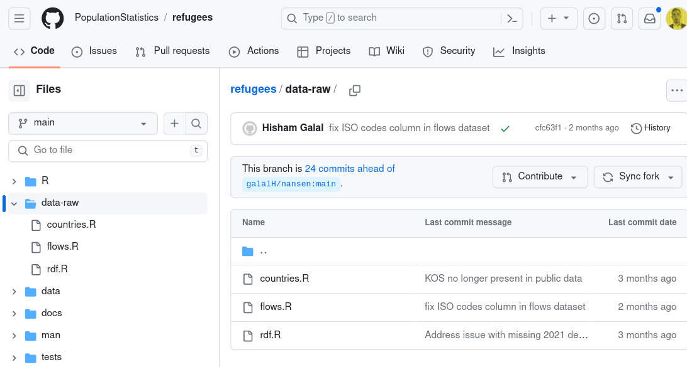
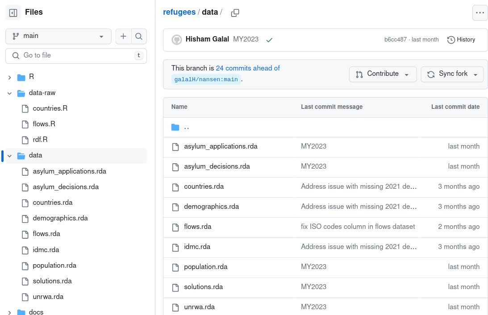
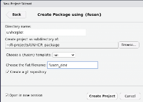
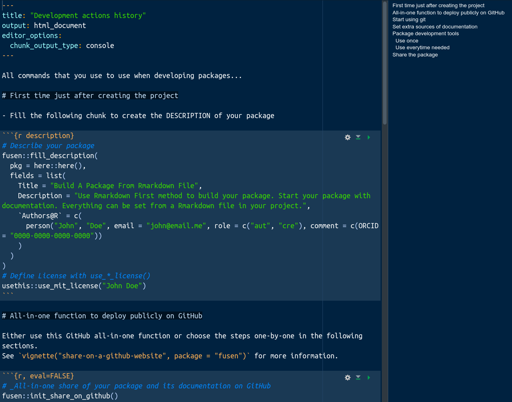
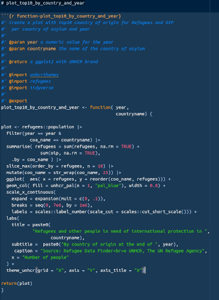
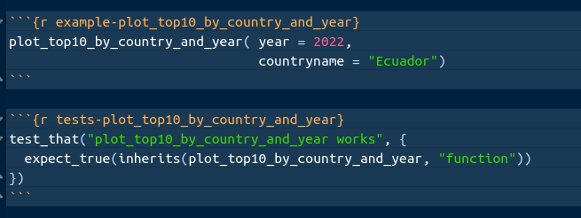
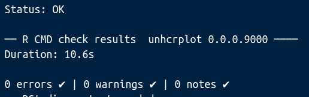
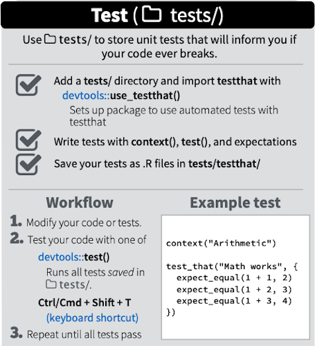
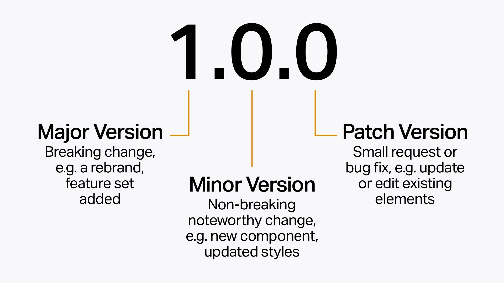
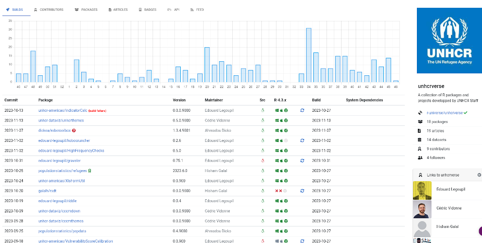

# Learning objectives

 * Why creating packages?
 
 * How to transition from functions to packages, 
 
 * Why documentation is crucial
 
 * Most current issues to fix package check

---


##  Create Packages: Why?

__Code Organization__

  * Packages are a collection of functions, data, and documentation that group related functions and data into a single unit.
  
  * They help you organize your code.   
  

__Code Reusability__

  * A package can be easily shared and used across different projects.
  
  * Share your work with others or your future self.
  
  * Functions and datasets are easily accessible.

__Collaboration__

  * Share your packages with the R community.
  
  * Contribute to the R ecosystem.


---

## Package DESCRIPTION file

The DESCRIPTION file is a metadata file that provides an overview of the package.

The file includes the following fields:

.pull-left[  

 __Package__: The name of the package.
 
__Title__: A short description of the package.
 
__Description__: A longer description of the package.
 
__Version__: The version number of the package.
 
__Author__: The name(s) of the package author(s).
 
__Maintainer__: The name and email address of the package maintainer.

]
.pull-right[
 
__License__: The license under which the package is distributed.
 
__Imports__: A list of packages that the package depends on.
 
__Suggests__: A list of packages that are suggested but not required.
 
__URL__: The URL of the package website.
 
__BugReports__: The URL or email address where bugs can be reported.

]


 


---

## Package NAMESPACE 


The NAMESPACE file is the second important metadata file that provides a way to control the visibility of functions and objects in a package 

It is a plain text file used to define the package’s exported and imported functions and objects. When a package is loaded, R reads the NAMESPACE file to determine which functions and objects are exported and which are imported from other packages 

The NAMESPACE file also defines the package’s internal functions and objects, which are not exported and are not visible to the user. The most important directives are:

 *   __ export__: This directive is used to specify which functions and objects should be exported from the package. Exported functions and objects are visible to the user and can be called from other packages.
 
 *   __ import__: This directive is used to specify which functions and objects should be imported from other packages. Imported functions and objects are not visible to the user but can be called from within the package.
 
 *   __importFrom__: This directive is used to specify which functions and objects should be imported from other packages and made visible to the user.


---

## Package Directory Structure

``` 

MyPackage/
|-- R/
|   |-- my_function.R
|-- data/
|   |-- data_made_available_with_the_package.Rda
|-- data-raw/
|   |-- data_used_for_package_development.csv
|-- inst/
|   |-- file_to_be_access_by_the_package.R
|
|-- man/
|   |-- my_function.Rd
|-- docs/
|   |-- index.html
|
|-- DESCRIPTION
|-- NAMESPACE
|-- README.md
|-- NEWS.md
```

---

## Explaining the standard directory structure

Where you add your functions: 
 *   __R/__: contains R code files that define the functions and objects in the package.
 
Where you add your data: 
 *  __inst/__: contains files that are copied to the installation directory, such as vignettes images, datasets, and other miscellaneous files. 
 *  __data/__: contains data files that will become available directly within the package.
 * __data-raw/__: used to store scripts that generate data files to be included in the package. This directory is not included in the package when it is built and installed, so it is not visible to the user. Keeping the scripts that generate the data files separate from the data files themselves makes it easier to regenerate the data files if necessary, and it also makes it easier to update the data files when new data becomes available.
 
Where you add your documentation: 
 *  __vignettes/__: contains vignettes, which are long-form documentation files that provide examples and explanations of how to use the package.
 *  __man/__: contains documentation files for the functions and objects in the package.
 *  __docs/__: contains companion website created by a specialised package {pkgdown}


---

## Example 
you can check the github repository for the [refugees package](https://github.com/PopulationStatistics/refugees)

.pull-left[ 



 
 ]
.pull-right[ 


]


---

##  Use a single markdown file to build your package


.pull-left[  

The {fusen} Rmarkdown template encourages users to fill their documentation and tests at the same time of writing their functions code. 

 {fusen} simplifies and reduces the number of steps towards a full R package.
 
After that, your {pkgdown} documentation website is one command away to be shared with all your users.

]
.pull-right[
.img75[] 
]

 
---

##  Steps to Create a Package with {fusen}


.pull-left[  

Install the {fusen} package


```{r eval=FALSE}
install.packages("fusen")

```

and benefit from a predefined project structure to speed-up package development

]
.pull-right[
.img75[] 
]

---

##  Create a new project with {fusen} project template

.pull-left[  
Provide your Directory name
 

Once created the project will included your 2 key notebooks within the `dev` folder:

 * `0-dev_history.Rmd` : where you set up all the initial configuration
 
 * `flat_fusen_dev.Rmd`: where you will start adding the functions in your package

]
.pull-right[

 

]


---

##  Add a function in your package 

.pull-left[  

The `flat_fusen_dev.Rmd` notebook is where you will include your functions.

You can each function, one by one using a dedicated Rstudio Add-in

 

]
.pull-right[
 
]

---

##  An example
let's add the function we created during the [sesssion on functions](03.Functions.html)


.pull-left[  

  

]
.pull-right[
Then add the the example and the test for your function.
 

 
]


---

## Package Dev 

Then go to the end of your notebook and run the `inflate` function to build your package...
```{r eval=FALSE}
fusen::inflate(flat_file = "dev/flat_fusen_dev.Rmd", vignette_name = "Get started")
```

.pull-left[  
Checks

  * Regularly perform package checks using `devtools::check()`.
  * Address any warnings, errors, and notes and address any issues identified by this tool.  
 

Bug Fixes and Updates

  * Regularly fix reported bugs and update the package.  
  * Keep it compatible with new R releases and dependencies.  

Manage environment variable within package  

```{r eval=FALSE}
# remotes::install_github("thinkr-open/checkhelper")
checkhelper::print_globals()  
```
]
.pull-right[

The objective is to get a __triple-0__ !
 
 


]
 

---

##  Documentation Is Essential

Documentation provides information on how to use a package.

 * __README.md__ provides the main pitch for your package

 * Each functions should comes with its documentation and an __example__ based on a demo dataset

 * __Vignettes__ are either like tutorial to quick-start your users or technical documentation explaining how to orchestrate the functions

 * __Companion website__ to be generated with `pkgdown::build_site()`.  You can apply unhcr brand on your website documentation with the package [`{unhcrtemplate}`](https://github.com/unhcr-dataviz/unhcrtemplate)


```{r eval=FALSE}
remotes::install_github("unhcr-dataviz/unhcrtemplate")
```

Then create a `_pkgdown.yml` file and copy the following in that file


```{r eval=FALSE}
template:
  package: unhcrtemplate
  bootstrap: 5
```


---

## Unit Testing

.pull-left[  


Unit testing is a software testing technique that involves testing individual units or components of a function in isolation from the rest of the package to ensure that they work as expected. It helps to catch bugs and errors early in the development cycle and before they become more serious issues.


  * Implement thorough unit tests using testthat.  
  * Ensure tests cover the majority of package functionality.  

Unit testing are created for each function by {fusen} using a dedicated package called [`{testthat}`](https://testthat.r-lib.org/)

__tests/__: contains test files for the package.


]
.pull-right[
 
]

---

## What to do then


If you are developing a package that is intended for public use, then [submitting it to CRAN](https://cran.r-project.org/submit.html) can help increase its visibility, increase the confidence for users to adopt it and make it easier for others to find and use.

Though the more complex is your package (for intance supporting the implementation of a complex workflow with API..), the more efforts it will require:

Check your code Robustness

  * Profile your code with [`{profvis}`](http://rstudio.github.io/profvis/), identify bottlenecks and optimize them. 
  * Make your package robust against different inputs.  
  * Ensure to handle errors and exceptions gracefully. 

Testing on Different Platforms
 
  * Set up a CI system (e.g., GitHub Actions, Travis CI).
  * Automatically run tests on code changes.
  * Ensure your package works on multiple platforms.
  * Test compatibility with different R versions.

---

## Managing release

.pull-left[  
__Dev Phase__

Alpha Version: used at earliest stages of software development. Typically not feature-complete and may contain many bugs and incomplete features and  often used for internal testing and may not be released to the public. 

Beta Version: More stable than alpha versions but may still contain bugs and issues. Often released to a select group of users for testing, known as beta testers. Beta testing helps identify issues and gather user feedback before the final release.

Release Candidate (RC): Version of the software that is considered stable and feature-complete. Released to a wider audience for testing to ensure there are no major issues. If no critical bugs are found in the release candidate, it may become the final release before production.

]
.pull-right[

__Production__

  * Follow semantic versioning (SemVer) principles.
  * Increment versions based on changes (major, minor, patch).


   
  
  * Use MIT license as default and reference UNHCR there

]


 


---

## If you want to go fast, go alone, if you want to go far, go together

  * __Community Engagement__: Engage with the R community and respond to user feedback, Consider contributions from other developers.

  * __Code of Conduct__: Include a code of conduct in your package to promote an inclusive community.

  * __Long-Term Maintenance__: Plan for long-term maintenance and have a transition plan in place.

  * __Peer Review__: Consider having your package peer-reviewed by other R developers.
  
  * __Recognition__: include in the package DESCRIPTION every person that contributed to your package

---

## UNHCRverse to enhance package discoverability accross the organisation.

https://unhcrverse.r-universe.dev/builds. You can submit a pull request to https://github.com/unhcRverse/unhcRverse.r-universe.dev to add your package.

 
---


## Conclusion

  * Creating packages in R is essential for code organization and sharing.
  
  * Transition from standalone functions to packages for better code management.
  
  * Proper documentation is crucial for effective collaboration and code sharing.

---
class: inverse, center, middle

# Thank you

### Questions?


[post Feedback here](https://github.com/unhcRverse/unhcrverse/issues/new?assignees=&labels=enhancement&projects=&template=comment_prex_2_tidyverse.md&title=%5Blearn%5D) 
-> [next you can start creating a web graphical user interface for your package with Shiny](11.Simplify_with_companionApp.html)


<a href="index.html"><i class="fa fa-indent  fa-fw fa-2x"></i></a>

---

# Reference

 - [Hadley - R packages](https://r-pkgs.org/)
 
 - [Fusen](https://thinkr-open.github.io/fusen/index.html)

