# Learning objectives


 * Shiny: what? why? when?

 * Shiny App Structure: User Interface (UI), Server Logic & Reactive Elements

 * Prototyping and Deployment with {graveler}


---

## Recurrent challenges when dealing with data processes

Many technical guidance are not per default "paired" with __tools__ to implement them

Re-inventing the wheel: although most data challenges are similar across operations and region, staff tends to create "__their own solutions__"

Good practices are not __documented__ in a way so that they can be re-used and recycled seamlessly 

The solutions that are developed are not __scalable__ and adaptative to other context preventing learning and knowledge creation

When __Staff turn-over__ – everything needs to be recreated again ("author lock-in")...


---

## Field Capacity 

Most field data experts (_level 1_) will never become scripts users for a series of good reasons (time, interest, coding ability). What they need in order to benefit from automation are simple (or _simplified_) __"point & click" / "no code"__ interfaces!

```{r eval=TRUE, echo=FALSE}
 
expert <- data.frame(
      Level = c(
        "Level 1",
        "Level 2",
        "Level 3",
        "Level 4",
        "Level 5"
      ),
      Capacity_to = c(
       "Use an interface – point & click application – understand what needs to be done through on-screen self-explanatory instructions ",
        "Use an automation script and configure what gets in & out",
        "Write scripts, i.e., a function to automate a process",
        "Write a package, i.e.,  a collection of documented scripts",
        "Develop an interface for a package so that level 1 users can benefit from automated task" 
      ),
      Supported_by = c(
       "Level 5 – to get interface fitting their precise needs for complex data processing",
        "Level 3 – Someone else writes the initial script for them",
        "Level 4 – so that function are documented and tested",
        "Level 5 – so that package audience is widen to level 1 users" ,
        ""
      ),
      Guestimated_proportion = c(
        ">80%",
        "<10%",
        "±5%",
        "±3%",
        "±2%" 
      )
    ) 
kableExtra::kbl(expert, format = 'html') |> 
  kableExtra::kable_styling(font_size = 18) |> 
  #kableExtra::column_spec(1, bold = TRUE) |> 
  kableExtra::column_spec(2, bold = TRUE, color = "#0072bc")


```


---

## Why Shiny?

Shiny is __Graphical User Interface Framework__ designed to interact with back-office functions written in R Statistical Computing Language. It allows you to turn your R code into interactive web apps without the need for web development skills. 

Allow for sophisticated data interactions(beyond simple visualization or content filtering...) for __end-users without advanced technical knowledge__ (no need to install Rstudio!) 

Resulting Applications to be hosted on __UNHCR Corporate Posit Connect Server__: http://analysis.unhcr.org 

Full control on the interface enables __simplified entry point for complex processes__: no vendor restrictions due to Open-Source Nature of the solution


---

## App with Shiny (1/1)

Developing dashboards in shiny, rather than with a _"point and click"_  software, requires some familiarity with R programming but also comes with numerous advantages: 

 *  __Customizability within standards__: Shiny offers a high level of flexibility and customization, allowing you to design interactive dashboards with tailored visualizations, layouts, and user interfaces (including for the instance [humanitarian icons](https://fontawesome.com/icons/categories/humanitarian)). This comes also with amazing plotting capacity leveraging [ggplot2](https://ggplot2.tidyverse.org/). At the same time, as soon as the standard css (with [{unhcrshiny}](https://edouard-legoupil.github.io/unhcrshiny/)) is used, the look and feel will remain fully consistent.
 
 *  __Seamless Integration with R__: Shiny allows you to leverage the power and flexibility of the R language and its extensive ecosystem of packages for data analysis, visualization, and statistical modeling.

 *   __Responsiveness on mobile devices__: Shiny Dashboard are built per default with bootstrap, allowing for User Interface Responsiveness, meaning the resulting product will be legible on smartphones for senior managers in a hurry.

---

## App with Shiny (2/2)


 *  __Advanced Analytics__: With R's extensive statistical capabilities, Shiny enables the integration of complex statistical models and advanced analytics directly into your dashboard.
 
 *  __Reproducibility and Transparency__: Since Shiny dashboards are built using R code, they are inherently reproducible and transparent, making it easier to share and validate analysis methods and results.
 
 *  __Publication and Maintenance__: UNHCR has already invested in a [Rstudio Connect server](http://rstudio.unhr.org) infrastructure, which is ready to be leveraged. There are even ways to keep your dashboard behind authentication if need arise. As Shiny Dashboard are based on scripts, there are easier to maintain and monitor over time, as you can keep them under version control in github.
 
 *   __Open-Source Community__: Shiny benefits from a large and active open-source community, which provides a wealth of resources, packages, and support.

 
---

## PowerBI -- Vs -- Shiny

.pull-left[  

`PowerBI` fits for quick prototyping: Product development accessible with rapid learning curve 

__Pros__

 * Easy to get "quick and dirty" dashboard...

 * Point and click interface minimize learning to build an initial product

__Cons__

 * Not easy to collaborate on the same project

 * Maintenance beyond initial ad hoc products...

 * Maintenance when need to hand over...
  
]
.pull-right[ 

`Shiny` allows for complex data processes: Less accessible at first for developers but more robust and sustainable applications

__Pros__

 * Flexibility & advanced capacity 

 * Documentation & Knowledge building

 * Robustness

 * Maintenance

__Cons__

 * Require more training  to contribute to product development 

 * Require standard settings
]


---

## Use Cases for Shiny
    
__Customized Data Applications__: 
highly specialized and customized data applications that go beyond standard dashboarding -  enables the creation of bespoke data tools with user-friendly interfaces that suit unique business processes and context.

__Advanced Statistical Analysis__: 
Statistical applications and models tailored to UNHCR's specific needs, which goes beyond the capabilities of Power BI.

__Custom Workflow Integration__: 
ShinyApp can be seamlessly integrated into existing workflows and applications. This makes it a valuable choice for organization needing to create interactive data applications that fit within their different systems (for instance between Kobotoolbox, ActivityInfo, Compass, RIDL), enhancing workflow efficiency.


---

## Shiny App Components

.pull-left[  
Every Shiny app consists of few main components:

 *  User Interface (UI) defines the app's appearance and layout.
 *  Server Logic defines the app's behavior and data processing.
 *  Style Defined through CSS.
 *  Client side interaction defined with Javascript.

]
.pull-right[
 
]


---

## User Interface (UI) Elements

.pull-left[  
UI is defined using a set of elements like fluidPage, sidebarLayout, and widgets.

These elements structure the layout and interaction of your app.

]
.pull-right[

Example __User Interface__

```{r eval=FALSE}
# Define UI structure
ui <- fluidPage(
  titlePanel("My Shiny App"),
  sidebarLayout(
    sidebarPanel(
      # Input widgets
    ),
    mainPanel(
      # Output elements
    )
  )
)
``` 
]
 

---

## Shiny Widgets Gallery


.left-column[  

When you build your interface, select the right widget based on your needs
https://shiny.posit.co/r/gallery/widgets/widget-gallery/

 
]
.right-column[


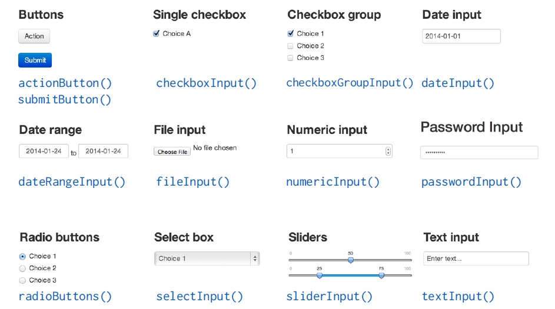 

 
]

---

## An App works with `Input` and `Output`


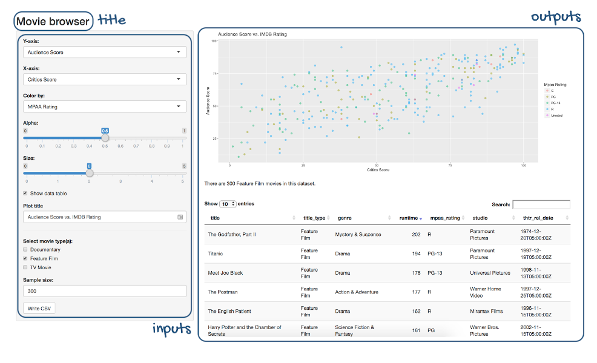 

???
https://shiny.posit.co/r/getstarted/build-an-app/hello-shiny/getting-started.html

---

## Server Logic Function

.pull-left[  

The server function is where you define the app's logic.

It reacts to user inputs and generates outputs.

The widget always contains a server componnent to add


]
.pull-right[

Example __Server Logic__

```{r eval=FALSE}
# Define server logic
server <- function(input, output) {
  # Reactive expressions and outputs
}
``` 
]

---

## App structure


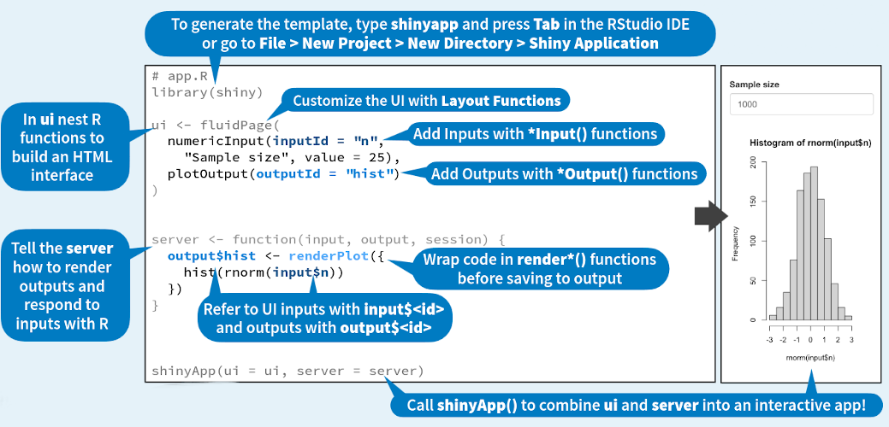 

???
https://raw.githubusercontent.com/rstudio/cheatsheets/main/shiny.pdf

---

## Reactive Elements  Expressions

.pull-left[  

Reactive expressions are used to compute outputs based on inputs.

They ensure that your app responds to user interactions in real-time.


]
.pull-right[

Example __Reactive Expression__

```{r eval=FALSE}
# Define a reactive expression
output$plot <- renderPlot({
  # Code to generate a plot based on input
})
``` 

]


---

## Reactive Values

.pull-left[  

Reactive Values in Shiny allow for dynamic reactivity, updating values based on user input or other reactive expressions.

Reactive Values act as containers to store intermediate values during the Shiny app's execution.

They have an isolated scope, meaning changes in one reactive context don't trigger unnecessary updates elsewhere.


Useful for storing and updating form input values dynamically.

Possibility to Control the visibility or content of UI elements based on reactive values.

]
.pull-right[
```{r eval=FALSE}
# Initialization a reactive value
 rv <- reactiveValues(data = NULL, count = 0)
 
# Access: rv$data and rv$count allow access to 
# the stored values.

# observe and observeEvent  functions update 
# reactive values in response to changes in 
# other reactive expressions or user inputs.

observe({ rv$count <- rv$count + 1 }) 
# updates the count value when triggered.
    
``` 

]


---

## What is Golem?

.pull-left[  

`{Golem}` is an R package that brings an opinionated `{shiny}` framework. It promotes structured app development. 

`{shiny}` itself can be complicated to spin up at times for developers who are not familiar with its syntax. `{Golem}` is to shinyApp development what `{fusen}` is to Package development!
  
As any development team grows larger, it is important to standardize code to avoid the dreaded event in which you are handed a project that is coded so differently from your usual workflow that you either have to spend hours refactoring and / or rebuilding from scratch.
 

`{Golem}` __enforces best practices__ for code organization, modularization, and scalability. 


]
.pull-right[

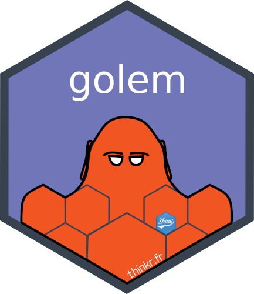 
]


---

## Benefits of Using `{Golem}`
 


.pull-left[  


`{Golem}` enforces a structured project layout.
  
  * Key directories include R, inst, tests, man, and app.
  
  * Improved code organization through the systematic usage of __modules__
  
  * Easier maintenance and collaboration
  
  * Built-in testing for quality assurance
  
  * Scalability for large projects
  
  * Community-driven development


]
.pull-right[

 
]


---

## What can go wrong when creating apps?


.pull-left[  

__Scope Creep__: too wide or to restricted or not clear..

__Lack of standards__: prevent collaboration when 

  *  Setting up the application architecture & technology stack

  *  Writing code with conventions

  *  Implementing corporate brand in application look and feel (css)

__Unreliable Robustness__: No unit testing and examples for back-office functions

__Poor ergonomics__: Not user Friendly, no clear user-centric application journey...


]
.pull-right[

 
]


---

## Setting up Common Good Practices


.pull-left[  

Each Shiny App to:


 * have code under [Version Control](07.VersionControl.html)  to allow for collaboration, issue tracking & peer review
 
 * have a documented and discussed __scope__ in the README.md

 * come with a documented and tested [R package](10.Package_Knowledge.html)  

 * use the same framework, chart theme  and branded Css

]
.pull-right[

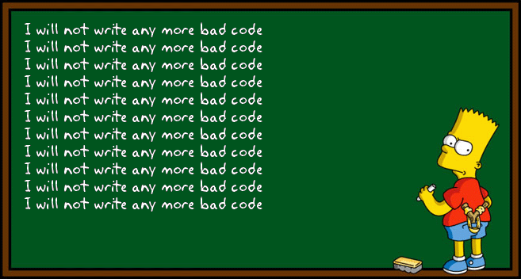 
]


---

## {Graveler} Project template


.pull-left[  


No need to start from scratch!!

[`{Graveler}`](https://edouard-legoupil.github.io/graveler/) is an R package to help you quickstart your project with mainstreamed design decision.

{Graveler} offers an  __Rstudio Project Template__ and a wrapper for [{golem}](https://engineering-shiny.org/), [{shinyDashboard}](https://rstudio.github.io/shinydashboard/index.html), [{fusen}](https://thinkr-open.github.io/fusen).

It includes [{unhcrshiny}](https://edouard-legoupil.github.io/unhcrshiny/) packages, which implements UNHCR branded as CSS __-->__

> Note that this package is not like {shinyWidgets} or other shiny element packages. This is a dashboard skeleton creator that allows you and your team to all start from the same page (some might say fluidPage) so your dashboards all have the same feel, layout, and backend creation.

]
.pull-right[

 
]

---

## Install the package to obtain the project template

.pull-left[  

```{r eval=FALSE}
install.packages("pak")
pak::pkg_install("edouard-legoupil/graveler")
```

]
.pull-right[

 

]


---

## Define your project

.pull-left[  

 package and directory name are better to be the same
 
 package name should not include special characters

]
.pull-right[
 

 
]

---

## Follow the guide: start with the back office function to be implemented a a {fusen} package

.pull-left[  

once the project is created open the file: 
`dev/01_dev.R`

The first step is to get the back office through Fusen.

Your shinyApp should be a first a __"triple-0" working package__

 > 0 errors ✔ | 0 warnings ✔ | 0 notes ✔

]
.pull-right[

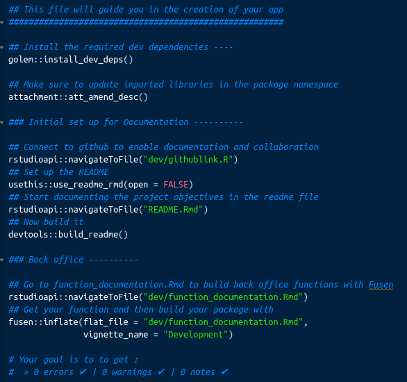 

]
  
---

## We can paste the fusen function chunk we used during the previous session

.pull-left[  

  

]
.pull-right[

 

 
]
  
  
---

## Follow the guide: Generate the empty App

.pull-left[  

The second stage is generate the empty version of the app wit `golem::run_dev()`

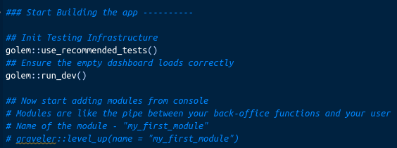 

]
.pull-right[

This is what you should see

 


]
    
  
---

## Edit the home module

Open  `R/mod_home.R`, edit it as needed, in case the viewer is running, stop it first and then relaunch it with `golem::run_dev()` 

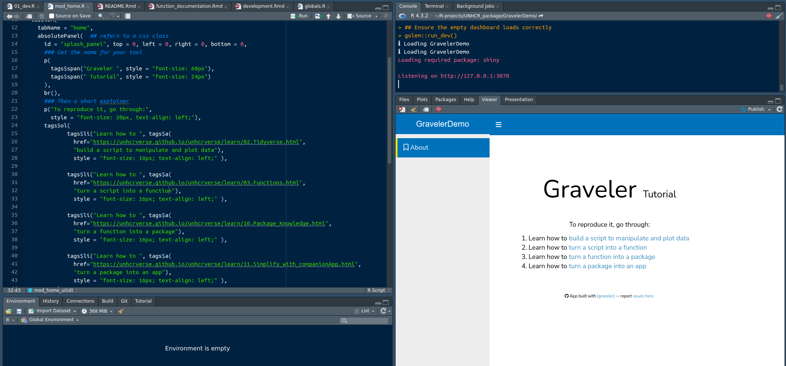 

  
---

## Follow the guide: Adding a module 

The function `level_up(name = "my_plotting_module")` will add a new module - called her `"my_plotting_module"` (rename it as you wish- trying to use a meaningful name) - to your dashboard. See the [module file here](https://github.com/Edouard-Legoupil/GravelerDemo/blob/master/R/mod_my_plotting_module.R)


.pull-left[  
Part of the module for __UI__

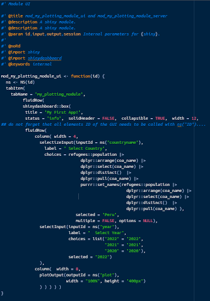 

]
.pull-right[
Part of the module for __Server__

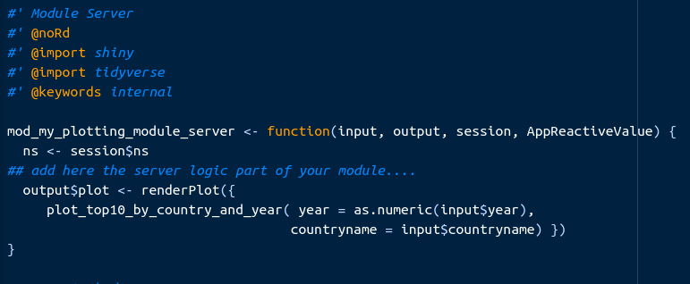 
]
???

Do not forget to __stop your viewer__, in order to be able to run the next command! 

You place your UI and server code in the mod file, that reflect away repeatable data manipulation or plotting functions created through your {fusen} notebook.

In general, this helps keep your module code short and tidy, and allows you to put documentation for your functions just like a package.


---

## Follow the guide: Connect your module

`level_up()` might create your module, but you still need to tell your dashboard to include and run this module. To do so, there are three lines at the bottom you copy and paste into their appropriate files: `body.R`, `sidebar.R` and `app_server.R`  (un-commented, of course). The body and sidebar lines need to be separated with commas if you have multiple modules, but the app_server will be individual lines.


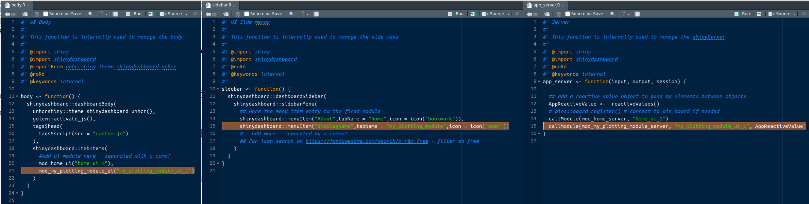 

---

## Connect multiple modules together

Once that is done, your modules should appear on the left. All that is left to do is to insert your actual dashboard elements.

Typically communication between modules will be required if you want to use filters across modules.

This imply to set a specific `reactivalues()` object (called per default `AppReactiveValue`). It will be used a fuction parameters for all modules server functions.

---

## Follow the guide: Generate your application manifest


`rsconnect::writeManifest()` is a function in R that generates a `manifest.json` file. 

This file contains a list of all files in the app along with their dependencies. 

Before creating the manifest, push all your files to github and re-install your package from there so the manifest can correctly reference all source for the package
 
```{r eval=FALSE}
install.packages("pak")
## Change GITHUBACCOUNT & PACKAGENAME to fit your project
pak::pkg_install("GITHUBACCOUNT/PACKAGENAME")
```


then run:


```{r}
rsconnect::writeManifest()
```

and commit the `manifest.json` to github

---

## Publish via Button

Get in touch with UNHCR Global Data Service to obtain a Rstudio Connect license.


Run the app.R file at the root of your project to launch your application locally and then click on the blue: `publish button` in the top right.

 


It will gather your dependencies, ensure the server has them installed, and then your dashboard will be viewable on RStudio Connect. More [info on deployment here](https://data-viz.it.wisc.edu/__docs__/admin/appendix/deployment-guide/)


---

## Publish via Github


.pull-left[  

As a general approach, it is a good practice to keep a copy of your dashboard in github. __git backed content__ will ensure your published works will align with your team’s codebase and allow others to collaborate easier.

Earlier, we made a `manifest.json` file at the end of the `01_dev.R` file. This creates an “image” that RStudio looks for and reproduces from github directly.

To publish for the first time, you push your code to whichever repo and branch on github, then in RStudio Connect you click its blue, publish button. You then navigate to the repo and branch you just pushed to, find the manifest file. Just like before, it will gather your dependencies from the manifest, ensure the server has them installed, and then your dashboard will be viewable on RStudio Connect.

]
.pull-right[ 

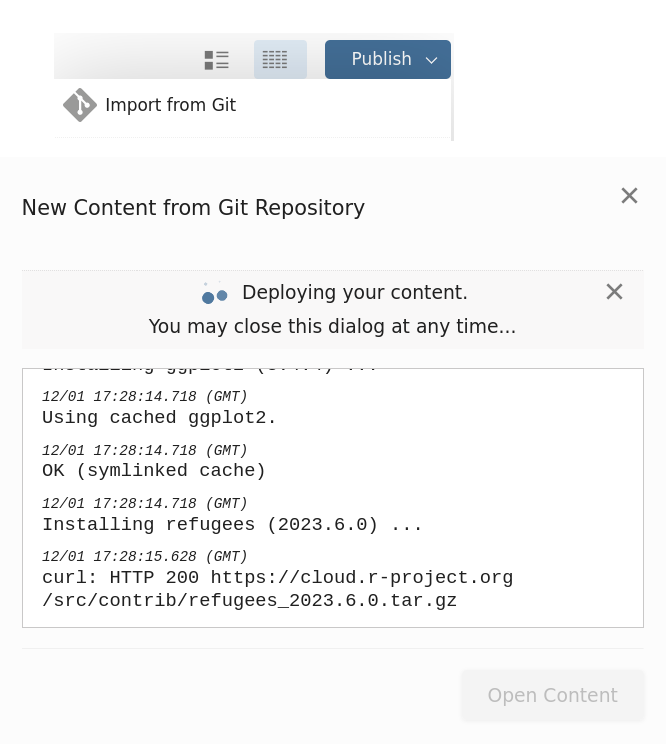 
]


---

## Et voila: https://rstudio.unhcr.org/gravelerDemo/

Now you can define who shall access your app and git a deployment name


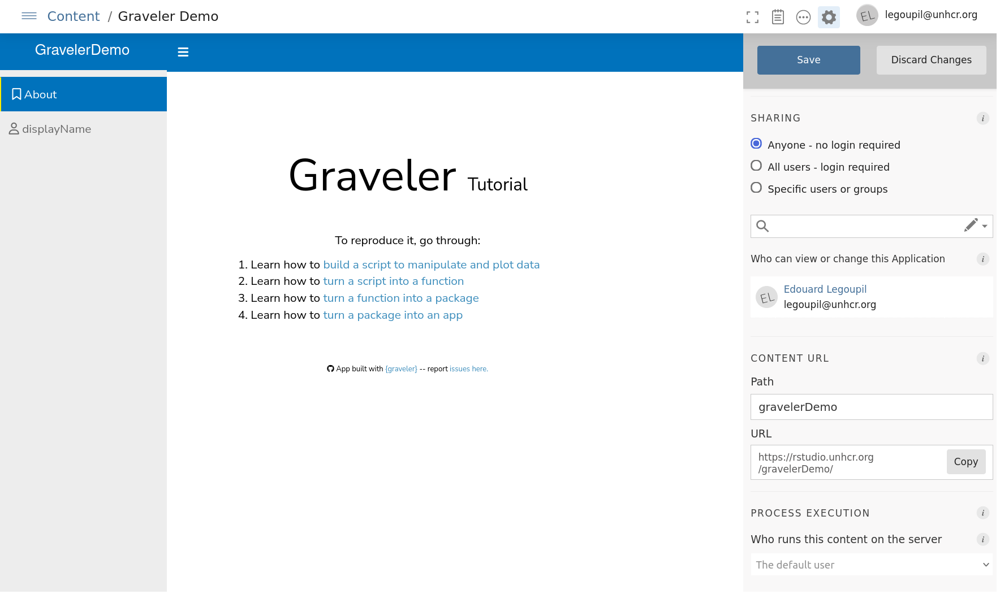 


---

## Good practices when publishing

.pull-left[  
>  Be cautious with __password__ and __token__ - do not upload this in github. Password and token should rather be called as environement variables and set up separately after deployement in rstudio Connect

Favor publication from github as much as possible. Build and publish your package documentation on github with pkgdown::build_site()

Share publication access rights with colleagues so that there’s a back up plan to update the app if needed

Once the application is published on the Posit Connect server, document the name of the github repo for your app within Rstudio Connect metadata and use a specific URL before disseminating the app

Do not hesitate to reach out for peer review! :)

]
.pull-right[ 

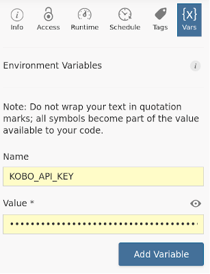 
]


  
---

## Key Takeaways

  * Take the time to properly scope your project
  
  * Use good practices and work under version control
  
  * Apps have a UI structure and server logic.
  
  * Reactive elements enable real-time interactivity.
  
  * `{golem}` is a powerful framework for structured Shiny app development that enforces best practices, modularity, and automated testing.
  
  
  * Use `{graveler}` to speed up your project development  
    


 
---
class: inverse, center, middle

# Thank you

### Questions?


[post Feedback here](https://github.com/unhcRverse/unhcrverse/issues/new?assignees=&labels=enhancement&projects=&template=comment_prex_2_tidyverse.md&title=%5Blearn%5D) 

---

# Reference

Workday Training: 

 *  [Building Data Apps with R and Shiny: Essential Training](https://wd3.myworkday.com/unhcr/learning/course/046437bef6c810195cf435c99f680004?type=9882927d138b100019b928e75843018d)
 
 *  [Creating Interactive Presentations with Shiny and R](https://wd3.myworkday.com/unhcr/learning/course/046437bef6c810195ced25308e8e0005?type=9882927d138b100019b928e75843018d)
 
 *  [R: Interactive Visualizations with htmlwidgets](https://wd3.myworkday.com/unhcr/learning/course/046437bef6c810195cfa6c1cdad00001?type=9882927d138b100019b928e75843018d)

Documentation
 
 *  [getstarted/shiny-basics](https://shiny.posit.co/r/getstarted/shiny-basics/lesson1/index.html)
 
 *  [Production-grade-r-shiny-with-golem-prototyping](https://towardsdatascience.com/production-grade-r-shiny-with-golem-prototyping-51b03f37c2a9)

