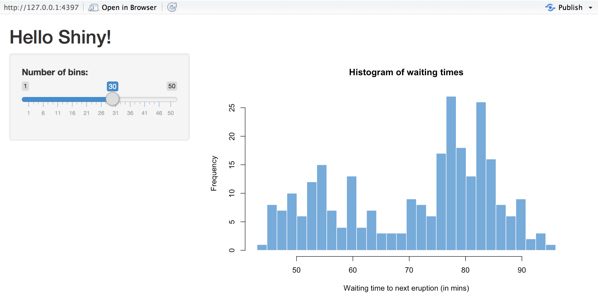
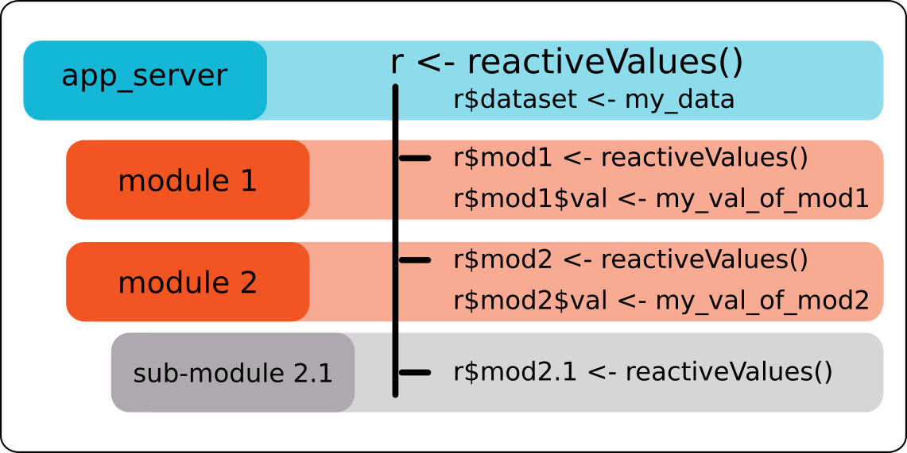
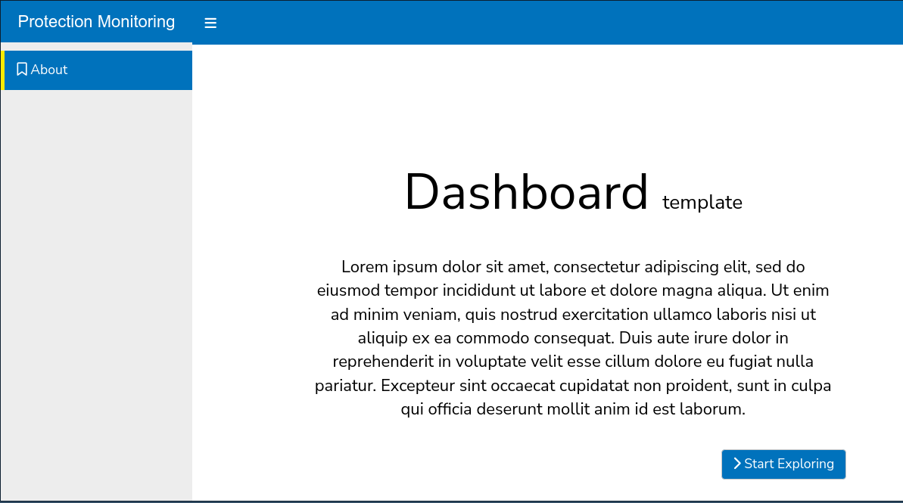
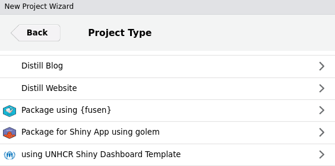
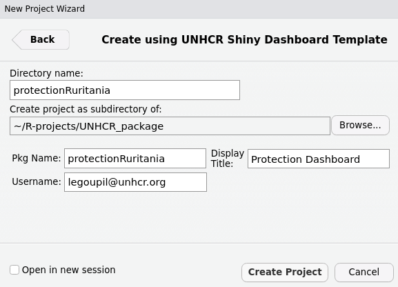
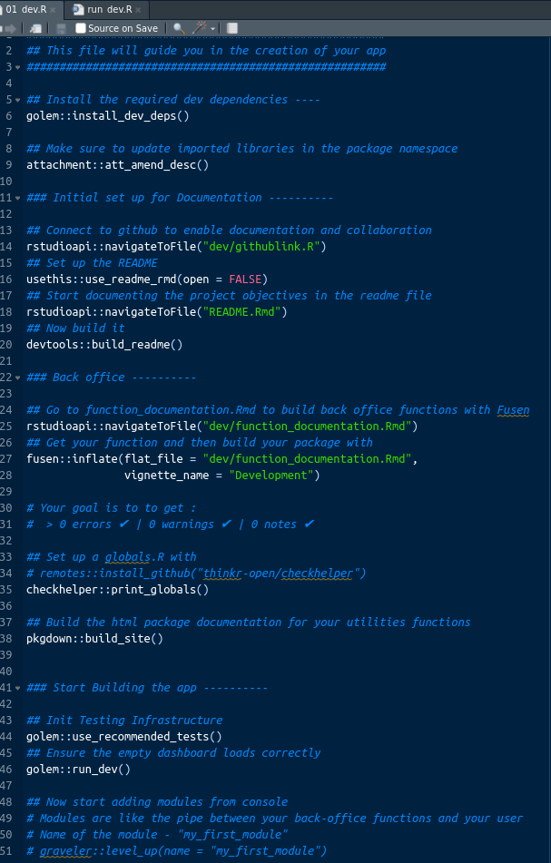

## Agenda

  * Introduction to Shiny
  * Shiny App Structure
  * User Interface (UI)
  * Server Logic
  * Reactive Elements
  * Deployment
  * Advanced Topics
  * Conclusion


---

## App with Shiny (1/1)

Developing dashboards in shiny, rather than with a _"point and click"_  software, requires some familiarity with R programming but also comes with numerous advantages: 

 *  __Customizability within standards__: Shiny offers a high level of flexibility and customization, allowing you to design interactive dashboards with tailored visualizations, layouts, and user interfaces (including for the instance [humanitarian icons](https://fontawesome.com/icons/categories/humanitarian)). This comes also with amazing plotting capacity leveraging [ggplot2](https://ggplot2.tidyverse.org/). At the same time, as soon as the standard css (with [{unhcrshiny}](https://edouard-legoupil.github.io/unhcrshiny/)) is used, the look and feel will remain fully consistent.
 
 *  __Seamless Integration with R__: Shiny allows you to leverage the power and flexibility of the R language and its extensive ecosystem of packages for data analysis, visualization, and statistical modeling.

 *   __Responsiveness on mobile devices__: Shiny Dashboard are built per default with bootstrap, allowing for User Interface Responsiveness, meaning the resulting product will be legible on smartphones for senior managers in a hurry.

---

## App with Shiny (2/2)


 *  __Advanced Analytics__: With R's extensive statistical capabilities, Shiny enables the integration of complex statistical models and advanced analytics directly into your dashboard.
 
 *  __Reproducibility and Transparency__: Since Shiny dashboards are built using R code, they are inherently reproducible and transparent, making it easier to share and validate analysis methods and results.
 
 *  __Publication and Maintenance__: UNHCR has already invested in a [Rstudio Connect server](http://rstudio.unhr.org) infrastructure, which is ready to be leveraged. There are even ways to keep your dashboard behind authentication if need arise. As Shiny Dashboard are based on scripts, there are easier to maintain and monitor over time, as you can keep them under version control in github.
 
 *   __Open-Source Community__: Shiny benefits from a large and active open-source community, which provides a wealth of resources, packages, and support.

---

## Introduction to Shiny


.pull-left[  

What is Shiny?

  * Shiny is an R package for building interactive web applications.
  * Allows you to turn your R code into interactive web apps without the need for web development skills.
  
]
.pull-right[ 

Why Shiny?

  * Data visualization
  * Data exploration
  * Interactive reporting
  * Dashboards
]


---

## Shiny App Components

.pull-left[  
Every Shiny app consists of few main components:

 *  User Interface (UI) defines the app's appearance and layout.
 *  Server Logic defines the app's behavior and data processing.
 *  Style Defined through CSS.
 *  Client side interaction defined with Javascript.

]
.pull-right[
 
]


---

## User Interface (UI) Elements

.pull-left[  
UI is defined using a set of elements like fluidPage, sidebarLayout, and widgets.

These elements structure the layout and interaction of your app.

Example UI
]
.pull-right[

```  
# Define UI structure
ui <- fluidPage(
  titlePanel("My Shiny App"),
  sidebarLayout(
    sidebarPanel(
      # Input widgets
    ),
    mainPanel(
      # Output elements
    )
  )
)
``` 
]

---

## Server Logic Function

.pull-left[  

The server function is where you define the app's logic.

It reacts to user inputs and generates outputs.

Example Server Logic
]
.pull-right[

``` 
# Define server logic
server <- function(input, output) {
  # Reactive expressions and outputs
}
``` 
]

---

## Reactive Elements  Expressions


.pull-left[  

Reactive expressions are used to compute outputs based on inputs.

They ensure that your app responds to user interactions in real-time.

Example Reactive Expression

]
.pull-right[
``` 
# Define a reactive expression
output$plot <- renderPlot({
  # Code to generate a plot based on input
})
``` 

]


---

## Reactive Values

.pull-left[  

Reactive Values in Shiny allow for dynamic reactivity, updating values based on user input or other reactive expressions.

Reactive Values act as containers to store intermediate values during the Shiny app's execution.

They have an isolated scope, meaning changes in one reactive context don't trigger unnecessary updates elsewhere.


Useful for storing and updating form input values dynamically.

Possibility to Control the visibility or content of UI elements based on reactive values.

]
.pull-right[
``` 
# Initialization a reactive value
 rv <- reactiveValues(data = NULL, count = 0)
 
# Access: rv$data and rv$count allow access to the stored values.

# observe and observeEvent  functions  update reactive values in response to changes in other reactive expressions or user inputs.

observe({ rv$count <- rv$count + 1 }) 
# updates the count value when triggered.
    
``` 

]


---

## What is Golem?

.pull-left[  

Golem is an opinionated Shiny framework that promotes structured app development.Golem to shinyApp development what Fusen is to Package development!
  
As any development team grows larger, it is important to standardize code to avoid the dreaded event in which you are handed a project that is coded so differently from your usual workflow that you either have to spend hours refactoring and / or rebuilding from scratch. Additionally, {shiny} itself can be complicated to spin up at times for developers who are not familiar with its syntax. Goelm enforces best practices for code organization, modularization, and scalability. 


]
.pull-right[

 
]


---

## Benefits of Using Golem
 

  * Golem enforces a structured project layout.
  
  * Key directories include R, inst, tests, man, and app.
  
  * Improved code organization
  
  * Easier maintenance and collaboration
  
  * Built-in testing for quality assurance
  
  * Scalability for large projects
  
  * Community-driven development

---

## {Graveler} Project template


.pull-left[  

An __Rstudio Project Template__ and a wrapper for [{golem}](https://engineering-shiny.org/), [{shinyDashboard}](https://rstudio.github.io/shinydashboard/index.html), [{fusen}](https://thinkr-open.github.io/fusen), and [{unhcrshiny}](https://edouard-legoupil.github.io/unhcrshiny/) packages.


]
.pull-right[

 
]

---

## Install the package to obtain the project template

.pull-left[  

```
install.packages("pak")
pak::pkg_install("edouard-legoupil/graveler")
```
 


]
.pull-right[

 

 
]


---

## Follow the guide

.pull-left[  

once the project is created open the file: 
```
dev/01_dev.png
```


and follow the instructions

]
.pull-right[

 

]
  
---

## Key Takeaways

  * Shiny allows you to create interactive web apps with R.
  
  * Apps have a UI structure and server logic.
  
  * Reactive elements enable real-time interactivity.
  
  * Golem is a powerful framework for structured Shiny app development that enforces best practices, modularity, and automated testing.
  
  * Use graveler to speed up your project development  
    
 
---
class: inverse, center, middle

# Thank you

### Questions?


[post Feedback here](https://github.com/unhcRverse/unhcrverse/issues/new?assignees=&labels=enhancement&projects=&template=comment_prex_2_tidyverse.md&title=%5Blearn%5D) 

---

## Ressources

 [Building Data Apps with R and Shiny: Essential Training](https://wd3.myworkday.com/unhcr/learning/course/046437bef6c810195cf435c99f680004?type=9882927d138b100019b928e75843018d)
 
 [Creating Interactive Presentations with Shiny and R](https://wd3.myworkday.com/unhcr/learning/course/046437bef6c810195ced25308e8e0005?type=9882927d138b100019b928e75843018d)
 
 [R: Interactive Visualizations with htmlwidgets](https://wd3.myworkday.com/unhcr/learning/course/046437bef6c810195cfa6c1cdad00001?type=9882927d138b100019b928e75843018d)
 
 [getstarted/shiny-basics](https://shiny.posit.co/r/getstarted/shiny-basics/lesson1/index.html)
 
 [production-grade-r-shiny-with-golem-prototyping](https://towardsdatascience.com/production-grade-r-shiny-with-golem-prototyping-51b03f37c2a9)

